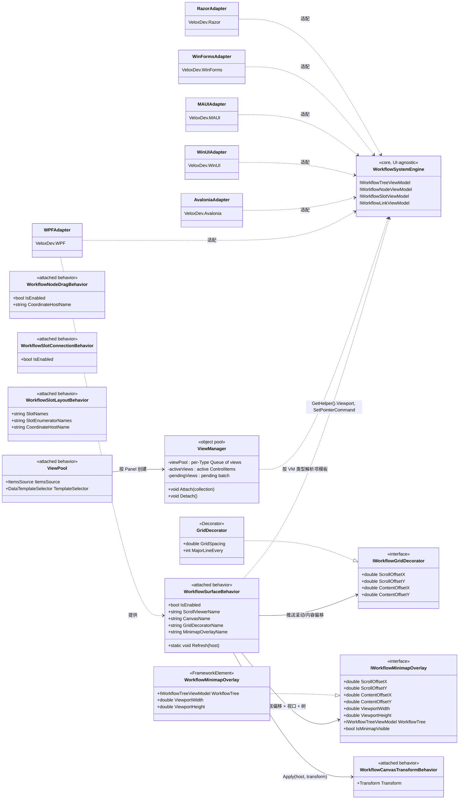

# 08 · 平台适配器 — 设计模式分析

平台适配器层把与 UI 框架无关的工作流引擎变成可交互编辑器。六个适配器包（`VeloxDev.WPF`、`VeloxDev.Avalonia`、`VeloxDev.WinUI`、`VeloxDev.MAUI`、`VeloxDev.WinForms`、`VeloxDev.Razor`）各自提供相同的附加行为表面、对象池化视图容器，以及各平台过渡/主题接线。下图展示了支撑这一切的关系；未经演示覆盖的细节以源码为依据并标注 `*推断所得*`。

## Mermaid classDiagram

## 模式表

| 模式 | 出现位置 | 作用 |
|---|---|---|
| **适配器（Adapter）** | 六个适配器包包装同一个 `VeloxDev.WorkflowSystem` 引擎 | 每个适配器把与 UI 无关的工作流模型转换成框架原生的视图/行为，同时保持单一公开表面（`VeloxDev.WorkflowSystem.AttachedBehaviors`），因此跨 WPF/Avalonia/WinUI/MAUI/WinForms/Razor 的应用代码几乎一致。 |
| **附加行为（Attached Behavior）** | `WorkflowSurfaceBehavior`、`WorkflowCanvasTransformBehavior`、`WorkflowNodeDragBehavior`、`WorkflowSlotConnectionBehavior`、`WorkflowSlotLayoutBehavior`、`ViewPool` | 把 UI 关注点（平移、拖拽、连线、布局同步、虚拟化）打包成附加属性，在 XAML 中声明式接线，无需继承即可挂到任意宿主上。 |
| **对象池（Object Pool）** | `ViewPool` → `ViewManager` | `ViewManager` 为每个类型维护一个 `Queue<FrameworkElement>`，复用视图而不是销毁重建；被移除的视图折叠后归还池。减少平移/缩放大图时的分配压力。 |
| **策略（Strategy）** | `IWorkflowGridDecorator`、`IWorkflowMinimapOverlay` | `WorkflowSurfaceBehavior` 依赖接口，因此网格装饰层和小地图可以自由替换（模板 `GridDecorator`、演示 `WorkflowGridDecorator`、自定义实现）而无需改动行为。 |
| **观察者（Observer）** | `WorkflowSurfaceBehavior`（`DataContextChanged` / `ScrollChanged`）、`WorkflowMinimapOverlay`（节点/连接/槽的 `CollectionChanged` + `PropertyChanged`） | 画布把滚动/偏移/视口变化推给装饰层与小地图；小地图订阅节点/连接变更通知并标记脏，而不是轮询。 |
| **生命周期钩子 / 模板方法** | `WorkflowSurfaceBehavior.Attach/Detach`、`WorkflowNodeDragBehavior.Attach/Detach` | 一致的 attach/detach 成对订阅/退订事件并清理状态，防止宿主卸载或功能关闭时泄漏。 |

## 设计说明

- **同名不同绑定。** 附加行为在每个适配器中公开名称相同，但针对各自框架的事件模型实现（WPF `PreviewMouse*`、Avalonia 指针事件、WinUI `PointerPressed`、MAUI 手势识别器、Razor JS 互操作 — 后者为 `*推断所得*`）。
- **画布行为是协调者。** `WorkflowSurfaceBehavior` 自己不渲染；它解析命名部件、通过 `WorkflowCanvasTransformBehavior` 持有平移变换，并经由策略接口把数据喂给网格装饰层/小地图。
- **池化按类型、分批进行。** `ViewManager` 分批实例化（WPF 已验证为每 dispatcher `Background` 滴答 3 个），因此大图永远不会在单帧内创建全部视图。
