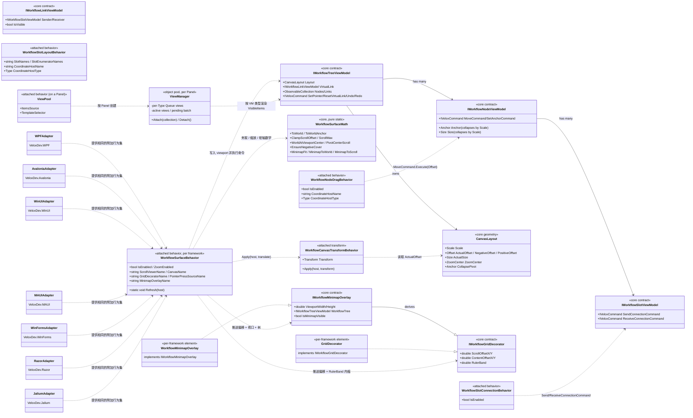

# 08 · 平台适配器 — 设计模式分析

平台适配器层把与 UI 框架无关的工作流引擎（`VeloxDev.Core`，命名空间 `VeloxDev.WorkflowSystem`）变成可交互编辑器。七个适配器包（`VeloxDev.WPF`、`VeloxDev.Avalonia`、`VeloxDev.WinUI`、`VeloxDev.MAUI`、`VeloxDev.WinForms`、`VeloxDev.Razor`、`VeloxDev.Jalium`）各自提供相同的附加行为表面、对象池化视图容器、各平台的小地图/网格实现，以及各平台过渡/主题接线。行为类位于共享命名空间 `VeloxDev.WorkflowSystem.AttachedBehaviors`（已在每个适配器中源码核实）；装饰层/小地图契约、几何类型与纯坐标数学已统一进 Core，使七个适配器调用同一份定义。未经演示覆盖的细节以源码推断并标注 `*推断所得*`。

## Mermaid classDiagram

上面这些共享边代表七个适配器程序集共用的同一个命名空间 `VeloxDev.WorkflowSystem.AttachedBehaviors`——应用只引用其中一个适配器程序集，因此同名行为不会冲突。

## 模式表

| 模式 | 出现位置 | 作用 |
|---|---|---|
| **适配器（Adapter）** | 七个包（`VeloxDev.*`）包装与 UI 无关的工作流引擎 | 每个包把 Core 模型转换成框架原生的视图与行为，并用框架专属具体类型扩展共享的过渡/主题命名空间（`Interpolator` 注册原生采样器、`State`、`TransitionEffect`、`UIThreadInspector`、`ThemeValueConverters`）。跨 WPF/Avalonia/WinUI/MAUI/WinForms/Razor/Jalium 的应用代码几乎一致。 |
| **附加行为（Attached Behavior）** | `WorkflowSurfaceBehavior`、`WorkflowCanvasTransformBehavior`、`WorkflowNodeDragBehavior`、`WorkflowSlotConnectionBehavior`、`WorkflowSlotLayoutBehavior`、`ViewPool` | 把 UI 关注点（平移/缩放、拖拽、连线、布局同步、虚拟化）打包成附加属性（在 WinForms/Blazor 里为其无依赖属性的等价物），在任意宿主上声明式接线而无需继承。每个适配器中公开名称一致，即便各按该框架的事件模型实现。 |
| **对象池（Object Pool）** | `ViewPool` → `ViewManager`（每个 `Panel` 一个） | `ViewManager` 为每个具体类型维护视图 `Queue` 和按类型的 `_templateMap`，每 dispatcher `Background` 滴答渲染 3 个。被移除的视图折叠、解绑并入池；管理器以面板为键注册进 `ConditionalWeakTable`，并在 `Unloaded` 时清理。 |
| **命令（Command）** | 行为作为 Core 命令层的前端 | 附加行为只把手势翻译成 Core `IVeloxCommand`——`MoveCommand`（拖拽）、`SendConnectionCommand`/`ReceiveConnectionCommand`（连线）、`ResetVirtualLinkCommand`（取消）、`SetPointerCommand`（指针追踪）。撤销/重做命令保留在树 VM 上；行为从不持有工作流逻辑。 |
| **策略 / 桥接（Strategy / Bridge）** | `IWorkflowGridDecorator`、`IWorkflowMinimapOverlay`、`WorkflowSurfaceMath`、`CanvasLayout.Scale` | 画布通过两个 Core 契约推送状态，使网格装饰层与小地图可自由替换（模板 `GridDecorator`、演示 `WorkflowGridDecorator`、自定义实现）。缩放是把*折叠因子*写入 `CanvasLayout.Scale`；`WorkflowSurfaceMath` 持有七个适配器共享的夹取/枢轴/覆盖/小地图公式的唯一规范副本，各框架不再各自内联一份代数。 |
| **观察者（Observer）** | `WorkflowSurfaceBehavior`（`DataContextChanged`/`ScrollChanged`）、`WorkflowMinimapOverlay`（节点/连线集合 + `Anchor`/`Size`）、`WorkflowNodeScaleTracker`（`Scale` 变化）、空间管理器（`NodeAdded`/`LinkAdded`） | 画布把滚动/偏移/视口变化推给装饰层与小地图；小地图订阅模型事件并标记脏而非轮询；每个节点的缩放跟踪器在缩放 `Scale` 变化时重新触发 `Anchor`/`Size`；空间管理器从树的增删事件保持索引最新。 |
| **模板方法 / 生命周期钩子** | `WorkflowSurfaceBehavior.Attach/Detach`、行为事件钩子、`ViewPool` 面板 `Unloaded` 清理 | 一致的 attach/detach（或 Loaded/Unloaded）成对订阅/退订并清理状态，防止宿主卸载、标签页关闭或功能禁用时泄漏。 |

## 设计说明

- **Core 拥有模型与数学；适配器只做绑定。** `IWorkflow*ViewModel`、`CanvasLayout`（含 `Scale`/`ActualOffset`/`NegativeOffset`/`PositiveOffset`/`ActualSize`）、装饰层/小地图契约与 `WorkflowSurfaceMath` 都位于 `VeloxDev.Core` 的 `VeloxDev.WorkflowSystem` 命名空间（例如 `Src/Core/VeloxDev.Core/Interfaces/WorkflowSystem/IWorkflowGridDecorator.cs`、`WorkflowSystem/GUI/Math/WorkflowSurfaceMath.cs`）。此前每个适配器都内联同样的网格/小地图/数学副本；统一后只有一份权威定义。
- **同名不同绑定。** 附加行为在每个适配器中公开名称一致（`namespace VeloxDev.WorkflowSystem.AttachedBehaviors`），但按框架实现：WPF/Jalium 用 WPF 式 `PreviewMouse*`/`AddHandler`，Avalonia 隧道化指针事件并剥离 ScrollViewer 的手势识别器，WinUI 用 `Pointer*` + 合成 `Canvas.Translation`，MAUI 用手势识别器（pan/pinch，外加原生 Windows 滚轮），WinForms 用 Win32 `IMessageFilter` + `MouseWheel`，Razor 走 JS 互操作。`ViewPool` 的模板选择器同样因框架而异：WPF/WinUI/MAUI 用 `DataTemplateSelector`、Avalonia 用 `IDataTemplate`、WinForms/Jalium 用 `IWorkflowTemplateSelector`、Razor 用 `ItemTemplate` 片段。未经演示覆盖的细节为 `*推断所得*`。
- **画布行为是协调者。** `WorkflowSurfaceBehavior` 自己不渲染；它解析命名部件（`PART_ScrollViewer`、`PART_Canvas`、`PART_SurfaceBorder`、装饰层、小地图）、经 `WorkflowCanvasTransformBehavior` 持有共享画布平移（一个通知载体，节点/连线视图把 `RenderTransform` 绑定到它），并通过策略契约喂给装饰层/小地图/视口/虚拟化内缩。
- **缩放是模型折叠，而非画布变换。** 每个适配器写入更小的 `Layout.Scale`（滚轮向上除以 1/1.1）；`NodeDefaultViewModel` 的 `Anchor`/`Size` getter 按该比例朝世界原点折叠，并经 `WorkflowNodeScaleTracker` 重新触发。各框架细节（WPF/Avalonia 行为驱动的枢轴滚动、WinUI 合成偏移、MAUI pinch + `RecenterOnWorldPointAsync`、WinForms 全局消息过滤器缩放、Razor JS 原子 `applyZoomSurface`、Jalium 演示表面的宿主驱动缩放）都建立在同一套 `WorkflowSurfaceMath` 枢轴/覆盖数学之上。
- **虚拟化是 Core/适配器的分工。** 空间索引（`WorkflowSpatialManager` + `SpatialGridHashMap`）在 Core 中根据 `Helper.Viewport` 计算 `VisibleItems`；适配器的 `ViewPool`/`ViewManager` 只实例化这些视图。XAML 演示把池绑定到 `Helper.VisibleItems`（MAUI 剥离连线 VM 成仅节点包装；连线在一个视口大小的 `WorkflowLinkOverlay` 中渲染），而 WinForms 与 Blazor 演示绑定完整节点集合并把可见区域簿记交给画布——因此对 `VisibleItems` 的池化仅在 WPF/Avalonia/WinUI/MAUI 有演示验证，其余为 `*推断所得*`。
- **各框架的小地图/网格元素类型不同。** WPF `FrameworkElement`、Avalonia `Control`、WinUI `Canvas`（形状池化，16 ms 重建）、MAUI `GraphicsView: IDrawable`、Jalium `FrameworkElement`、Razor SVG 组件；只有 Jalium 与 Razor 在适配器内提供网格装饰器*控件*；WinUI 连线视图遵循"偏移帧"契约（自定位在 −ActualOffset，几何预加 ActualOffset），使缩放永不裁掉连线的负半区。
