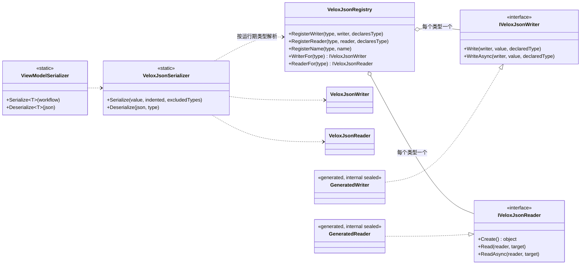

# 设计模式分析 — 序列化

归档引擎存在的目的是让一件事成立：**文档里只可能出现编译器见过的类型**。其余设计都是从这条性质推出来的。

它分两层：

- **编译期** —— `VeloxDev.Core.Generator` 走一遍编译单元，判定哪些类型**在**闭世界里，并为每个类型产出一个 `internal sealed` 的写出器与读入器，落在生成出来的 `_VeloxJson.g.cs` 里，另加一个负责注册它们的 `[ModuleInitializer]`。
- **运行期** —— `VeloxJsonSerializer` 拿类型去 `VeloxJsonRegistry` 里查，调用查到的写出器或读入器。热路径上**没有任何反射**，也没有兜底：没有条目的类型会抛 `MissingWriter` / `MissingReader`，而不是写成一个空壳。

在这两层之上，本特性组合了 **Registry**、**Strategy**（两个接口背后的生成式写/读配对）、**Marker Attribute**（`[Archivable]` 打开一个可达性遍历本不会找到的类型）与 **Immutable Snapshot**（每次注册都发布新副本，所以读侧永不加锁）。

> 源码：`Src/Core/VeloxDev.Core/Serialization/`（引擎）、`Src/Generators/VeloxDev.Core.Generator/VeloxJson.cs` 与 `Writers/VeloxJsonCodeWriter.cs`（生成器）。

## 类图

## 闭世界

把类型放进来的路有四条，生成器**只看源码**就能判定（`Base/VeloxJsonModel.cs:588-614`）：

| 路径 | 生成器找什么 |
|---|---|
| 组件接口 | `IWorkflowTreeViewModel` / `IWorkflowNodeViewModel` / `IWorkflowSlotViewModel` / `IWorkflowLinkViewModel` |
| 组件特性 | `[WorkflowBuilder.*]` |
| 可观察字段 | 一个 `[VeloxProperty]` 字段 —— 由 MVVM 生成器提升 |
| 标记 | `[Archivable]`，可选地点名额外根类型 |

随后可达性沿**成员的声明类型**闭合 —— 属性的类型、字段的类型、方法的返回类型、泛型实参 —— 一次一跳（`:377-399`）。2026-10-04 起这个闭包又沿三条轴加宽：派生类、字典的键与值、以及作为根使用的开放泛型的约束（`:34-48`）。

有一条后果值得直说：抽象类与接口**永远**拿不到条目 —— 对它们 `ReaderFor` 恒为 `null`。多态之所以成立，是因为**具体类型**作为判别符被写进文档，读侧再把这个名字经注册表解析回来。

## 两个入口，一个引擎

| 入口 | 约束 | 服务哪条路 |
|---|---|---|
| `ViewModelSerializer.Serialize<T>` / `.Deserialize<T>` | `where T : INotifyPropertyChanged` | `[VeloxProperty]` 那条路 —— ViewModel |
| `VeloxJsonSerializer.Serialize(object, …)` / `.Deserialize<T>` | `where T : class` | `[Archivable]` 那条路 —— 普通文档 |

`ViewModelSerializer` 里**没有任何引擎逻辑**；它只是 `VeloxJsonSerializer` 之上一个视图模型形状的薄门面 —— 这也正是 `CheckpointEx` 能绕过它、直接用一个「根本不是 ViewModel 的类型」的原因。

## 注册表归属 —— 唯一一条带理由的规则

注册要消解一个全局表消解不了的歧义：**非泛型**类型只有一个声明程序集，但**封闭泛型**可能既由声明它的程序集发出、也由封闭它的程序集发出。

规则是：*声明方永远胜出；消费方只能补空缺*（`VeloxJsonRegistry.cs:195,215`）。它由生成器**说出**的 `declaresType` 标志来执行，而不是让注册表去推断（`Writers/VeloxJsonCodeWriter.cs:503-507`）—— 推断必须靠猜，而猜错的后果是静默地把一个程序集的写出器换成另一个的。

`RegisterName` 与 `RegisterContainerFactory` **刻意没有**这条守卫。

## 这里**不是**模式的部分

没有惰性类型解析、没有约定优于配置、也没有一个带长尾开关的序列化器设置对象。`SerializationOptions` 只有三个成员，而逐成员的控制只有 `[Archive(...)]` 与 BCL 的 `[JsonIgnore]`。这是刻意的取舍：闭世界已经回答了「什么会被写出去」，在它之上再加一套配置 API，只会是同一件事的第二种、也更弱的说法。
