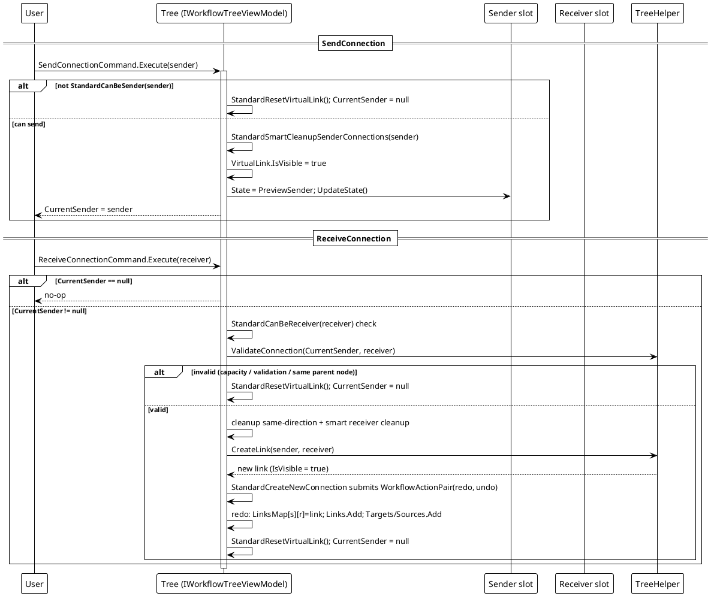

# 工作流系统 — 连接流程

`SendConnection` → `ReceiveConnection` → `CreateLink`。

连线分两阶段建立。`SendConnection(sender)` 校验发送方能力、清理冲突的发送方连接、显示 `VirtualLink` 并记下 `CurrentSender`。`ReceiveConnection(receiver)` 校验接收方能力 + 自定义 `ValidateConnection` + 同节点规则，清理同向冲突，然后 `StandardCreateNewConnection` 向树助手要一条新连线，并把整次连接作为一个可撤销的 `WorkflowActionPair` 提交。

提交的那对动作会被立即执行（`redo`）并压入撤销栈；之后 `StandardUndo`/`StandardRedo` 执行 `undo`/`redo` 并交换两栈（见设计模式维度的「命令模式」页）。任何一步校验失败都会重置虚拟连线，不留连接。

*源码：`Src/Core/VeloxDev.Core/WorkflowSystem/StandardEx/WorkflowTreeEx.cs`，`StandardSendConnection` 第 95-126 行，`StandardReceiveConnection` 第 128-169 行，`StandardCreateNewConnection` 第 373-426 行。*
