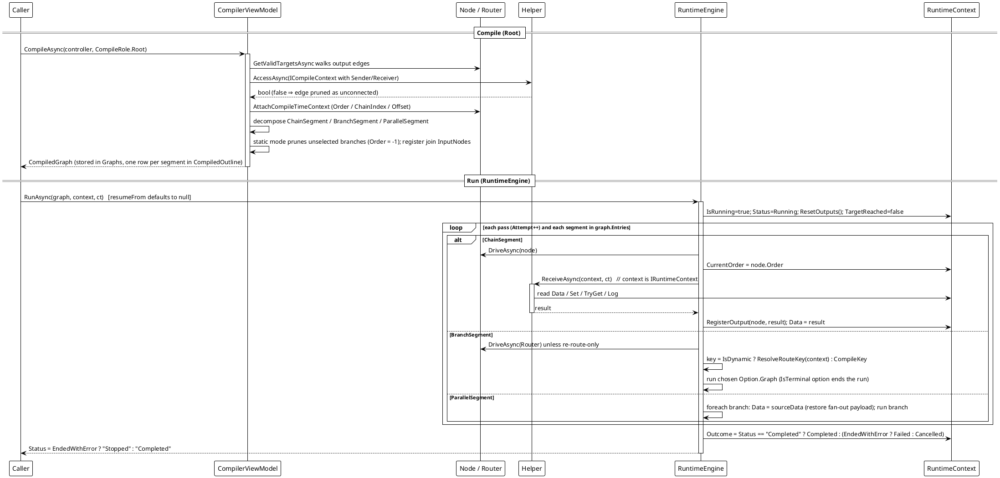

# 工作流系统 — 编译与运行（Root）

`CompileAsync(role: Root)` → `RuntimeEngine.RunAsync` → `ReceiveAsync`。

两个相位。**编译**从控制器出发走可达子图并构建不可变分段：线性串折成 `ChainSegment`，实现 `ICompileTimeRouter` 的节点成为 `BranchSegment`，多目标扇出成为 `ParallelSegment`。每条输出边都用发送方的 `AccessAsync` 以 `ICompileContext` 做静态校验（被拒绝的边按「未连接」处理并丢弃）；每个可达节点经 `ICompileTimeAware` 得到固定的编译身份（`Order`/`ChainIndex`/`Offset`），多输入汇合点会登记其输入来源节点。**运行**驱动这些分段：引擎独占下游派发，直接用 `IRuntimeContext` 调 `Helper.ReceiveAsync`，把返回值写回 `context.Data`，并登记每个节点的产物。



取消路径：`ct.ThrowIfCancellationRequested()` 终止本趟；节点抛出的 `OperationCanceledException` 会立即重抛（取消**不是**重定向），`RunAsync` 把 `Status` 置为 `"Stopped"` 并记 `RunOutcome.Cancelled` —— 且**不**写 `[Error]` 日志行，因为宿主停掉自己的运行不是失败。

**实测行为**（在随库实现上复现，三节点链 `Ticker → Bias → Printer`）：

```text
[2] root: Completed data=tick->bias->print attempt=1 outcome=Completed
[2] orders: 0,1,2
[2] entries=1 first=ChainSegment
```

三个节点拿到了连续的编译序号 `0,1,2`，线性串折成**一个** `ChainSegment`。

*源码：`Src/Core/VeloxDev.Core/WorkflowSystem/CompilerEx/Compile/CompilerViewModel.cs`（第 26-57 行入口、59-249 行分解、414-447 行 `GetValidTargetsAsync`）；`CompilerEx/Runtime/RuntimeEngine.cs`（`RunAsync` 52-128、`RunExecuteAsync` 166-247、`RunParallelAsync` 329-383、`DriveAsync` 412-506）。Demo：`Examples/Workflow/Common/Lib/ViewModels/Workflow/ControllerViewModel.cs`。测试：`CompilerEx/RuntimeEngineRunTests.cs`、`CompilerEx/EntrySemanticsTests.cs`。*
