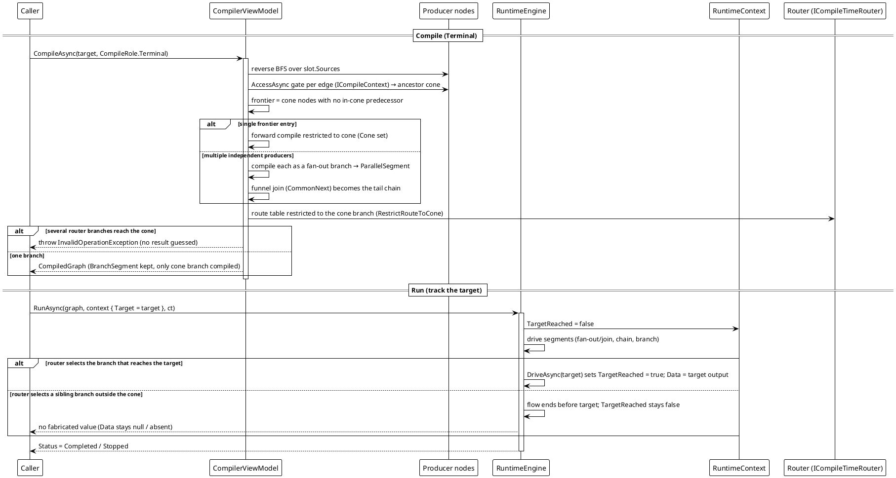

# 工作流系统 — 反向 / 终端锥流程

`CompileAsync(role: Terminal)` → 带 `Target` 运行。

`CompileRole.Terminal` 从某个汇点节点的**祖先锥**算出它的结果：沿 `Sources` 做反向 BFS，每条边用发送方的 `AccessAsync` 校验（被拒绝的边不算祖先）。锥自身的入口前沿（没有锥内输入的节点）自动推导 —— 不需要控制器/起点节点。锥上的路由**保留真实的 `BranchSegment` 语义**，但只编译通向锥内的那条分支（`RestrictRouteToCone`）；多个独立生产者先作为 `ParallelSegment` 汇入目标，再接一条公共汇合链。可达性由 `RuntimeContext.Target`/`TargetReached` 报告；绝不伪造结果。



**实测行为**（在随库实现上复现，三节点链 `Ticker → Bias → Printer`，目标是中间那个节点）：

```text
[3] result: Completed data=tick->bias reached=True
```

运行在 `Bias` 之后停下 —— `data` 是目标节点自己的产物，**不是** `tick->bias->print` —— 而且因为该节点真被驱动过，`TargetReached` 为 `true`。

*源码：`Src/Core/VeloxDev.Core/WorkflowSystem/CompilerEx/Compile/CompilerViewModel.Reverse.cs`（`BuildAncestorConeAsync` 第 33-74 行、`CompileConeAsync` 82-134）；`CompilerViewModel.cs` 的 `RestrictRouteToCone` 第 303-325 行。测试：`CompilerEx/CompileToReverseTests.cs`（`RouterOnConePath_SelectedBranchMatchesTarget_ReachesAndReturnsResult`、`RouterOnConePath_SelectedSiblingBranch_TargetNotReached_FlowEndsWithoutValue`、`FanOutJoin_TargetAfterJoin_CompilesConeFunnel_GroupDataAtJoin`、`MultiLevelFanInAcrossIndependentEntries_ThrowsInformative`）。*
