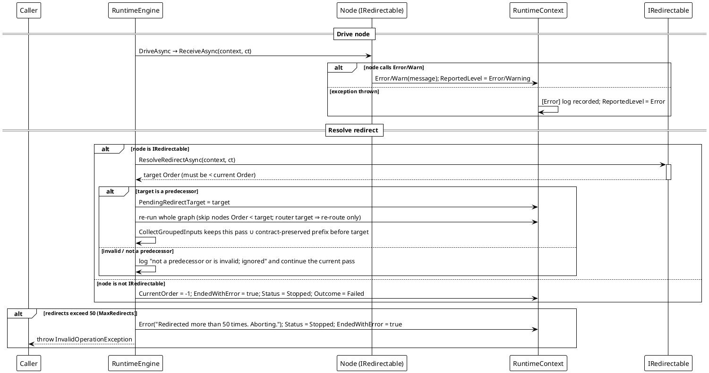

# 工作流系统 — 重定向重跑

`RuntimeContext.Error()` → `IRedirectable` → 整图重跑。

节点内的 `Error()`/`Warn()` 调用，或 `ReceiveAsync` 抛出的异常，都是一次重定向请求。节点实现 `IRedirectable` 时返回一个前驱 `Order`，`RunAsync` 就朝那个状态重跑整张图 —— `Order < 目标` 的节点被跳过，因此一次重定向可以跨链跳过、再往后接着跑。产物登记表在趟与趟之间**不**清空；陈旧产物由趟戳与 `ActiveRedirectTarget` 过滤，汇合点因此绝不会聚合被重跑否决掉的结果。



**实测行为**（在随库实现上复现；`boom` 节点永远抛出，且不实现 `IRedirectable`）：

```text
[10] compensate: status=Stopped outcome=Failed currentOrder=-1 reversed=[BoomNode]
```

`Status = Stopped`、`Outcome = Failed`、状态码掉到 `-1`，而本轮已经成功过的节点被交给了补偿器。

**两个层级、两种结局。** `Warn` 是提醒 —— 写一行日志，运行带着节点返回的值继续走。`Error` 与未捕获的异常是停止：那次驱动算作产出了 `null`，除非有 `IRedirectable` 安排路线，否则流程以状态码 `-1` 结束。路由器或重定向契约**抛出**异常同样结束整轮，相位是 `ExecutionFailurePhase.Router` / `.Redirect` —— 已经没有答案可给了（`EngineHostContractFailureTests`）。

*源码：`Src/Core/VeloxDev.Core/WorkflowSystem/CompilerEx/Runtime/RuntimeEngine.cs`（`RunAsync` 52-128、`RunExecuteAsync` 166-247、重定向解析 216-244）；`CompilerEx/Runtime/Model/RuntimeContext.cs`；`CompilerEx/Runtime/Contracts/IRedirectable.cs`。测试：`CompilerEx/RuntimeRedirectTests.cs`（`RedirectToPredecessor_SkipsPrefixOnRerun_CountsNodesPerPass`、`RedirectTargetNotAPredecessor_IsIgnored_FlowCompletesSinglePass`、`RedirectToRouter_ReroutesOnly_WithoutRecomputingRouter`、`RedirectIntoABranch_EntersIt_AndDrivesFromTheTargetInside`、`RedirectLoopsExceedingLimit_AbortWithException`）。*
