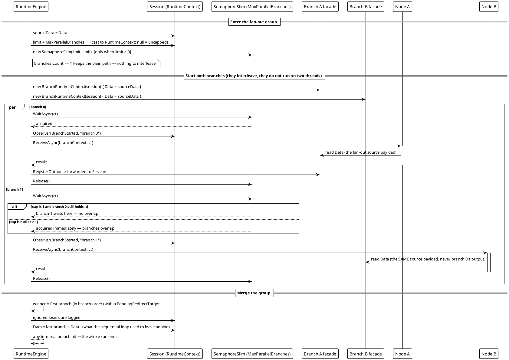

# 工作流系统 — 并行扇出与并发上限

`ParallelSegment` 让它的分支**并发**运行 —— 是交错的异步操作而不是线程 —— 并用 `MaxParallelBranches` 限制一个组同时有多少条在飞。

每条分支拿到自己的 `BranchRuntimeContext`：载荷、重定向请求与日志缓冲都是分支私有的，而身份、进度、产物登记表与共享变量留在宿主那唯一一个会话上。每条分支都从**扇出源**的载荷出发，绝不会读到兄弟的产物。日志是**转发**而不是缓冲，所以行按实际发生的顺序读。



**确定性，按分支顺序。** 多条分支同时请求重定向时**分支顺序第一条**胜出，其余记日志忽略 —— 按*顺序*而不是按墙上时钟，运行因此可复现。会话里留下的载荷是最后那条分支的。任意分支内命中终结分支即整轮结束。相比早先的顺序引擎有一处刻意的改变：分支抛出不再中途打断兄弟 —— 异常在整个组跑完之后才浮出来。

**实测行为**（在随库实现上复现；两条各 120 ms 的分支）：

```text
[11] segments: ChainSegment, ParallelSegment
[11] MaxParallelBranches=null: overlap=True
[11] MaxParallelBranches=1:    overlap=False
```

不设上限时两条分支同时在飞（总墙钟 ≈ 一条分支的时间，而不是两条）；`MaxParallelBranches = 1` 时第二条分支的开始落在第一条结束之后。

没有 demo 设置 `MaxParallelBranches`；契约由 `ParallelExecutionTests` 钉住（`Branches_AreInFlightAtTheSameTime`、`MaxParallelBranches_SerialisesTheGroupWhenSetToOne`、`EachBranch_SeesOnlyTheFanOutSourcePayload`、`LogLines_KeepTheOrderTheyHappened`、`TwoBranchesAskingToRedirect_TheFirstInBranchOrderWins_AndTheOtherIsLogged`）。

*源码：`Src/Core/VeloxDev.Core/WorkflowSystem/CompilerEx/Runtime/RuntimeEngine.cs` —— `RunParallelAsync` 第 329-383 行、`RunOneBranchAsync` 389-403；`CompilerEx/Runtime/Model/BranchRuntimeContext.cs`。*
