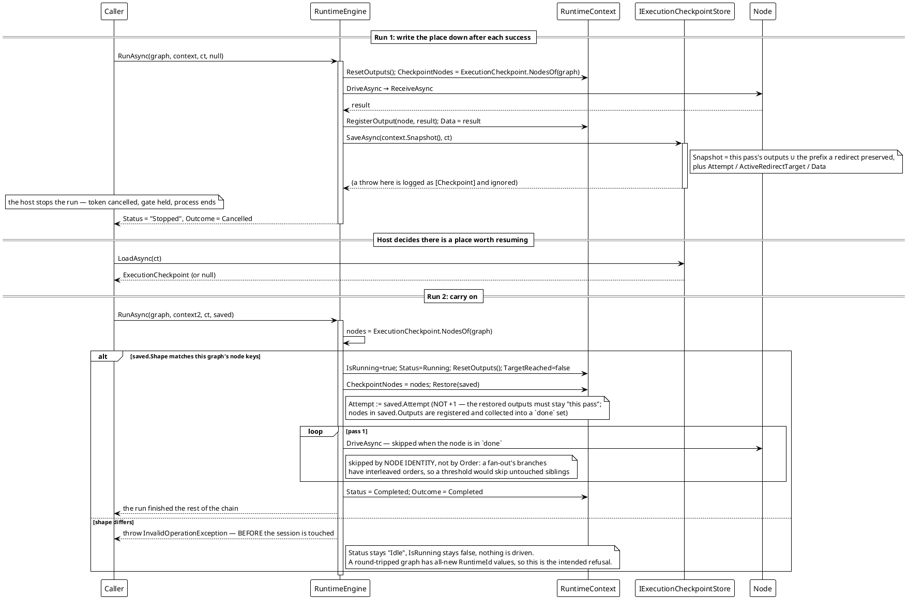

# 工作流系统 — 从检查点恢复

引擎在每个节点成功后把运行的*当前*位置写下来，而 `RunAsync` 可以把它作为 `resumeFrom` 参数接回去。它记录为已完成的节点不会再被驱动；取自另一张图的检查点在碰会话之前就被拒绝。



**实测行为**（在随库实现上复现；三节点链，运行在第一个节点之后停下）：

```text
[7] checkpoint: attempt=1 outputs=1 shape=<三个 RuntimeId GUID>
[7] resume: status=Completed data=tick->bias->print outcome=Completed
[7] refused on a serialized copy: The checkpoint does not belong to this graph status=Idle
```

恢复把链从断点跑完；取自序列化副本的检查点被拒绝，而 `Status` 仍读作 `Idle`，因为什么都没被碰过。

**说明：**

- **一个存储，一次运行。** 引擎写的是运行的*当前*状态而不是历史 —— 一个存储里只有一份最新检查点。保存多轮位置的宿主就保存多个存储，或者在自己的实现里按 `IRuntimeContext.Uid` 分键。
- **保存是尽力而为。** 抛异常的存储只换来一行 `[Checkpoint]`，运行照常继续。
- **恢复的那一趟原样沿用检查点里的 `Attempt`**，不是 `+1`：产物登记表按它盖戳，加一等于把铺回去的产物降级成陈旧产物，汇合点会立刻读不到它们。此后的重定向重跑照旧一趟加一。
- **汇合载荷按节点键归档，而不是按节点引用。** `Snapshot()` 把 `IGroupData` 改写成普通的 `Dictionary<string, object?>` —— 节点引用写不进文件，而且序列化它会顺带把整棵树拖进去。
- **数字经文件会丢类型。** 检查点是 JSON，而 JSON 只有一种整数类型：进去的 `int` 回来是 `long`。引擎自己的字段是精确的，但一个用 `int` 匹配载荷的节点在经 `FileCheckpointStore` 恢复之后匹配不上。`InMemoryCheckpointStore` 没有这个缺口。宿主确信另一份不同身份的图是同结构时，用 `ExecutionCheckpoint.Rekey(checkpoint, target)` 显式表态。

*源码：`Src/Core/VeloxDev.Core/WorkflowSystem/CompilerEx/Runtime/RuntimeEngine.cs` —— `RunAsync` 52-128（`RequireSameShape` 613-628、`Restore` 632-649、`SaveCheckpointAsync` 652-663）；`CompilerEx/Runtime/Model/ExecutionCheckpoints.cs`；`CompilerEx/Runtime/Model/RuntimeContext.cs`（`Snapshot` 183-207、`ResetOutputs` 371-375）。测试：`CompilerEx/ExecutionCheckpointTests.cs`。*
