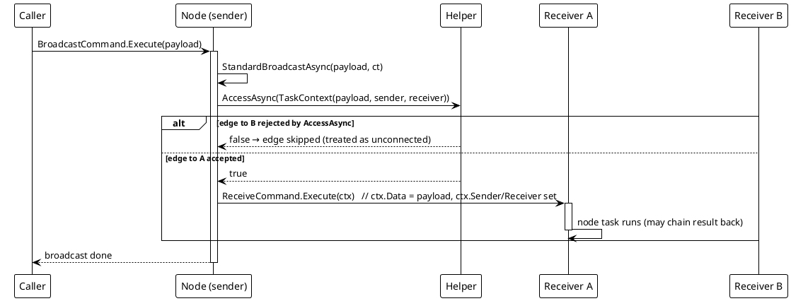

# 工作流系统 — 广播派发（非 Compiler）

`StandardBroadcastAsync` —— 无状态的边级路径。

模型有三个执行入口：① 单节点任务（`ReceiveCommand.Execute(ctx)` 带一个 `ITaskContext`），② 边级广播，③ 链级编译运行。本图画的是入口 ②：`StandardBroadcastAsync` 遍历本节点的输出槽位目标，为每条边构造一个 `TaskContext(parameter, sender, receiver)`，施加运行期 `AccessAsync` 门 —— 被拒绝的边按「未连接」跳过 —— 再经 `ReceiveCommand.Execute(ctx)` 逐条投递被接受的边。入口 ③ 从不走这条路：编译引擎自己派发下游，从不触发节点命令。

汇合聚合（`IGroupData`）、重定向契约与序列化往返都是 Compiler 路径的事，分别在 `01_编译与运行` 与 `02_终端锥` 页分析。非 Compiler 路径没有汇合、没有重定向、也没有可达性模型：多输入节点只是每来一条入边就跑一次。

*源码：`Src/Core/VeloxDev.Core/WorkflowSystem/StandardEx/WorkflowNodeEx.cs`，`StandardBroadcastAsync` 第 109-139 行（反向：`StandardReverseBroadcastAsync` 第 141-171 行，走 `Sources`）。测试：`CompilerEx/EntrySemanticsTests.cs`（`StandardBroadcast_DeliversTaskContextPerValidEdge_SkipsAccessRejectedEdge`、`CompiledRun_DrivesOnlyThroughHelper_NeverExecutesNodeCommands`）。*
