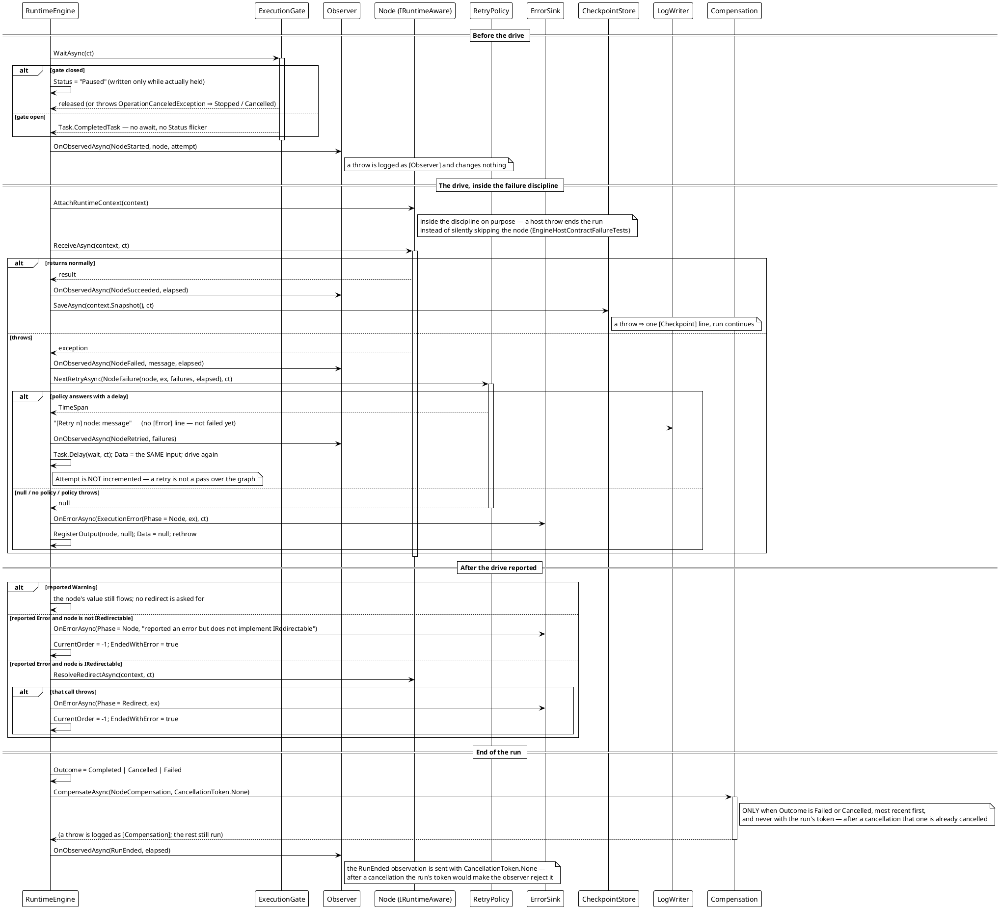

# 工作流系统 — 包在一次驱动周围的宿主能力

2026-09-27 加入的七个可选接缝，包在一次节点驱动周围。每一个都经私有的 `Session()` 助手从具体的 `RuntimeContext` 上读，因此在扇出内同样有效；每一个不设置时都精确复现 2026-09-27 之前的行为。



## 顺序就是契约

| # | 步骤 | 从哪读 | 抛出的含义 |
|---|---|---|---|
| 1 | `ExecutionGate.WaitAsync(ct)` | `RuntimeContext.ExecutionGate` | 抛 `OperationCanceledException` ⇒ `Stopped` / `Cancelled` |
| 2 | `Observer` —— `NodeStarted` | `.Observer` | 记 `[Observer]`，运行不变 |
| 3 | `IRuntimeAware.AttachRuntimeContext` | 节点 | **运行结束**（不是静默跳过） |
| 4 | `ReceiveAsync` | 节点 | 进入第 5 步 |
| 5 | `RetryPolicy.NextRetryAsync` | `.RetryPolicy` | 视作「不再重试」 |
| 6 | `ErrorSink.OnErrorAsync` | `.ErrorSink` | 吞掉，记 `[ErrorSink]` |
| 7 | `CheckpointStore.SaveAsync` | `.CheckpointStore` | 记 `[Checkpoint]`，运行继续 |
| 8 | `Compensation.CompensateAsync` | `.Compensation` | 记 `[Compensation]`，其余照跑 |
| — | `LogWriter.Write` | `.LogWriter` | 丢弃，在 `RuntimeContext.LogWriteFailed` 上上报 |

有两条规矩贯穿所有接缝：**引擎不为取消写任何日志行**，以及**一次上报绝不会让上报它的那次运行失败**。

**实测行为**（在随库实现上复现 —— 每项能力一个会话）：

```text
[5] paused: status=Paused isPaused=True running=True data=<null>
[6] observed: NodeStarted:TickerNode, NodeSucceeded:TickerNode, NodeStarted:BiasNode, NodeSucceeded:BiasNode, NodeStarted:PrinterNode, NodeSucceeded:PrinterNode
[6] sink on a clean run: 0 records
[8] retry: status=Completed data=ok drives=3 attempt=1
[8] retry logs: 01. FlakyNode | 02. [Retry 1] FlakyNode: flaky #1 | 03. [Retry 2] FlakyNode: flaky #2
[9] logfile: fileLines=3 retained=2      （写入器一行不丢；Logs 只留最新 2 行）
[10] compensate: status=Stopped outcome=Failed currentOrder=-1 reversed=[BoomNode]
```

*源码：`Src/Core/VeloxDev.Core/WorkflowSystem/CompilerEx/Runtime/RuntimeEngine.cs`（`DriveAsync` 412-506、`NextRetryAsync` 511-531、`ReportErrorAsync` 534-540、`NotifyErrorAsync` 543-557、`CompensateAsync` 561-581、`ObserveAsync` 585-599、`OutcomeOf` 602-610、`Session` 672-678）；`CompilerEx/Runtime/Model/RuntimeContext.cs`（`AppendLog` 260-279、`ReportNodeAsync` 329-342）。Demo：`Examples/Workflow/Common/Lib/ViewModels/Workflow/WorkflowDemoSession.cs` 的 `ConfigureRun`。测试：`CompilerEx/Execution{Gate,Observer,Retry,ErrorSink,Compensation}Tests.cs`、`NodeReportTests.cs`、`CompilerLogWriterTests.cs`。*
