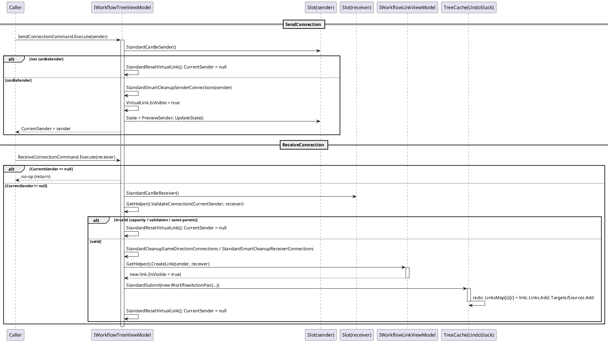
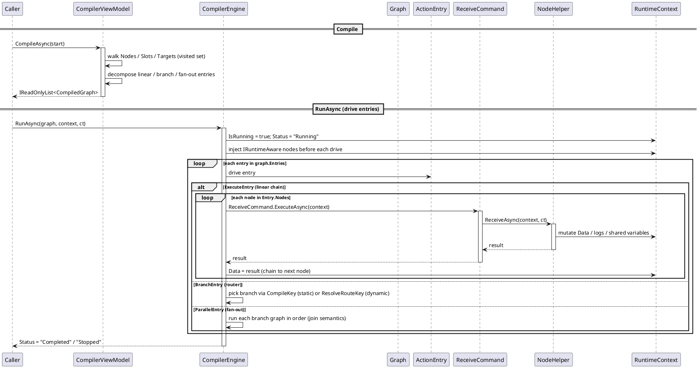
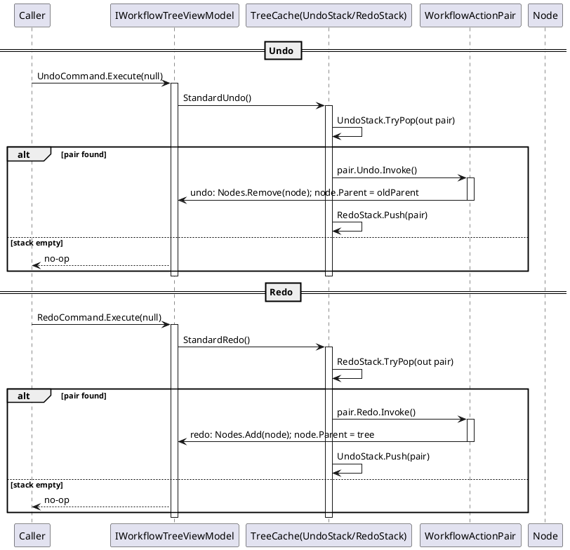
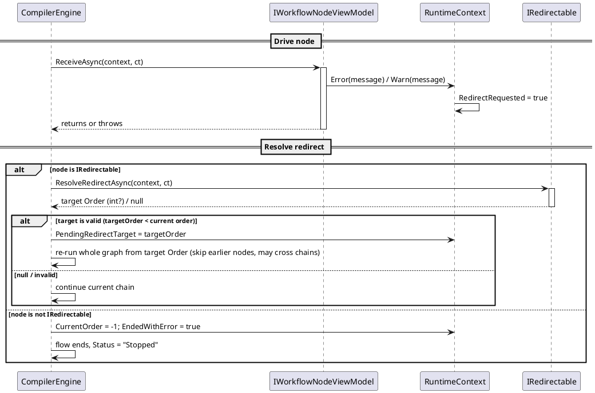
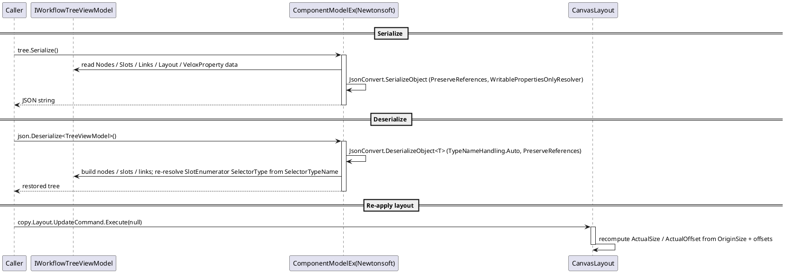

# 数据流 — 工作流系统

五个 PlantUML 时序图追踪主要数据流。每个参与者都已声明，每个 `activate` 都有配对的 `deactivate`，`alt/else/end` 块均已配平。

## 1. 连接流 —— `SendConnection` → `ReceiveConnection` → `CreateLink`

连接分两个阶段建立。`SendConnection(sender)` 检查发送端容量、显示 `VirtualLink` 并设置 `PreviewSender`。`ReceiveConnection(receiver)` 校验容量 + `ValidateConnection`、清理同向连接冲突、经 `GetHelper().CreateLink(...)` 创建连接，并把整条连接作为一个可撤销的 `WorkflowActionPair` 提交。

错误路径：任何校验失败（容量、自定义 `ValidateConnection`、同节点连接）都会重置虚拟连接且不建立连接；已有的同向连接通过提交的 `WorkflowActionPair` 被原子替换。

*源码：`Src/Core/VeloxDev.Core/WorkflowSystem/StandardEx/WorkflowTreeEx.cs`，`StandardSendConnection` 第 97-128 行、`StandardReceiveConnection` 第 130-171 行、`StandardCreateNewConnection` 第 375-428 行。*

## 2. 编译 + 运行 —— `CompileAsync` → `CompilerEngine.RunAsync` → `ReceiveAsync`

`CompilerViewModel.CompileAsync(start)` 把起点可达子图分解成 `CompiledGraph`（线性段 → `ExecuteEntry`、分支 → `BranchEntry`、扇出 → `ParallelEntry`）。`CompilerEngine.RunAsync(graph, context, ct)` 逐个条目驱动节点的 `ReceiveCommand → ReceiveAsync(context, ct)`，并用返回值写回 `RuntimeContext.Data` 链式传给下游。

取消路径：`ct.ThrowIfCancellationRequested()` 会中止整条链；节点抛出的 `OperationCanceledException` 立即重抛（取消不是重定向）。

*源码：`Src/Core/VeloxDev.Core/WorkflowSystem/CompilerEx/CompilerViewModel.cs`、`CompilerEngine.cs`（`RunGraphAsync` 第 63-89 行、`RunExecuteAsync` 第 96-148 行）。测试证据：`CompilerExTests.CompileThenRun_EngineDrivesGraph_WithRuntimeContext`。*

## 3. 撤销 / 重做

每个变更操作都以 `WorkflowActionPair(redo, undo)` 压入 `ConcurrentStack`。`UndoCommand` 弹出操作对并执行其 `Undo`，随后压入重做栈；`RedoCommand` 相反。

错误路径：若 `pair.Redo/Undo.Invoke()` 抛出异常，`StandardSubmit`/`StandardUndo`/`StandardRedo` 会捕获并通过 `Debug.WriteLine` 记录 —— 栈保持不变。

*源码：`Src/Core/VeloxDev.Core/WorkflowSystem/StandardEx/WorkflowTreeEx.cs`，`StandardSubmit` 第 210-222 行、`StandardUndo` 第 224-239 行、`StandardRedo` 第 193-208 行。*

## 4. 错误 / 重定向 —— `RuntimeContext.Error()` → `IRedirectable` 重跑

节点在 `ReceiveAsync` 中调用 `RuntimeContext.Error()/Warn()` 或抛异常即请求重定向。若实现 `IRedirectable`，引擎按返回的 `CompileContext.Order` 重跑整张图（跳过目标之前的节点，可跨链）；否则流程结束、状态 `-1`。

回退超过 50 次（`MaxRedirects` → 抛 `InvalidOperationException`）后放弃。若目标 Order 是一个 Router，引擎只重新路由、不重新计算。

*源码：`Src/Core/VeloxDev.Core/WorkflowSystem/CompilerEx/CompilerEngine.cs`（`RunAsync` 第 20-60 行、`RunExecuteAsync` 第 96-148 行）、`IRedirectable.cs`。测试证据：`RedirectTests.RedirectGate_RedirectsToChainHead_ThenSucceeds`、`RedirectTests.RedirectCrossChain_SkipsPriorAndReruns`、`RedirectTests.RedirectToRouter_ReroutesWithoutRecompute`。*

## 5. 异步 / 序列化 —— `Serialize` / `Deserialize`

`ComponentModelEx` 通过 Newtonsoft 以 `PreserveReferencesHandling.Objects` 和只写属性解析器把整张图序列化为 JSON；反序列化重建图，并从序列化的 `SelectorTypeName` 重新解析 `SlotEnumerator.SelectorType`。调用方随后用 `Layout.UpdateCommand` 重新应用布局。

错误路径：`TryDeserialize` 对 null / 空 / 畸形输入返回 `false` 而不抛出；`Deserialize` 在结果为空时抛 `JsonSerializationException`。

*源码：`Src/Core/VeloxDev.Core.Extension/ComponentModelEx.cs`。测试证据：`WorkflowSerializationTests.TreeWithEnumNode_RoundTripsSelectorType`。演示加载路径：`Examples/Workflow/WPF/Demo/Views/Workflow/WorkflowView.xaml.cs`，第 46-51 行。*
