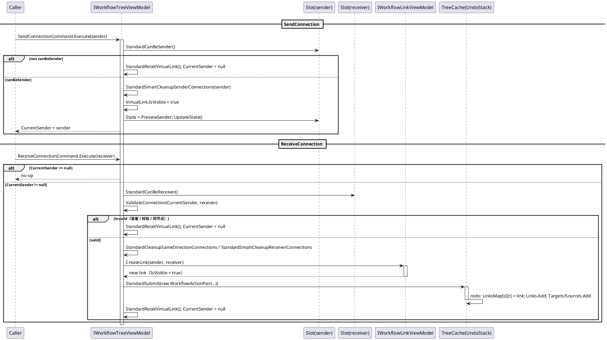
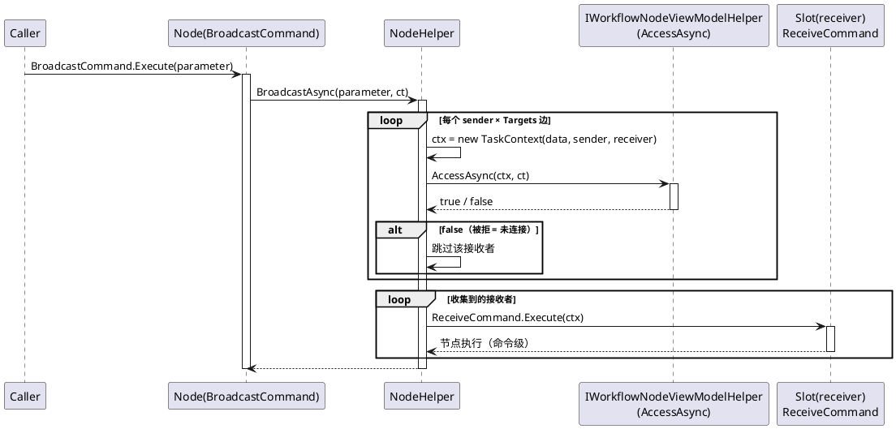
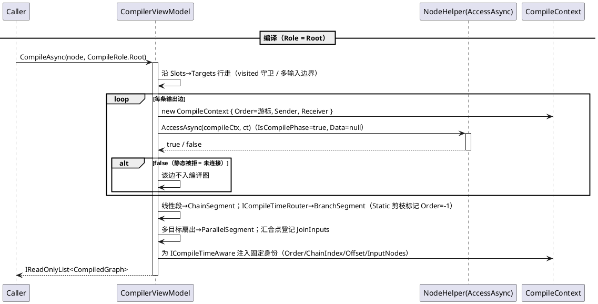
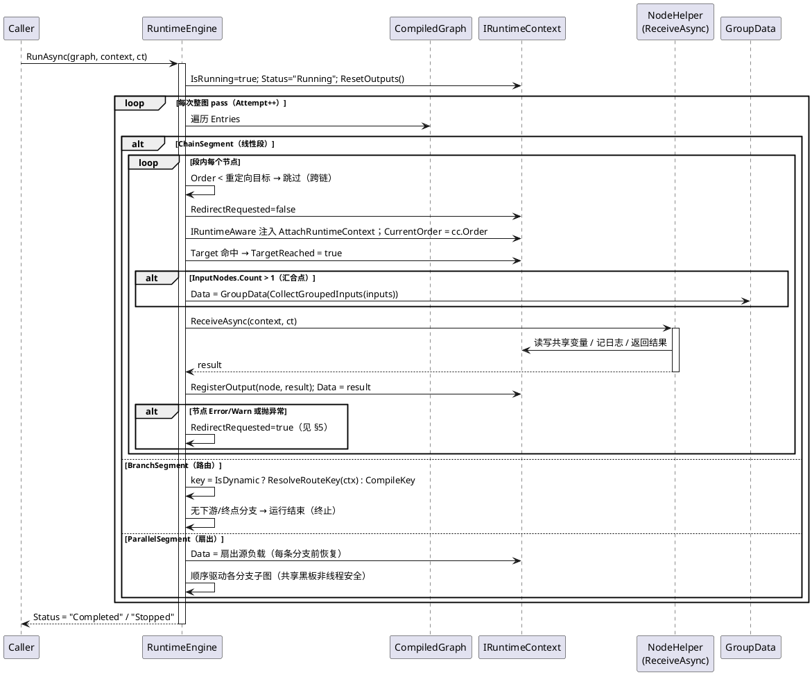
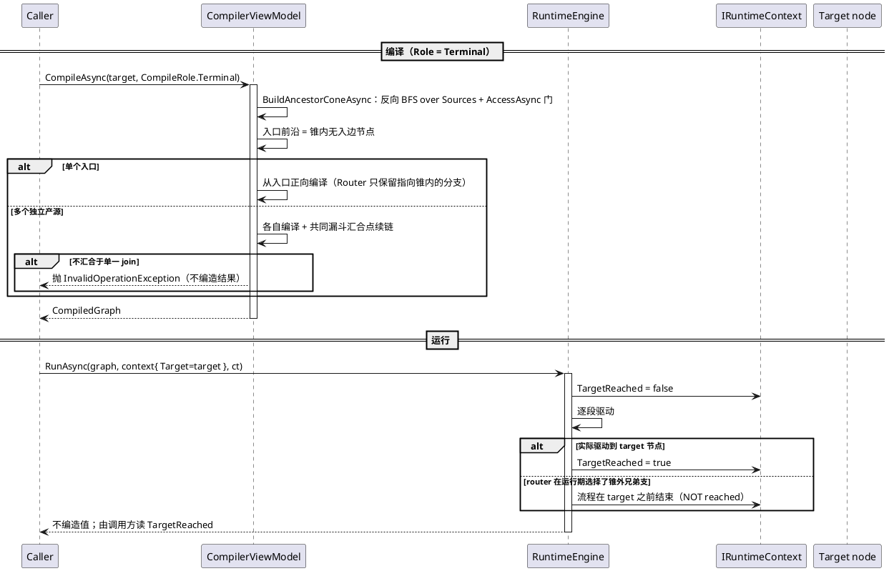
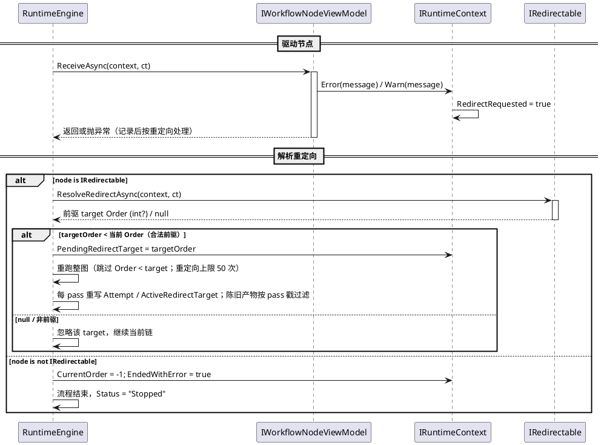
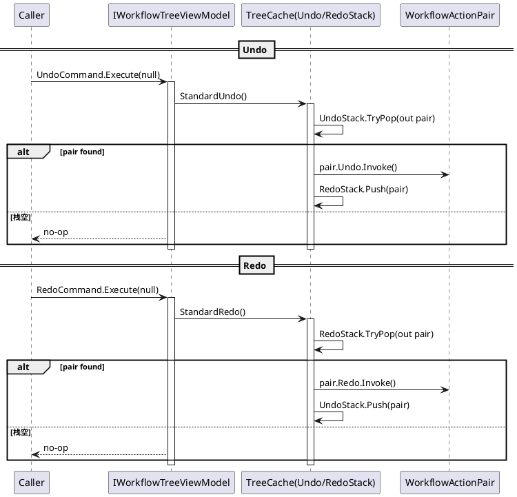
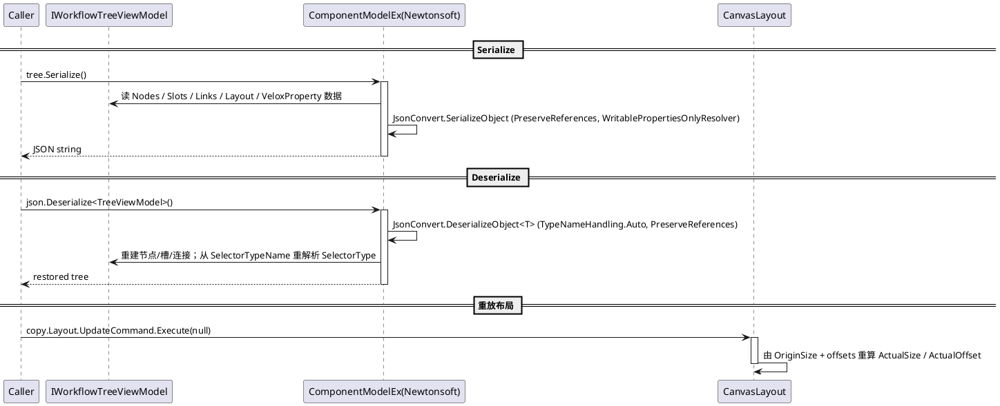

# 数据流 — 工作流系统

八张 PlantUML 时序图追踪主要数据流。所有参与者均已声明，每个 `activate` 都有配对的 `deactivate`，`alt/else/end` 块已配平。执行模型是**两阶段**：编译期 `CompilerViewModel.CompileAsync` 固定身份并做静态校验（此时上下文 `IsCompilePhase = true`、`Data = null`）；运行期 `RuntimeEngine.RunAsync` 以 `IRuntimeContext` 会话驱动不可变段（`Data` 携带真实负载）。

## 1. 连接流 —— `SendConnection` → `ReceiveConnection` → `CreateLink`

连接分两阶段建立。`SendConnection(sender)` 检查发送端容量、清理同向连接冲突、显示 `VirtualLink` 并设 `PreviewSender`。`ReceiveConnection(receiver)` 校验容量 + `ValidateConnection` + 同节点判定，成功后经 `GetHelper().CreateLink(...)` 建连，并把整条连接作为一个可撤销的 `WorkflowActionPair` 提交。

错误路径：任何校验失败（容量、自定义 `ValidateConnection`、同节点连接）都重置虚拟连接且不建立连接；已有同向连接通过提交的 `WorkflowActionPair` 原子替换。

*源码：`Src/Core/VeloxDev.Core/WorkflowSystem/StandardEx/WorkflowTreeEx.cs`——`StandardSendConnection` 第 97-128 行、`StandardReceiveConnection` 第 130-171 行、`StandardCreateNewConnection`（private）第 375-428 行；`StandardCanBeSender/StandardCanBeReceiver` 在 `StandardEx/WorkflowSlotEx.cs` 第 179-189 行。*

## 2. 广播派发（无状态）—— `BroadcastCommand` → `BroadcastAsync` → 每边 `AccessAsync` 门

单节点任务与无状态广播都经命令层。`BroadcastCommand` 触发节点的广播处理器（`NodeDefaultViewModel.Broadcast`，第 121-125 行）→ `NodeHelper.BroadcastAsync` → `StandardBroadcastAsync`：先对每个输出槽的每条 `Targets` 边构造携带 `data/sender/receiver` 的 `TaskContext`，用**运行期** `AccessAsync`（`IsCompilePhase = false`、`Data` 有值）逐边过滤（被拒边视为未连接），再在第二遍对每个通过的接收者执行 `ReceiveCommand.Execute(ctx)`：

反向广播对称（`ReverseBroadcastCommand` → `StandardReverseBroadcastAsync`，沿 `Sources` 派发，`WorkflowNodeEx.cs` 第 141-171 行）。选择器的无状态路径更窄：`EnumSelectorHelper` 只把数据投给**当前选中分支**对应槽位的下游（`SelectorBroadcast.ToSlotAsync`，每个接收者也过 owner 的 `AccessAsync` 门）。派发最终仍落在 `ReceiveCommand`，而编译运行不触发任何节点命令——引擎直接调 `Helper.ReceiveAsync`（见 §3）。

*源码：`Src/Core/VeloxDev.Core/WorkflowSystem/StandardEx/WorkflowNodeEx.cs`（`StandardBroadcastAsync` 第 109-139 行）。测试证据：`EntrySemanticsTests.StandardBroadcast_DeliversTaskContextPerValidEdge_SkipsAccessRejectedEdge`（第 40-71 行）、`CompiledRun_DrivesOnlyThroughHelper_NeverExecutesNodeCommands`（第 17-38 行）。*

## 3. 编译 + 运行（Root 正向）—— `CompileAsync(Root)` + `RuntimeEngine.RunAsync`

`CompilerViewModel.CompileAsync(node, CompileRole.Root)` 把 node 当作根/入口，沿 `Targets` 下游把可达子图分解为段（`ChainSegment`/`BranchSegment`/`ParallelSegment`）；每条输出边都经 `AccessAsync` 静态校验。`RuntimeEngine.RunAsync` 随后驱动各段，把每节点 `ReceiveAsync` 的返回值写回 `context.Data` 链式传给下游。

编译图是**不可变**的可能执行集合描述（`CompiledGraph` 文档第 6-10 行），真实路径由运行期状态决定。取消：`ct.ThrowIfCancellationRequested()` 中止链；节点抛 `OperationCanceledException` 立即重抛（取消不是重定向）。

*源码：`CompilerEx/Compile/CompilerViewModel.cs`（第 37-57 行统一入口、第 59-232 行 `CompileGraphAsync`、第 397-430 行 `GetValidTargetsAsync` 逐边 `AccessAsync`）、`CompilerEx/Runtime/RuntimeEngine.cs`（第 19-68 行 `RunAsync`、第 71-97 行 `RunGraphAsync`、第 106-160 行 `RunExecuteAsync`、第 205-214 行扇出恢复、第 227-261 行 `DriveAsync`）。测试证据：`RuntimeEngineRunTests.LinearChain_DrivesEachNodeOnceInOrder_DataFlowsThroughSession`、`FanOutParallel_RestoresSourcePayload_BeforeEachBranch`、`JoinWithTwoUpstreams_ReceivesGroupDataKeyedBySourceNode`、`CompileDecompositionTests.InvalidOutputEdge_AccessFalse_IsPrunedFromGraph_DegradesToSinglePath`、`StaticRouter_SelectionALocksCompileKey_UnselectedBranchDownstreamGetsMinusOne`。*

## 4. 反向 / Terminal 锥编译与运行 —— `CompileAsync(node, CompileRole.Terminal)`

以节点为*结果终点*，无需显式起点：编译器沿 `Sources` 反向 BFS 收集其**祖先锥**（每条反向边也过 owner 的 `AccessAsync` 门，与正向同一“被拒即未连接”规则），锥内无入边者构成入口前沿；Router 保留真实分支语义，只编译通往锥内的分支，扇入的多个独立产源汇合到共同的漏斗汇合点后继续：

约束：若某 Router 有**多条**不同 key 分支都能抵达终点，则“单次正向运行只能走一支”，该锥被拒绝而非猜测（`RestrictRouteToCone` 抛 `InvalidOperationException`）；若多个独立产源不汇合到单一共同 join，同样拒绝（series-parallel 锥之外不可表达）。汇合处 `InputNodes.Count > 1` 时运行期注入 `IGroupData`，与正向语义一致。

*源码：`CompilerEx/Compile/CompilerViewModel.Reverse.cs`（`BuildAncestorConeAsync` 第 33-74 行、`CompileConeAsync` 第 82-134 行）、`CompilerEx/Compile/CompilerViewModel.cs`（`RestrictRouteToCone` 第 286-308 行）、`CompilerEx/Compile/CompileRole.cs`。测试证据：`CompileToReverseTests`——`LinearChain_TargetMidCone_CompilesFromOwnEntry_MatchesForwardRun`、`RouterOnConePath_SelectedSiblingBranch_TargetNotReached_FlowEndsWithoutValue`、`FanOutJoin_TargetAfterJoin_CompilesConeFunnel_GroupDataAtJoin`、`NoStartNodeProvided_EntryFrontierIsDerivedFromTheCone`、`MultiLevelFanInAcrossIndependentEntries_ThrowsInformative`。*

## 5. 错误 / 重定向 —— `Error()`/`Warn()` → `IRedirectable` 整图重跑

`ReceiveAsync` 内调用 `Error()/Warn()` 或抛异常即请求重定向。若节点实现 `IRedirectable`，引擎按其返回的前驱 `Order`（`Order < 当前`）重跑整图——目标之前的节点（可跨链）跳过不驱动，属**契约保留前缀**；目标若是 Router 自身则只重新路由、不重算。未实现 `IRedirectable` 时流程以 `-1` 结束：

回退超过 50 次（`MaxRedirects`）抛 `InvalidOperationException` 放弃。重定向是纯运行期契约——编译图本身无环。

*源码：`CompilerEx/Runtime/RuntimeEngine.cs`（第 19-68 行 `RunAsync`、第 136-158 行 `RunExecuteAsync` 重定向分支）、`CompilerEx/Runtime/Contracts/IRedirectable.cs`、`CompilerEx/Runtime/Model/RuntimeContext.cs`（`CollectGroupedInputs` 第 127-151 行 pass 戳过滤）。测试证据：`RuntimeRedirectTests.RedirectToPredecessor_SkipsPrefixOnRerun_CountsNodesPerPass`、`RedirectTargetNotAPredecessor_IsIgnored_FlowCompletesSinglePass`、`RedirectToRouter_ReroutesOnly_WithoutRecomputingRouter`、`RedirectLoopsExceedingLimit_AbortWithException`。*

## 6. 撤销 / 重做

每个变更操作以 `WorkflowActionPair(redo, undo)` 压入撤销栈（`redo` 立即执行）。`UndoCommand` 弹栈运行 `Undo` 后压入重做栈；`RedoCommand` 相反。

错误路径：`pair.Redo/Undo.Invoke()` 抛异常时 `StandardSubmit/StandardUndo/StandardRedo` 捕获并经 `Debug.WriteLine` 记录——栈保持不变。`StandardRemoveConnections` 等批处理把许多微操作聚合进单个操作对，栈深与逻辑用户操作数成正比。

*源码：`Src/Core/VeloxDev.Core/WorkflowSystem/StandardEx/WorkflowTreeEx.cs`——`StandardSubmit` 第 210-222 行、`StandardUndo` 第 224-239 行、`StandardRedo` 第 193-208 行、`TreeCache` 第 655-660 行、`StandardRemoveConnections`（private）第 430-528 行。*

## 7. 序列化（`ComponentModelEx.Serialize` / `Deserialize`）

`ComponentModelEx` 用 Newtonsoft 以 `PreserveReferencesHandling.Objects` 与只写属性解析器把整图序列化为 JSON；反序列化重建图，并从序列化的 `SelectorTypeName` 重新解析 `SlotEnumerator.SelectorType`。调用方随后用 `Layout.UpdateCommand` 重新应用布局：

错误路径：`TryDeserialize` 对 null / 空 / 畸形输入返回 `false` 而不抛；`Deserialize` 结果为空时抛 `JsonSerializationException`。

*源码：`Src/Core/VeloxDev.Core.Extension/ComponentModelEx.cs`。测试证据：`WorkflowSerializationTests`（`Src/Core/VeloxDev.Core.Extension.Test/Agent/Workflow/Functions/WorkflowSerializationTests.cs`）。*
