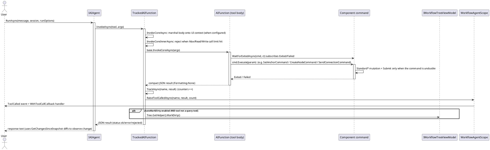

# 数据流 — Agent 工具调用

用户消息交给 agent。发生工具调用时，`TrackedAIFunction.InvokeCoreAsync` 在配置了 UI 上下文时 marshal 到其上，`InvokeCoreInnerAsync` 预检调用上限并运行底层 `AIFunction`。工具体通过**恰好一个**组件命令变更树并等待真实完成；随后 `TrackAsync` 触发 `ToolCalled` 并按需置脏。框架的撤销/重做栈是唯一真相源——工具包从不提交自己的手势。

要点：

- 等待命令完成（`WaitForExitedAsync`、`WaitForCommandAsync`、`WaitForNDispatchesAsync`、`SendReceiveAsync`）保证下一个工具调用不会观察到过期的状态窗口。
- 查询工具绝不自动置脏；状态观察工具（`TakeSnapshot` / `GetChangesSinceSnapshot`）是单独、按需调用的。

> 源码：`Src/Core/VeloxDev.Core.Extension/Agent/Workflow/Functions/WorkflowAgentToolkit.cs`，`TrackedAIFunction` 第 178-242 行、`TrackAsync` 第 264-281 行、等待辅助 第 2672-2767 行；`WorkflowAgentScope.cs`，`RaiseToolCalledAsync` 第 444-450 行。
