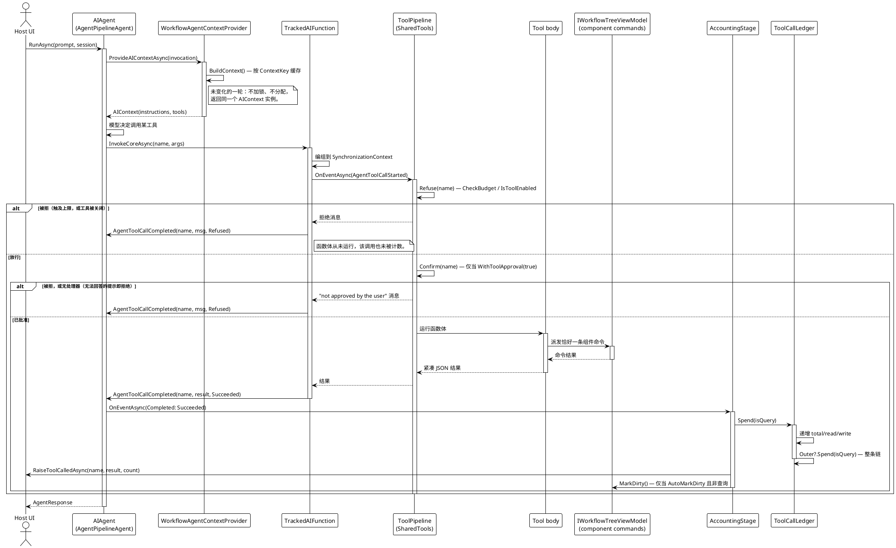

# 数据流 —— 一次工具调用的端到端

每次工具调用 —— 内置、开发者注册、MCP 来源、技能来源或一次子代理派发 —— 都走同一条路径：模型调用某个 `TrackedAIFunction`，它把调用编组到宿主的上下文，并把调用交给作用域的**同一个共享 `ToolPipeline`**，后者在函数体运行前施加预算/宿主策略拒绝与人工审批闸门。函数体派发一条组件命令，完成事件由记账阶段计入。

```plantuml
@startuml
!theme plain

actor "Host UI" as Host
participant "AIAgent\n(AgentPipelineAgent)" as Agent
participant "WorkflowAgentContextProvider" as Provider
participant "TrackedAIFunction" as Tracked
participant "ToolPipeline\n(SharedTools)" as Gate
participant "Tool body" as Tool
participant "IWorkflowTreeViewModel\n(component commands)" as Tree
participant "AccountingStage" as Acct
participant "ToolCallLedger" as Ledger

Host -> Agent: RunAsync(prompt, session)
activate Agent
Agent -> Provider: ProvideAIContextAsync(invocation)
activate Provider
Provider -> Provider: BuildContext() — 按 ContextKey 缓存
note right of Provider
  未变化的一轮：不加锁、不分配，
  返回同一个 AIContext 实例。
end note
Provider --> Agent: AIContext(instructions, tools)
deactivate Provider

Agent -> Agent: 模型决定调用某工具
Agent -> Tracked: InvokeCoreAsync(name, args)
activate Tracked
Tracked -> Tracked: 编组到 SynchronizationContext
Tracked -> Gate: OnEventAsync(AgentToolCallStarted)
activate Gate

Gate -> Gate: Refuse(name) — CheckBudget / IsToolEnabled
alt 被拒（触及上限，或工具被关闭）
    Gate --> Tracked: 拒绝消息
    Tracked -> Agent: AgentToolCallCompleted(name, msg, Refused)
    note right of Tracked
      函数体从未运行，该调用也未被计数。
    end note
else 放行
    Gate -> Gate: Confirm(name) — 仅当 WithToolApproval(true)
    alt 被拒，或无处理器（无法回答的提示即拒绝）
        Gate --> Tracked: "not approved by the user" 消息
        Tracked -> Agent: AgentToolCallCompleted(name, msg, Refused)
    else 已批准
        Gate -> Tool: 运行函数体
        activate Tool
        Tool -> Tree: 派发恰好一条组件命令
        activate Tree
        Tree --> Tool: 命令结果
        deactivate Tree
        Tool --> Gate: 紧凑 JSON 结果
        deactivate Tool
        Gate --> Tracked: 结果
        Tracked -> Agent: AgentToolCallCompleted(name, result, Succeeded)
        deactivate Tracked

        Agent -> Acct: OnEventAsync(Completed: Succeeded)
        activate Acct
        Acct -> Ledger: Spend(isQuery)
        activate Ledger
        Ledger -> Ledger: 递增 total/read/write
        Ledger -> Ledger: Outer?.Spend(isQuery) — 整条链
        deactivate Ledger
        Acct -> Host: RaiseToolCalledAsync(name, result, count)
        Acct -> Tree: MarkDirty() — 仅当 AutoMarkDirty 且非查询
        deactivate Acct
    end
    deactivate Gate
end

Agent --> Host: AgentResponse
deactivate Agent
@enduml
```

来源：`WorkflowAgentToolkit.cs`（`CreateTools`、`CheckBudget`、`ConfirmMutationAsync`、`AccountAsync`、`CreateAccountingStage`）、`TrackedAIFunction.cs`、`ToolPipeline.cs`、`WorkflowAgentContextProvider.cs`。

## 图中所钉定的要点

- **模型永远看不到闸门会拒绝的工具。** `CreateTools` 把被关闭的工具从列表中过滤掉，*并且* `CheckBudget` 在调用时拒绝它们 —— 测试 `SwitchedOffTool_IsRefusedAtCallTime_NotJustHidden` 在开关前捕获 `AIFunction`、开关后调用它，钉定的是拒绝而非仅隐藏。
- **拒绝发生在函数体之前。** 被拒或失败的调用从不运行函数体，因此不计数：`AccountingStage` 只计 `AgentToolOutcome.Succeeded`。测试 `ARefusedTool_IsReportedToTheModel_AndDoesNotCountAsACall` 断言 `CallCount == 0`。
- **一份策略，每个切片。** 闸门实例与 MCP、技能提供器共享，因此 MCP 来源的工具与内置工具被计入同一账本、被同一开关拒绝。
- **`ResetToolCallLimit` 豁免。** 它通过拒绝钩子（逃生舱挺过它本就为之存在的闸门），在用户同意时清零*整条*账本链，且自身从不被计数。
- **支出沿链上行。** 对派发的子代理，`Spend` 递归到 `Outer`，因此根账本的总数就是整棵树任意处的调用数。
