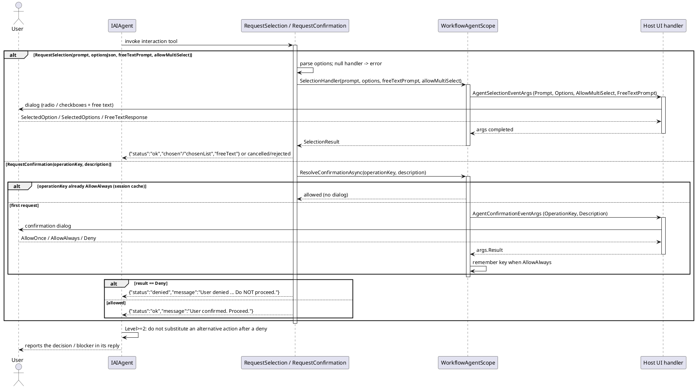

# 数据流 — 交互与确认

当 agent 遇到歧义或破坏性动作时，它可以暂停并把决定权交给宿主 UI。`RequestSelection` 让用户从选项中挑选（另加一个自由文本框）；`RequestConfirmation` 请求允许/拒绝决定，`AllowAlways` 批准按 `operationKey` 在会话余下时间内被记住（`ResolveConfirmationAsync`）。

要点：

- 交互工具仅在存在处理器**且**安全级别 > 0 时注册；`Deny` 不会被绕过——较高安全级别禁止在拒绝后另选替代动作。
- `SelectionResult`（单选/多选/自由文本）从宿主层返回给工具包（`WorkflowAgentScope.SelectionResult`）。

> 源码：`WorkflowAgentScope.cs`，`WithSelectionHandler`/`WithConfirmationHandler`/`ResolveConfirmationAsync` 第 324-450 行；`WorkflowAgentToolkit.cs`，`RequestSelection` 第 2153-2194 行、`RequestConfirmation` 第 2197-2208 行。
