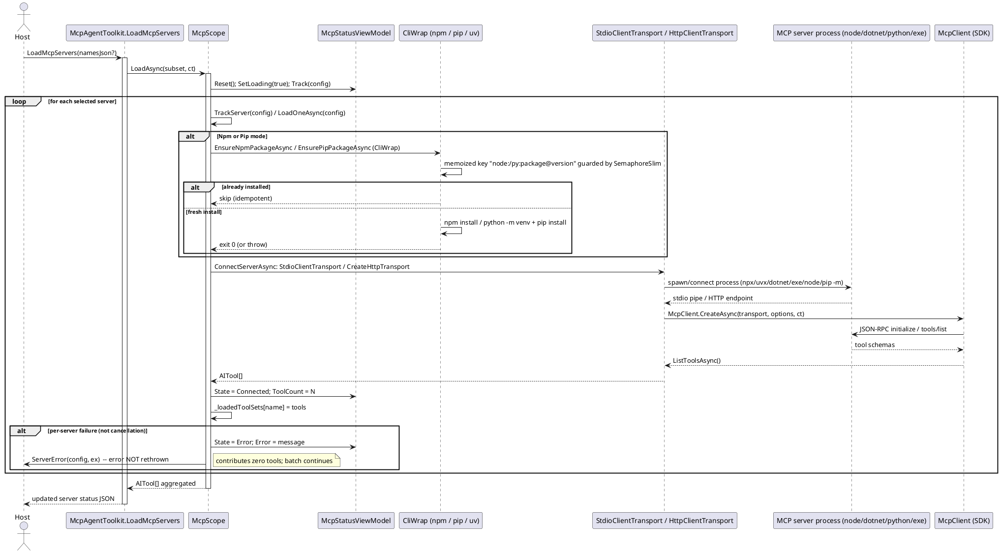

# 数据流 — MCP 服务器加载

`McpAgentToolkit.LoadMcpServers` 汇入 `McpScope.LoadAsync`。每个 `McpServerConfiguration` 变成一组工具：本地模式安装/准备运行时（进程级记忆化），`ConnectServerAsync` 构建 `StdioClientTransport`（`Http` 用 `HttpClientTransport`）并完成 JSON-RPC `initialize`/`tools/list` 握手，返回的工具被加入 `McpScope.LoadedTools`，使按会话组装的工具集（`base tools + LoadedTools`）在下一次调用时体现它们。

要点：

- `Http` 模式不安装任何运行时，直连 `Endpoint`（Streamable HTTP，SSE 兜底）；可选 `headers`/`oauth`/`connectionTimeout`/`transportMode`/`ownsSession` 来自 `McpServerConfiguration.Options`（未知键被拒绝）。
- 取消以 `OperationCanceledException` 传播（不被单服务器处理器捕获）。配置了 `WithSynchronizationContext` 时状态更新 marshal 到 UI 上下文。

> 源码：`Src/Core/VeloxDev.Core.Extension/Agent/MCP/McpScope.cs`，`LoadAsync` 第 167-191 行、`LoadOneAsync` 第 193-230 行、`EnsureNpmPackageAsync` 第 300-332 行、`ConnectServerAsync` 第 382-418 行；`McpAgentToolkit.cs`，`LoadServers` 第 120-162 行。
