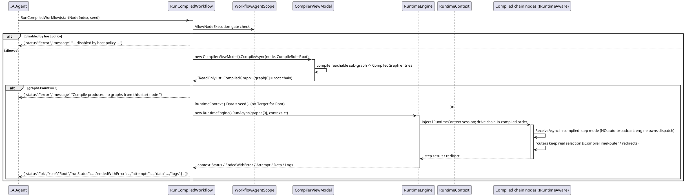

# 数据流 — Root 链运行（`RunCompiledWorkflow`）

`RunCompiledWorkflow(startNodeIndex, seed)` 是链级执行入口——与 demo 的 Run 按钮同一条路径。它用 `CompileRole.Root` 编译从起始节点可达的子图，并让 `RuntimeEngine` 驱动整条链。它与 `ExecuteNode`（单节点经 `ReceiveCommand` 的节点级 EXEC）不同。

要点：

- 引擎拥有下游派发，因此编译步节点不会自动广播；分支选择在运行时经编译期路由器完成，结果与 GUI 运行同一张图一致。
- `GetNodeResult` 是孪生的 *Terminal* 入口，从其祖先锥计算单节点结果——参见 [Terminal 结果](../04_Terminal结果执行/index.md)。

> 源码：`WorkflowAgentToolkit.cs`，`RunCompiledWorkflow` 第 1789-1794 行及共享 `RunCompiledRoleAsync` 第 1804-1861 行；`WorkflowLifecycleFidelityTests` 覆盖门控与 terminal 运行契约。
