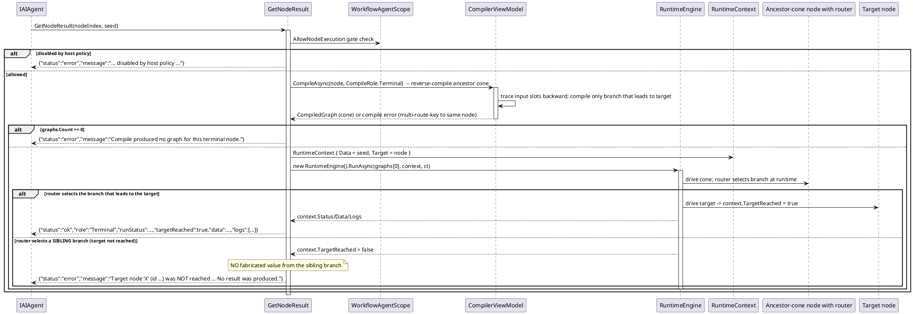

# 数据流 — Terminal 结果（`GetNodeResult`）

`GetNodeResult(nodeIndex, seed)` 隔离地计算单个节点的结果。它以 `CompileRole.Terminal` 反向编译该节点的**祖先锥**（从其输入槽反向追溯的、喂给它数据的所有上游生产者），再用运行时引擎驱动该锥，因此无需控制器/起始节点。锥内路由器保持真实分支语义：只编译通向目标的那条分支。

这正是内嵌提示规范（与 `RunCompiledRoleAsync`）强制执行的错误契约：若锥上某路由器选中兄弟分支，目标**未**到达，工具返回点名目标的 `status:error`——绝不把另一分支的最终数据当作本节点结果上报。要成功，先把路由器指向通向本节点的分支，或改问实际选中分支上的节点。

> 源码：`WorkflowAgentToolkit.cs`，`GetNodeResult` 第 1796-1801 行及共享 `RunCompiledRoleAsync` 第 1804-1861 行（第 1827-1836 行的前向一致 `Target`/`TargetReached` 语义）；测试 `WorkflowLifecycleFidelityTests.GetNodeResult_*`。
