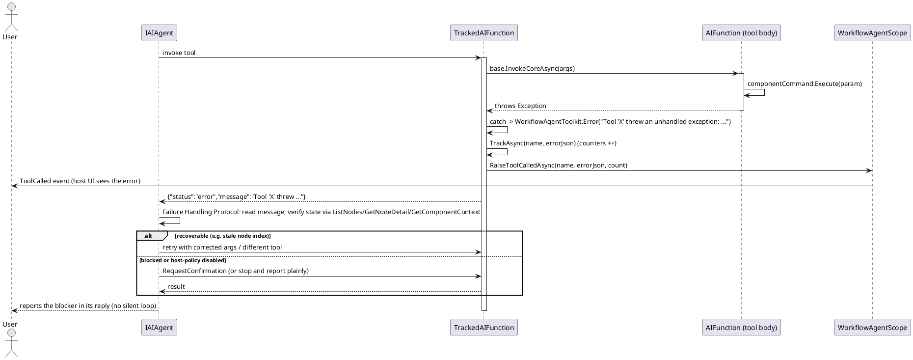

# 数据流 — 错误与恢复

工具体抛出异常时，`TrackedAIFunction.InvokeCoreInnerAsync` 把异常转成紧凑 JSON `{"status":"error"}`，而不是把 SDK 失败抛给模型；追踪（计数器 + `ToolCalled`）仍会触发。随后 agent 应用注入的失败处理协议：读取 `message`/`reasons`/`hint`/`preferredAlternative`，核验当前状态，用不同工具重试——或询问用户。被宿主策略禁用的工具如实上报，绝不被绕过。

要点：

- 未挂载组件的操作按框架设计是静默无操作；协议告诉模型先核验挂载状态（`ListNodes` / `GetNodeDetail`）再重试。
- 被门控的工具（`ExecuteNode`、`ExecuteCommandOnNode`、`ExecuteCommandById`、`RunCompiledWorkflow`、`GetNodeResult`）在宿主未启用时返回结构化 `disabled by host policy` 错误；模型被指示不要绕过它。

> 源码：`WorkflowAgentToolkit.cs`，`TrackedAIFunction.InvokeCoreInnerAsync` 第 196-219 行；`WorkflowAgentScope.cs`，`BuildFailureHandlingProtocol` 第 509-523 行。
