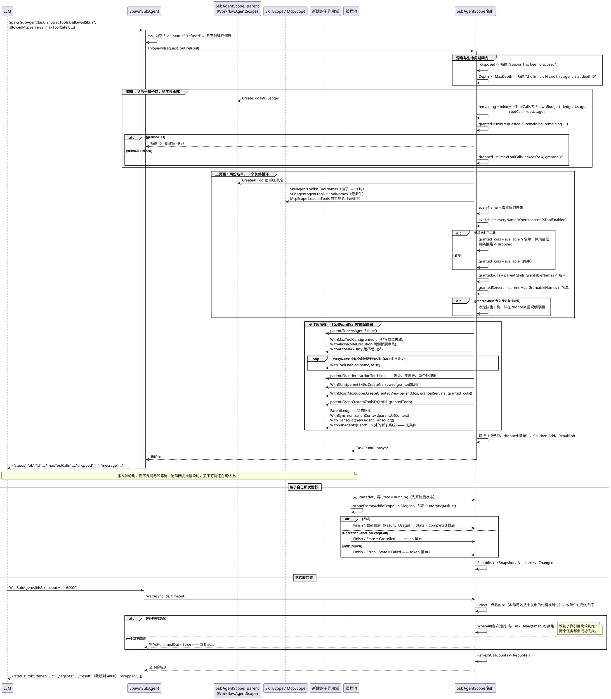

# 数据流分析 — 子代理派发（`SpawnSubAgent` → `WaitSubAgents`）

子代理这条流是「一次工具调用启动一次后台运行，第二次工具调用把它收回来」。它值得追踪的地方在于：**全部收窄都同步发生在第一个工具体内** —— 在宿主的 UI 线程上、在孩子存在之前 —— 而孩子自己的运行被交给线程池。本页跟踪一次 spawn，从模型给出的参数一直到落定的名册行，然后是读它的那次等待。

几点说明：

- **`Task.Run` 之前的一切都与另一次 spawn、以及面板串行**，因为它发生在名册线程上。被交出去的只有孩子自己那次运行 —— 这正是「一次 spawn 可以像其他只读工具调用一样被对待，而孩子在并行干活」的原因。
- **`SpawnSubAgent` 被归为只读**（`SubAgentAgentToolkit.ToolNames` 并入工作流工具包的查询清单），所以一次 spawn 与一次等待都记在**读**计数器上，绝不会标脏工作流图。`SubAgentBudgetTests.ASpawnIsAQuery_AndSoIsNotChargedToTheMutationBudget` 两个方向都断言了，包括「读预算花光时 spawn 被拒」与「变更预算花光时 spawn 不受影响」。
- **spawn 本身也是一次调用，从同一口锅里扣**，这就是授予写成 `remaining - 1` 而不是 `remaining` 的原因：那个 `- 1` 让递减授予的不变式即便那次记账尚未发生也依然成立。
- **孩子从它的第一次调用起就记在树上**，因为 `ParentLedger` 在工具包存在之前就设好了。`SubAgentBudgetTests.AChildsCalls_AreCountedOnTheRootsLedger` 断言根的用量等于那次 spawn 加上孩子的那次调用。
- **被拒绝的 spawn 不留下任何行。** 拒绝是一个 JSON 对象，且期望模型去读 `message`；没有任何半成品被留在那里。
- **孩子自己的名册一开始是空的**，只有它自己去派发时才会被填；这里没有任何一步让兄弟的句柄变得可达。

> 源码：`SubAgentScope.cs`（`TrySpawn` 387-606、`RunAsync` 781-806、`Finish` 815-839、`WaitAsync` 891-906）；`SubAgentAgentToolkit.cs`（五个工具，85-229）；`WorkflowAgentScope.cs`（`GrantInteractionTo` 283-296、`GrantCustomToolsTo` 251-264、`WithSubAgents` 1788-1804）；`ToolCallLedger.cs`。测试：`SubAgentDispatchTests`、`SubAgentBudgetTests`、`SubAgentHierarchyTests`、`SubAgentCapabilityGrantTests`。
