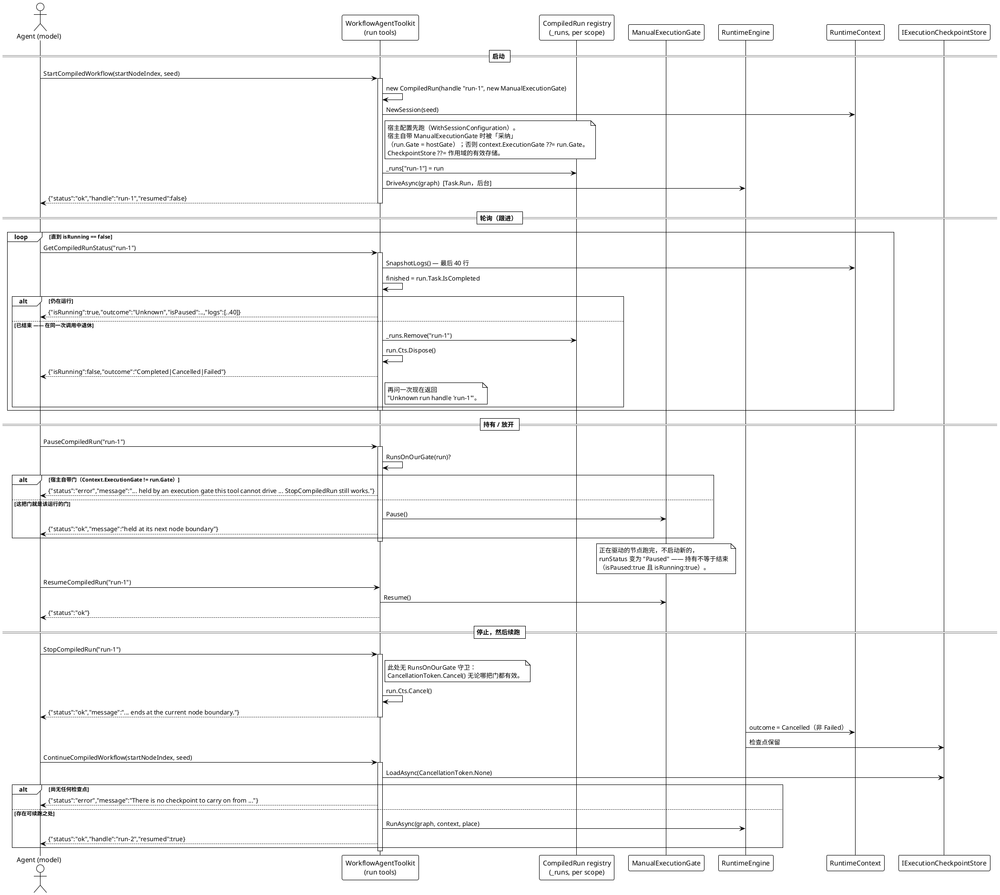

# 数据流 —— 编译运行句柄生命周期

`RunCompiledWorkflow` 等待到结束；而一次需要持有、跟进或停止的运行做不到。运行句柄家族在后台启动同一条编译链并返回句柄。本页追踪整个生命周期：启动 → 轮询 → 持有/放开 → 停止/续跑，含两项已记录的行为（句柄退休与 `RunsOnOurGate` 守卫）。

来源：`WorkflowAgentToolkit.cs`（`StartCompiledAsync`、`DriveAsync`、`GetCompiledRunStatus`、`PauseCompiledRun`、`ResumeCompiledRun`、`StopCompiledRun`、`NewSession`、`RunsOnOurGate`、`GateNotOurs`、`CompiledRun`）；`RunOutcome.cs`；`RuntimeContext.SnapshotLogs`。

## 图中所钉定的行为

- **退休就是回答。** `GetCompiledRunStatus` 只读一次 `run.Task.IsCompleted`，并在同一次调用里于结束时刻丢弃句柄、释放其 `CancellationTokenSource`。回答与退休描述同一状态，因此轮询循环在 `isRunning == false` 时退出，之后的调用是未知句柄。测试：`CompiledRunControlTests.WaitForEndAsync` —— 其唯一出口是 `isRunning == false`。
- **工具驱动的门必须是引擎所等的门。** `NewSession` 采纳宿主的 `ManualExecutionGate`，因此 `PauseCompiledRun` / `ResumeCompiledRun` 操作真实的那把门；当宿主的门*不是*该运行的门时，二者返回错误，而非报告一次没发生的暂停。测试：`AStartedRun_CanBeHeld_LetGo_AndFollowedToItsEnd`；守卫本身**仅源码**（`Agent/**` 中无测试断言它）。
- **停止是取消，不是失败。** `StopCompiledRun` 取消令牌；运行在节点边界以 `outcome: Cancelled` 结束，它留下的检查点正是 `ContinueCompiledWorkflow` 要读的东西 —— 所以被停止的运行可稍后续跑。测试：`AStoppedRun_EndsAsCancelled_AndTheAgentCanCarryOnFromIt`。
- **续跑绝不凭空启动。** 尚无任何写入时它返回 `"no checkpoint"`，而非悄悄启动一次全新运行。测试：`CarryingOn_WithNothingWrittenYet_IsRefused`。
- **失败与日志随结果同行。** 会话配置了重试策略时，`failures` 携带 `Warning` 与 `Error` 记录，`logFile` 是含重试行的绝对路径。测试：`TheFailureRecords_AndTheLogFile_TravelWithTheResult`。

**运行声明：** 上述四个 `CompiledRunControlTests` 在 2026-10-01 的确定性套件中通过（`已通过! 失败: 0，通过: 387`）；`RunsOnOurGate` 守卫与 40 行日志尾巴仅对照源码核验。
