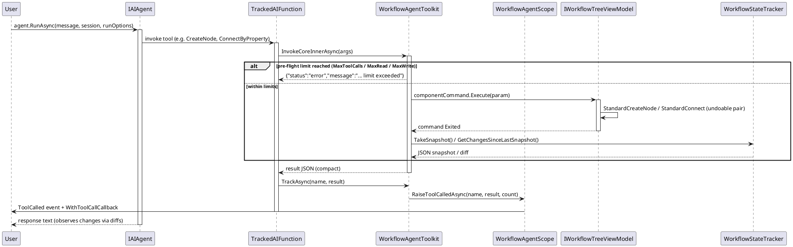
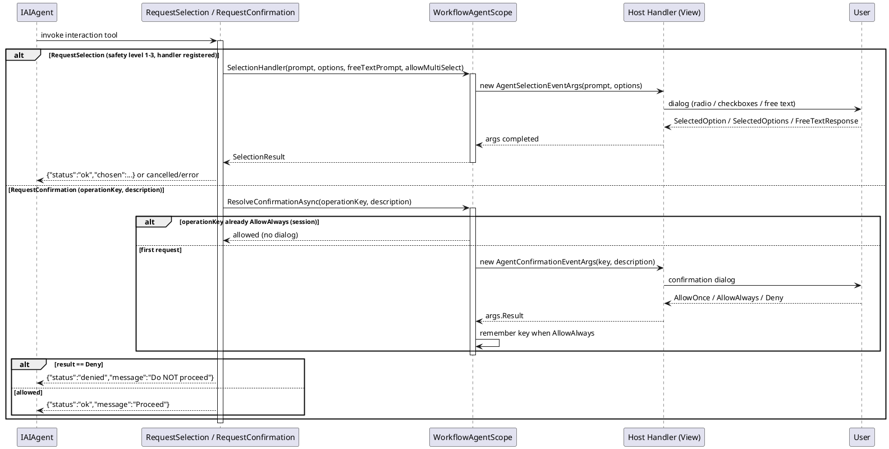
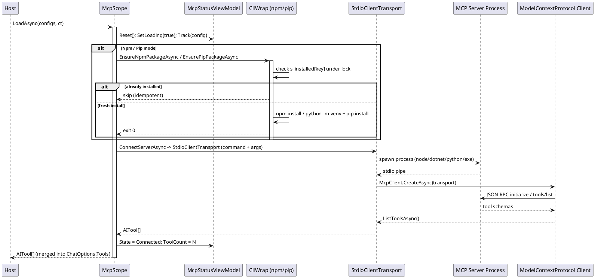
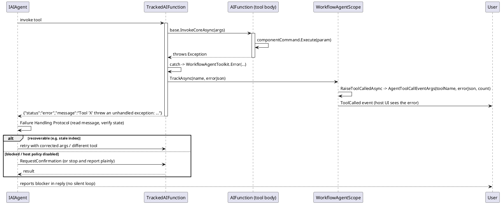

# 数据流 — 工作流代理

四个时序图追踪 AI 控制层的主要数据流。使用 PlantUML 语法，可在任意 PlantUML 服务器渲染。

## 1. Agent 工具调用流

用户消息传给 Agent。工具被调用时，`TrackedAIFunction` 调用底层 `AIFunction`，工具通过组件命令变更树，`WorkflowStateTracker` 做快照/差异，让 Agent 观察变化。

错误路径（工具抛出）：见时序图 4。

*源码：`WorkflowAgentToolkit.cs` 的 `TrackedAIFunction` 第 175-239 行、`TrackAsync` 第 261-271 行；`WorkflowAgentScope.cs` 的 `RaiseToolCalledAsync` 第 444-450 行。*

## 2. 交互安全 / 确认流

Agent 遇到有歧义或破坏性操作时，`RequestSelection` / `RequestConfirmation` 工具暂停运行并委托给宿主处理器。`AllowAlways` 审批按 `operationKey` 在会话内记住。

若结果是 `denied`，Agent 必须停下并报告 —— 不得用替代操作蒙混（第 3 档安全策略）。

*源码：`WorkflowAgentScope.cs` 的 `WithSelectionHandler`/`WithConfirmationHandler`/`ResolveConfirmationAsync` 第 387-442 行；`WorkflowAgentToolkit.cs` 的 `RequestSelection` 第 2106-2147 行、`RequestConfirmation` 第 2150-2161 行。*

## 3. MCP 握手

`LoadAsync` 在需要时安装服务器包（幂等，进程级集合 + `SemaphoreSlim` 守卫）、经 stdio 启动服务器、完成 JSON-RPC MCP 握手，并把服务器工具作为 `AITool[]` 返回。

错误路径：单服务器失败把状态置为 `Error`、触发 `ServerError(config, ex)` 并贡献 0 个工具 —— 批次继续处理其余服务器。取消以 `OperationCanceledException` 传播。

*源码：`McpScope.cs` 的 `LoadAsync` 第 163-187 行、`LoadOneAsync` 第 189-226 行、`EnsureNpmPackageAsync` 第 296-328 行、`ConnectServerAsync` 第 378-413 行。*

## 4. 错误路径 —— 工具抛出异常

`TrackedAIFunction.InvokeCoreInnerAsync` 用 try/catch 包住内部调用。抛出的异常变成 JSON `{"status":"error"}` 而非作为 SDK 失败传播给模型，且 `ToolCalled` 回调仍然触发。注入的失败处理协议随后告诉模型读 message、核对状态，改用别的工具重试或询问用户。

注意：`ExecuteNode`/`ExecuteCommandOnNode`/`ExecuteCommandById` 返回的 `disabled by host policy` 错误不许绕开 —— 协议指示模型报告并让宿主按需启用。

*源码：`WorkflowAgentToolkit.cs` 的 `InvokeCoreInnerAsync` 第 193-216 行；`WorkflowAgentScope.cs` 的 `BuildFailureHandlingProtocol` 第 509-523 行。*
