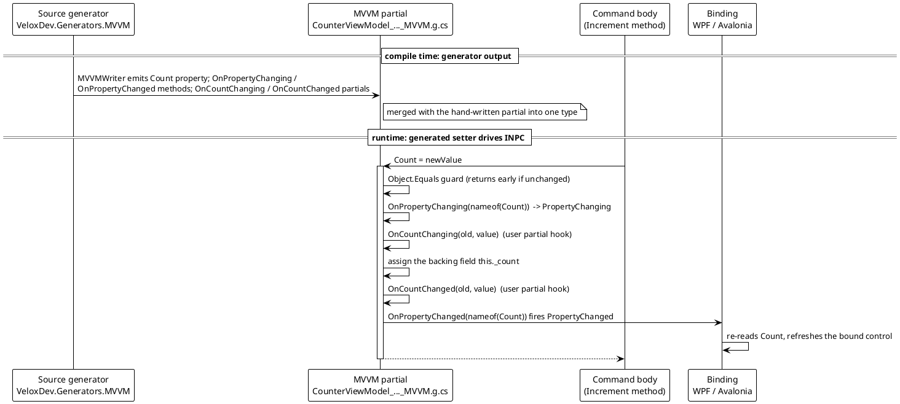
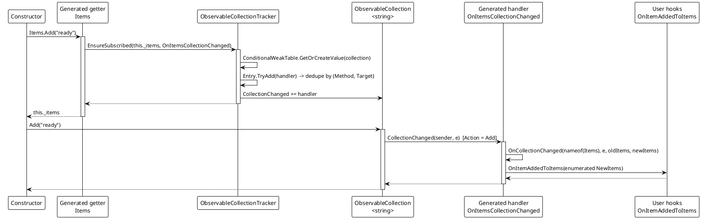
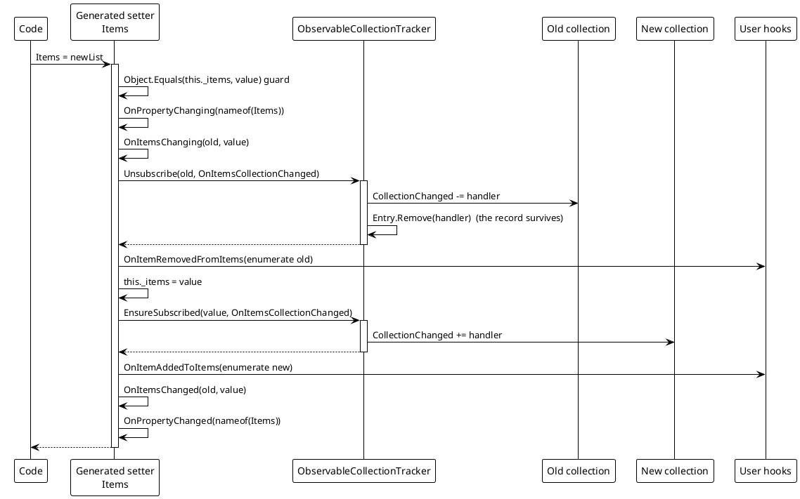

# 数据流分析 — 属性与集合

标量属性路径与集合路径形状相同：生成器在编译期产出骨架，setter 在运行期驱动它。集合路径额外加了一层懒加载订阅，使得字段初始化器（`= []`）无法让 `CollectionChanged` 处于未被观察的状态。

## (a) 生成器产出 → INPC 流



> 来源：setter 形态由 `MVVMPropertyFactory.GetSetterBodyLines` 产出（`Src/Generators/VeloxDev.Core.Generator/Base/Analizer.cs` 第 466 行），并在生成文件中逐字确认。

```csharp
// Source: Generated — obj/Debug/net9.0/generated/VeloxDev.Core.Generator/VeloxDev.Generators.MVVM/CounterViewModel_QuickStart_Mvvm_MVVM.g.cs
set
{
    if (global::System.Object.Equals(this._count, value)) return;
    var old = this._count;
    OnPropertyChanging(nameof(Count));
    OnCountChanging(old, value);
    this._count = value;
    OnCountChanged(old, value);
    OnPropertyChanged(nameof(Count));
}
```

## (b) 集合流：初始化器 → getter 订阅 → 按动作钩子

关键一步是构造函数里的第一次 `Items.Add("ready")`。字段初始化器直接给 `this._items` 赋了值，所以 setter 从未运行；订阅之所以存在，只是因为通往 `Add` 的路上读取了 **getter**。



> 来源：生成的 getter 与 `OnItemsCollectionChanged` switch —— `CounterViewModel_QuickStart_Mvvm_MVVM.g.cs`；tracker 行为 —— `Src/Core/VeloxDev.Core/MVVM/ObservableCollectionTracker.cs` 第 24-36 行（`EnsureSubscribed`）与第 100-118 行（`MethodTargetEqualityComparer`）。

```csharp
// Source: Generated — CounterViewModel_QuickStart_Mvvm_MVVM.g.cs, the collection getter
get
{
    global::VeloxDev.MVVM.ObservableCollectionTracker.EnsureSubscribed(this._items, OnItemsCollectionChanged);
    return this._items;
}
```

## (c) 替换整个集合

替换正是 tracker 的 `Unsubscribe` 起作用之处：没有它，被丢弃的集合会一直持有一个指回本视图模型的处理器。



> 来源：生成的集合 setter —— `CounterViewModel_QuickStart_Mvvm_MVVM.g.cs`；`Unsubscribe` —— `Src/Core/VeloxDev.Core/MVVM/ObservableCollectionTracker.cs` 第 47-59 行。

## 按动作分派

生成的 `OnItemsCollectionChanged` 把原始 `NotifyCollectionChangedAction` 映射到用户钩子：

```csharp
// Source: Generated — CounterViewModel_QuickStart_Mvvm_MVVM.g.cs
switch (e.Action)
{
    case global::System.Collections.Specialized.NotifyCollectionChangedAction.Add when e.NewItems is not null:
        OnItemAddedToItems(EnumerateItemsItems(e.NewItems));
        break;
    case global::System.Collections.Specialized.NotifyCollectionChangedAction.Remove when e.OldItems is not null:
        OnItemRemovedFromItems(EnumerateItemsItems(e.OldItems));
        break;
    case global::System.Collections.Specialized.NotifyCollectionChangedAction.Replace:
        if (e.OldItems is not null)
        {
            OnItemRemovedFromItems(EnumerateItemsItems(e.OldItems));
        }
        if (e.NewItems is not null)
        {
            OnItemAddedToItems(EnumerateItemsItems(e.NewItems));
        }
        break;
    case global::System.Collections.Specialized.NotifyCollectionChangedAction.Move when e.NewItems is not null:
        OnItemMovedInItems(EnumerateItemsItems(e.NewItems));
        break;
    case global::System.Collections.Specialized.NotifyCollectionChangedAction.Reset:
        OnItemsResetInItems();
        break;
}
```

## 错误与边界路径

| 路径 | 行为 |
|---|---|
| 值未变化 | `Object.Equals` 守卫在任何通知或钩子之前直接返回。 |
| 集合未实现 `INotifyCollectionChanged` | `EnsureSubscribed` / `Unsubscribe` 立即返回（`ObservableCollectionTracker.cs` 第 28-29、51-52 行）。 |
| `Unsubscribe` 收到 `null` 集合 | 同样提前返回；不抛异常。 |
| 处理器以全新的 method group 委托到达 | 按 `(Method, Target)` 去重，因此调用列表不会增长（`MethodTargetEqualityComparer`，第 100-118 行）。 |
| 集合被垃圾回收 | 它的 `ConditionalWeakTable` 条目一并消失 —— 不泄漏。 |
| 处理器抛异常 | 该事件自身的调用列表展开；命令事件会被吞掉，但集合处理器是普通 .NET 事件订阅者，tracker 不会为其兜底。 |
