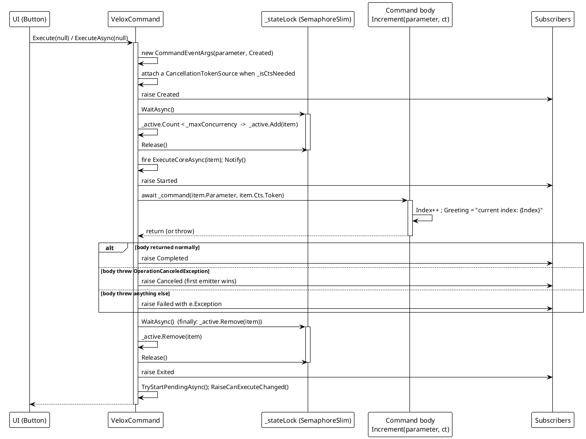
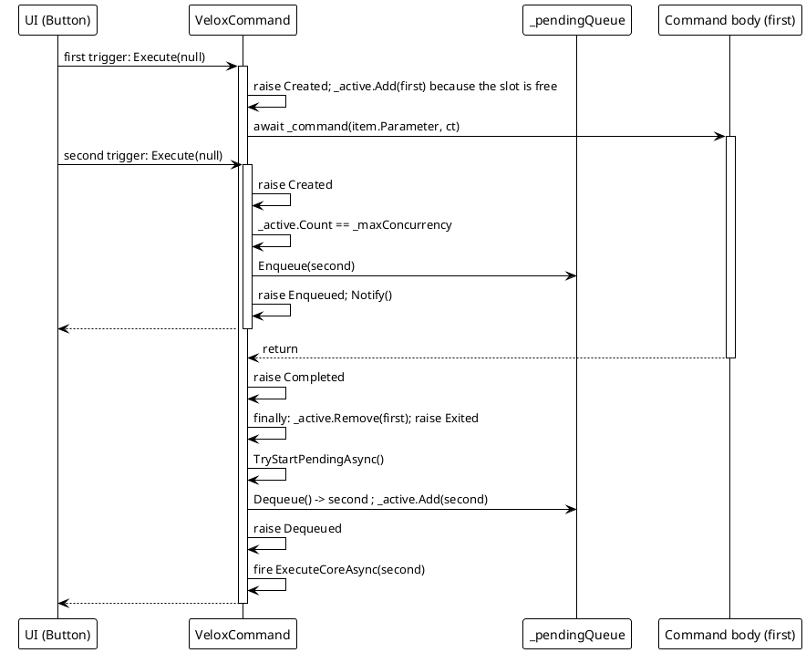
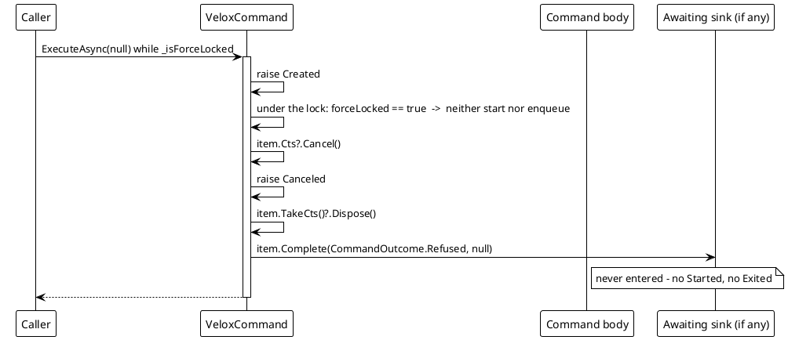
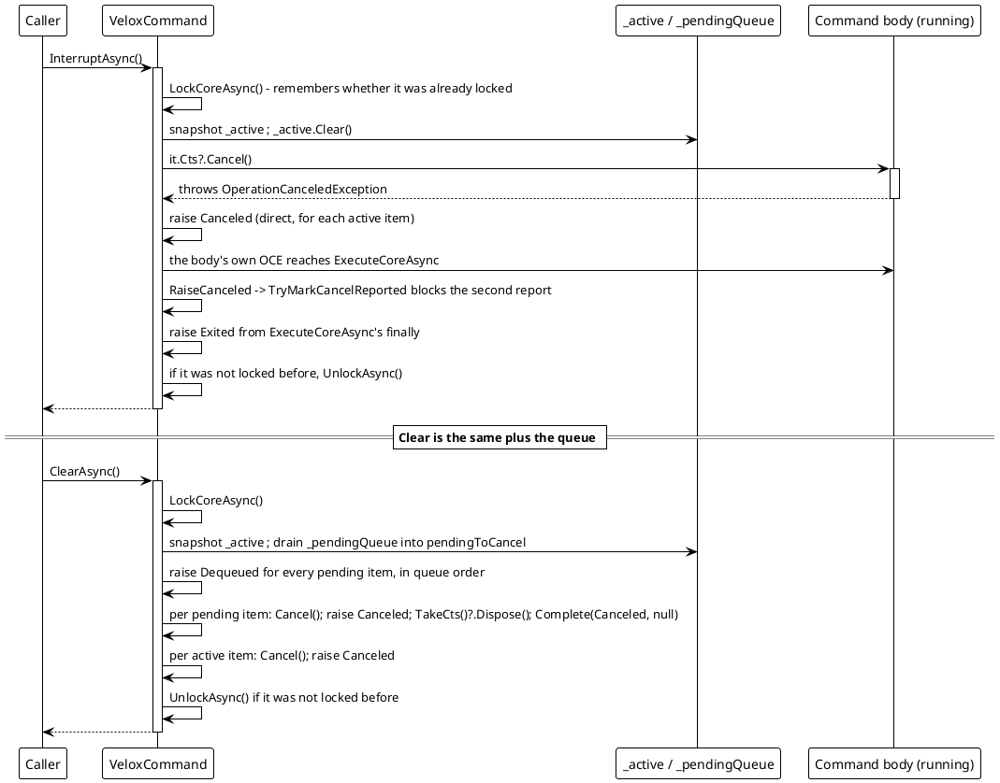
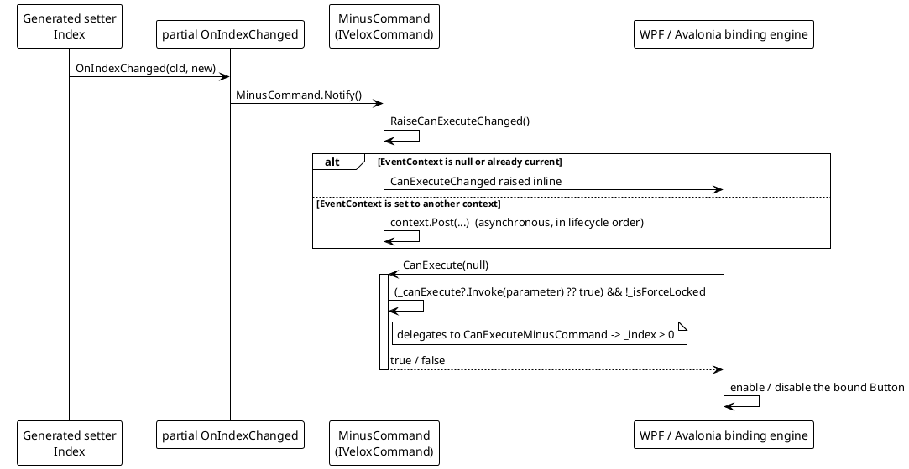

# 数据流分析 — 命令生命周期

`Src/Core/VeloxDev.Core/MVVM/VeloxCommand.cs` 中的执行管线。整个设计赖以成立的不变式写在源码自身里（`VeloxCommand.cs` 第 192-194 行）：`_stateLock` 是 `SemaphoreSlim(1,1)`，因此**不可重入**，持锁期间不得运行任何用户代码 —— 既不能是事件处理器，也不能是命令方法体。每次 `RaiseCommandEvent` 都发生在 `Release()` 之后。

## (a) 立即运行：Created → Started → Completed → Exited



> 来源：`VeloxCommand.cs` —— `ExecuteCore` 第 474-531 行、`ExecuteCoreAsync` 第 533-580 行、`OnExecutionCompletedAsync` 第 582-598 行。

## (b) 容量已满时排队：Enqueued …… Dequeued



> 来源：`VeloxCommand.cs` —— 入队分支第 503-505 与 521-524 行，`TryStartPendingAsync` 第 794-822 行（排空循环在第 801-809 行）。

## (c) 锁定下拒绝：Created → Canceled，别无其它



> 来源：`VeloxCommand.cs` 第 513-520 行。这是产生 `CommandOutcome.Refused` 的唯一路径，也是单看 `CommandEventType` 无法表达拒绝的原因（`CommandCompletion.cs` 第 22-28 行）。

## (d) 取消与清空



> 来源：`VeloxCommand.cs` —— `InterruptAsync` 第 642-683 行、`ClearAsync` 第 686-747 行、`RaiseCanceled` 第 398-404 行、`TryMarkCancelReported` 第 896 行。

```csharp
// Source: Src/Core/VeloxDev.Core/MVVM/VeloxCommand.cs, lines 396-404
// One execution reports at most one Canceled. Interrupt/Clear report promptly;
// the body's own OperationCanceledException arrives later and is blocked by TryMarkCancelReported.
private void RaiseCanceled(CommandEventArgs item)
{
    if (item.TryMarkCancelReported())
    {
        RaiseCommandEventAs(Canceled, item, CommandEventType.Canceled);
    }
}
```

## (e) `canValidate` 闸门：属性钩子 → Notify → CanExecuteChanged



> 来源：`VeloxCommand.cs` —— `Notify` 第 414 行、`RaiseCanExecuteChanged` 第 328-339 行、`CanExecute` 第 407-408 行；钩子见 `Examples/MVVM/WPF/Demo/MainWindowViewModel.cs` 第 34-38 行。

## 错误路径汇总

| 路径 | 行为 |
|---|---|
| 方法体抛非取消异常 | `outcome = Failed`、`failure = ex`，触发带 `CommandEventArgs.Exception` 的 `Failed`；`Exited` 仍从 `finally` 触发。 |
| 方法体抛 `OperationCanceledException` | `outcome = Canceled`，触发 `Canceled` —— 除非 `Interrupt` / `Clear` 已为该次执行报过一条。 |
| 强制锁定下的触发 | 既不启动也不入队；触发 `Canceled` 并以 `Refused` 收尾 sink。 |
| 有调用在排队时执行 `Clear` | 每个排队项先 `Dequeued` 再 `Canceled`；这样的项永远到不了 `Started` / `Exited`。 |
| 取消回调抛异常 | 被吞掉（`AggregateException`），因为让它逃逸会跳过 `UnlockAsync`，让命令永久锁死（`VeloxCommand.cs` 第 669-673、735-739 行）。 |
| `Cancel` 抛 `ObjectDisposedException` | 被吞掉：方法体可能已经跑完并释放了自己的源（第 665-668 行）。 |
| 订阅者抛异常 | 被捕获并经静态 `HandlerException` 上报；生命周期不受影响。 |
| `OnExecutionCompletedAsync` 抛异常 | 内层 `finally` 仍会执行 `item.Complete(...)` 与 `TakeCts()?.Dispose()`（第 569-578 行）。 |
