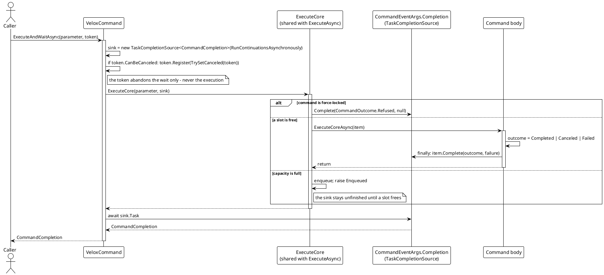
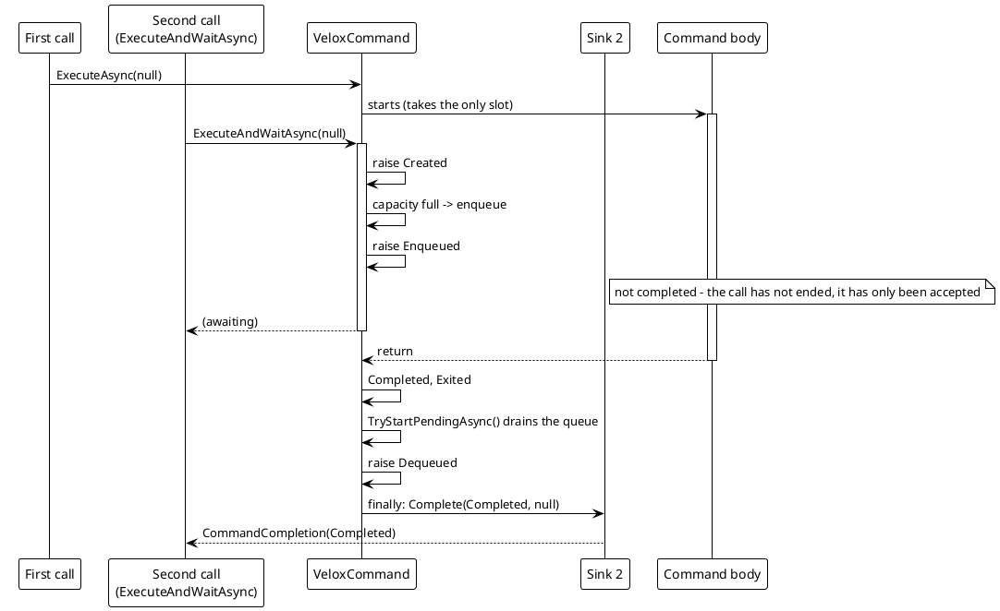
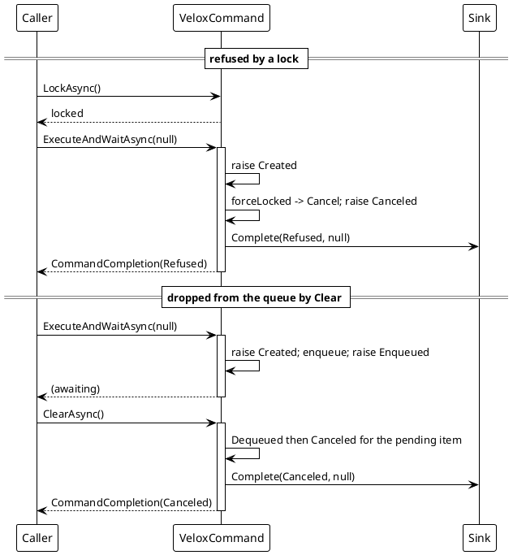

# 数据流分析 — `ExecuteAndWaitAsync`

`ExecuteAndWaitAsync` 就是 `ExecuteAsync` 加一个 sink。两者共用 `ExecuteCore`；唯一差别是有没有挂上 `TaskCompletionSource<CommandCompletion>`，而管线的每个分支都有责任恰好收尾它一次。

## (a) 等待路径



> 来源：`Src/Core/VeloxDev.Core/MVVM/VeloxCommand.cs` —— `ExecuteAndWaitAsync` 第 452-471 行、`ExecuteCore` 第 474-531 行、`CommandEventArgs.Complete` 第 899-900 行。

## (b) 结局在哪里确定

结局是在**执行内部**算出的，而不是从事件里读回来：

```csharp
// Source: Src/Core/VeloxDev.Core/MVVM/VeloxCommand.cs, lines 535-580
private async Task ExecuteCoreAsync(CommandEventArgs item)
{
    RaiseCommandEventAs(Started, item, CommandEventType.Started);

    // the outcome is computed here, not read back from the events or from the item:
    // the awaiting sink must not depend on someone having subscribed to Failed
    var outcome = CommandOutcome.Completed;
    Exception? failure = null;

    try
    {
        if (_isCtsNeeded)
        {
            await _command(item.Parameter, (item.Cts ?? new()).Token).ConfigureAwait(false);
        }
        else
        {
            await _command(item.Parameter, _defct).ConfigureAwait(false);
        }
        RaiseCommandEventAs(Completed, item, CommandEventType.Completed);
    }
    catch (OperationCanceledException)
    {
        outcome = CommandOutcome.Canceled;
        RaiseCanceled(item);
    }
    catch (Exception ex)
    {
        outcome = CommandOutcome.Failed;
        failure = ex;
        RaiseCommandEventAs(Failed, item, CommandEventType.Failed, ex);
    }
    finally
    {
        try
        {
            await OnExecutionCompletedAsync(item).ConfigureAwait(false);
        }
        finally
        {
            // a nested finally: a throwing OnExecutionCompletedAsync must not skip teardown
            item.Complete(outcome, failure);
            item.TakeCts()?.Dispose();
        }
    }
}
```

这正是让该 API 可用的设计点：从未订阅过 `Failed` 的调用方，依然能拿到带异常的 `CommandOutcome.Failed`。

## (c) 排队调用的 sink 为何保持未完成



> 来源：`VeloxCommand.cs` —— 入队分支第 521-524 行，排空见 `TryStartPendingAsync` 第 794-822 行。

## (d) 拒绝与队列丢弃：手搓等待会挂死的两种情况

被拒绝的调用与被从队列丢弃的调用都不会触发 `Exited`，这正是“订阅 `Exited` + `Failed`”不能用作等待的原因。



> 来源：`VeloxCommand.cs` 第 513-520 行（拒绝）、第 710-723 行（被 `ClearAsync` 丢弃的排队项）、`CommandCompletion.cs` 第 14-20 行。

## (e) 放弃等待

调用方的 token 在 `ExecuteCore` 运行之前就注册好了，而且它只取消 `TaskCompletionSource`：

```csharp
// Source: Src/Core/VeloxDev.Core/MVVM/VeloxCommand.cs, lines 455-471
var sink = new TaskCompletionSource<CommandCompletion>(TaskCreationOptions.RunContinuationsAsynchronously);

// this token only abandons the wait, it does not cancel the execution - cancelling the execution
// is the job of Interrupt / Clear, which empty the whole command and must not be triggered by one call
using var registration = cancellationToken.CanBeCanceled
    ? cancellationToken.Register(
        static state =>
        {
            var (source, token) = ((TaskCompletionSource<CommandCompletion>, CancellationToken))state!;
            source.TrySetCanceled(token);
        },
        (sink, cancellationToken))
    : default;

await ExecuteCore(parameter, sink).ConfigureAwait(false);
return await sink.Task.ConfigureAwait(false);
```

## 与 `ExecuteAsync` 的对比

| 方面 | `ExecuteAsync` | `ExecuteAndWaitAsync` |
|---|---|---|
| sink | `sink: null`（第 442 行） | 一个 `TaskCompletionSource<CommandCompletion>` |
| 完成时机 | 调用被受理 | 该次调用已结束，包括被拒绝与被丢弃的调用 |
| 结果通道 | 仅事件 | 一个 `CommandCompletion` 值 |
| 拒绝是否可观察 | 上报为 `Canceled`，与取消无法区分 | `CommandOutcome.Refused` |
| 是否需要 `Failed` 订阅者才能看到方法体失败 | 是 | 否 |
| token 语义 | 不适用 | 只放弃等待 |
| 延续 | 不适用 | `RunContinuationsAsynchronously`，因此收尾 sink 绝不会在管线上就地运行用户代码 |

最后一点刻意留白补全了整幅画面：`CommandEventArgs.With` 产生的副本不携带该 sink。

```csharp
// Source: Src/Core/VeloxDev.Core/MVVM/VeloxCommand.cs, lines 890-916
// the wait slot; only ExecuteAndWaitAsync attaches one. Copies made by With() do not carry it -
// a copy must not be able to complete the wait.
internal TaskCompletionSource<CommandCompletion>? Completion { get; set; }
```

> 来源：`Src/Core/VeloxDev.Core/MVVM/VeloxCommand.cs`（`ExecuteAndWaitAsync` 452、`ExecuteCore` 474、`ExecuteCoreAsync` 533、`Completion` 891、`Complete` 899）、`Src/Core/VeloxDev.Core/MVVM/CommandCompletion.cs`、`Src/Core/VeloxDev.Core/MVVM/VeloxCommandExtensions.cs` 第 34-45 行、`Src/Core/VeloxDev.Core.Test/MVVM/VeloxCommandCompletionTests.cs`。
