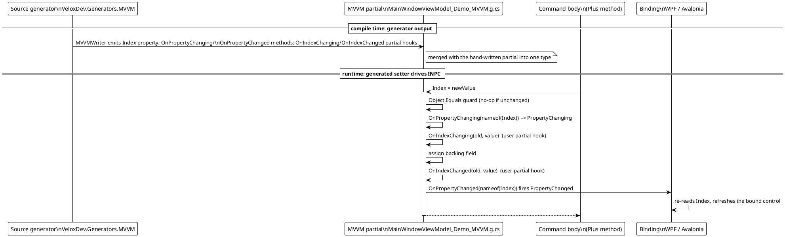
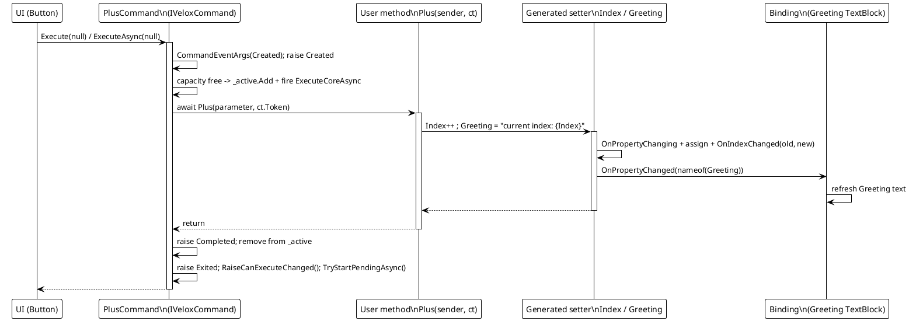
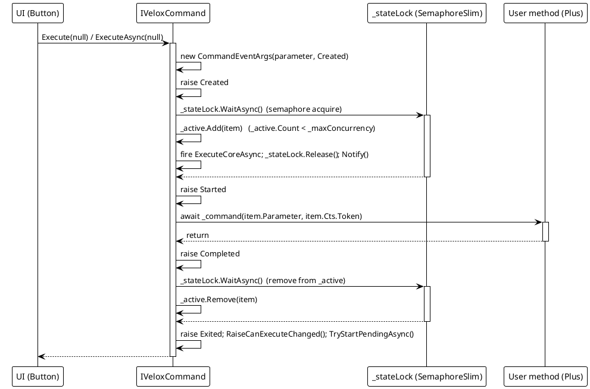
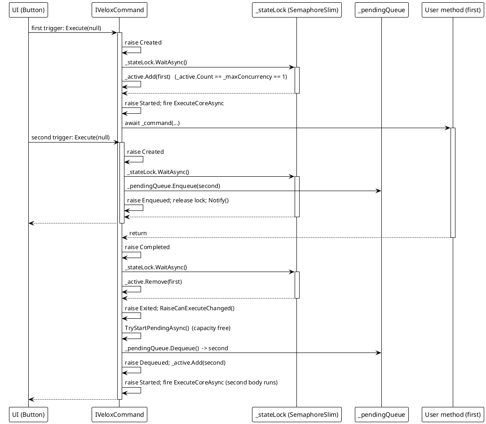
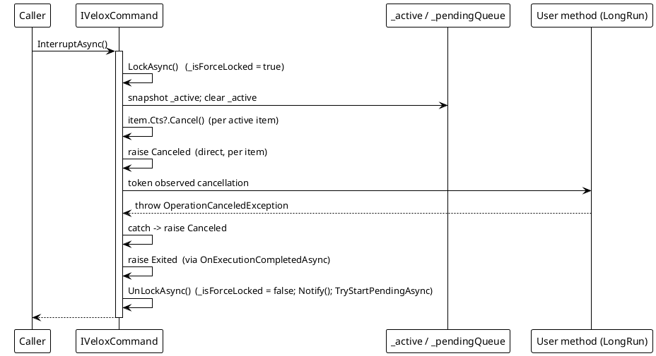
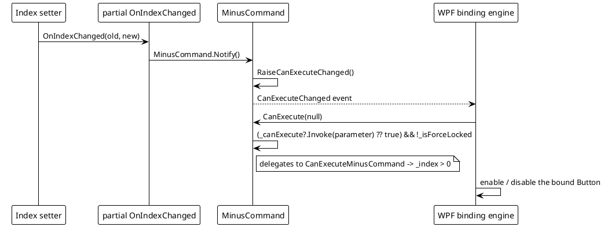

# 数据流 — MVVM

MVVM 功能有两个运行时面，外加一个同时喂养二者的编译期步骤：源码生成器在 `partial` 类上产生可观察属性与懒 `IVeloxCommand` 属性，`VeloxCommand` 则用信号量有界队列与生命周期事件执行带注解的方法。下图追踪生成器输出进入 `INotifyPropertyChanged` 流程的路径，以及 `Src/Core/VeloxDev.Core/MVVM/VeloxCommand.cs` 中命令引擎的各条路径与 `Src/Generators/VeloxDev.Core.Generator/Base/Analizer.cs`（`MVVMPropertyFactory`）生成的成员。

`VeloxCommand` 本身与 UI 无关——它用 `SemaphoreSlim` 与队列调度、串行化调用，并在调用上下文上触发事件。当 WPF/Avalonia 的 `Button` 绑定到生成的命令时，框架在 UI 线程调用 `Execute`/`ExecuteAsync`，因此属性变更通知在 UI 线程触发，绑定引擎可以同步更新。

## （a）生成器输出 → INPC 流程

## （b）命令执行 → 属性通知

## （c）命令生命周期：获取信号量 -> Started -> 调用 -> Completed -> 释放 -> Exited

## （d）`semaphore: 1` 下排队：第二次触发 -> Enqueued -> 等待 -> Dequeued

## （e）取消 / 清空路径

同一源码中的错误路径行为（VeloxCommand.cs 第 139-377 行）：

| 路径 | 行为 |
|---|---|
| `InterruptAsync` / `ClearAsync` | 取消每个受影响调用的 `CancellationTokenSource` 并触发 `Canceled`。观察 token 的运行中方法会抛出 `OperationCanceledException`，`ExecuteCoreAsync` 同样将其映射为 `Canceled`。 |
| 用户方法抛出异常（非取消） | `ExecuteCoreAsync` 捕获 `Exception ex` 并触发 `Failed`（携带 `CommandEventArgs.Exception`）；`Exited` 仍会在 `finally` 中触发。 |
| 强制锁定时触发 | `ExecuteAsync` 取消新条目的 CTS 并触发 `Canceled`；不开始执行。 |
| `ClearAsync` | 把所有待处理条目出队（每个触发 `Dequeued`），然后对 pending + active 触发 `Canceled`。 |

## （f）`canValidate` 门控：属性钩子 -> Notify -> CanExecuteChanged

> 源引用：`Src/Core/VeloxDev.Core/MVVM/VeloxCommand.cs`（`ExecuteAsync`、`ExecuteCoreAsync`、`OnExecutionCompletedAsync`、`TryStartPendingAsync`、`InterruptAsync`、`ClearAsync`）、`Src/Generators/VeloxDev.Core.Generator/Base/Analizer.cs`（`MVVMPropertyFactory.GetSetterBodyLines`、`GenerateCollectionMembers`）、`Examples/MVVM/WPF/Demo/MainWindowViewModel.cs`。
