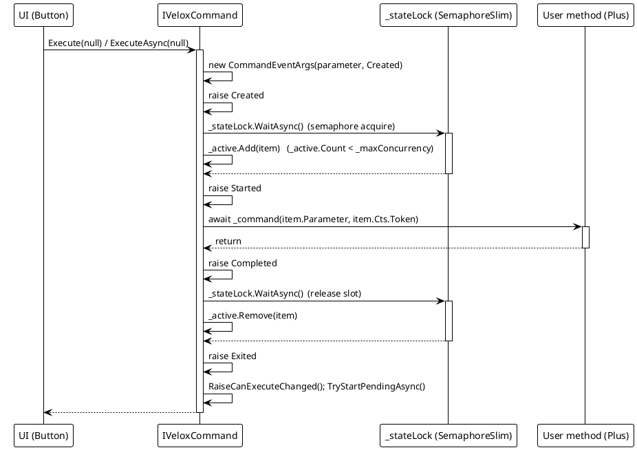
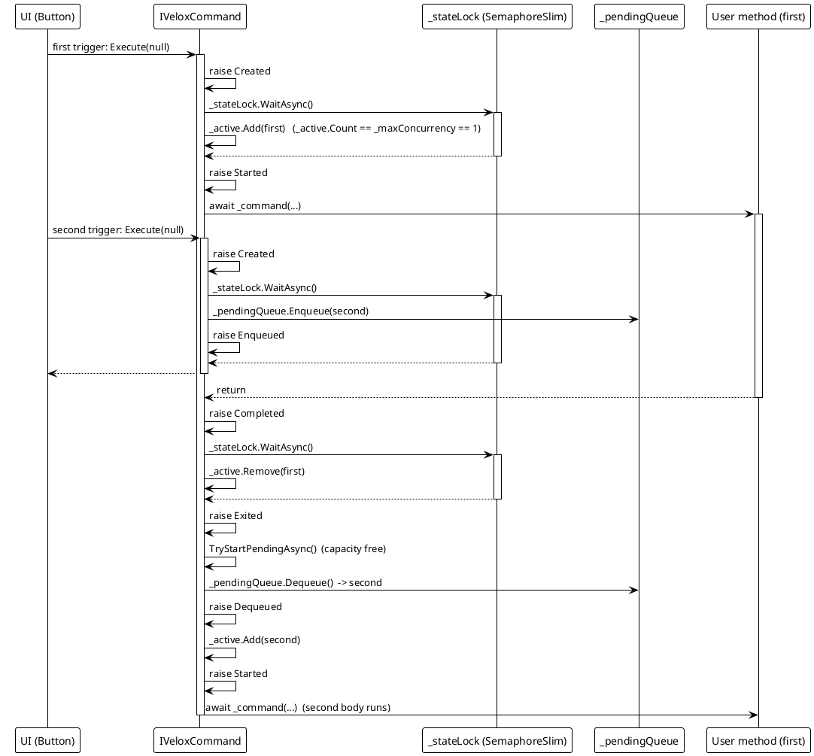
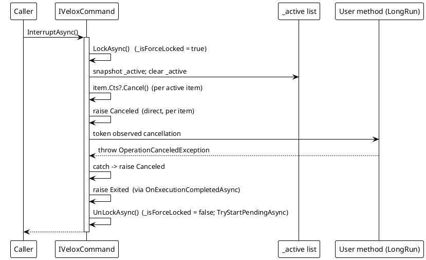
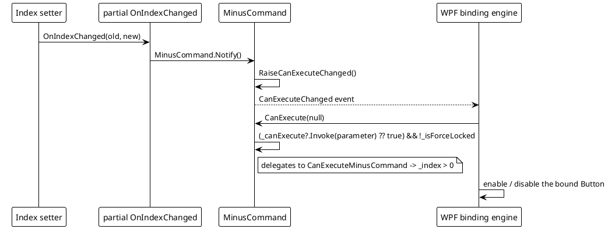

# 数据流 — MVVM

四张图均追溯自 `Src/Core/VeloxDev.Core/MVVM/VeloxCommand.cs` 的实现与 `Src/Generators/VeloxDev.Core.Generator/Base/Analizer.cs` 中生成的成员。

## （a）命令生命周期：获取信号量 -> Started -> 调用 -> Completed -> 释放 -> Exited

## （b）`semaphore: 1` 下排队：第二次触发 -> Enqueued -> 等待 -> Dequeued

## （c）取消路径：InterruptAsync -> Canceled / Failed

错误路径说明（同一源码，第 176-222 行）：

| 路径 | 行为 |
|---|---|
| `InterruptAsync` / `ClearAsync` | 取消条目的 CTS 并为每个受影响的调用触发 `Canceled`；正在运行的方法还可能在观察到 token 后抛出 `OperationCanceledException`，`ExecuteCoreAsync` 同样将其映射为 `Canceled`。 |
| 用户方法抛出异常（非取消） | `ExecuteCoreAsync` 捕获 `Exception ex` 并触发 `Failed`（`CommandEventArgs.Exception`）；`Exited` 仍会在 `finally` 中触发。 |
| 强制锁定时触发 | `ExecuteAsync` 取消新条目并触发 `Canceled`；不开始执行。 |
| `ClearAsync` | 把所有待处理条目出队（每个触发 `Dequeued`），然后对 pending + active 触发 `Canceled`。 |

## （d）`canValidate` 流程：CanExecute 门控

> 源引用：`Src/Core/VeloxDev.Core/MVVM/VeloxCommand.cs`（`ExecuteAsync`、`ExecuteCoreAsync`、`OnExecutionCompletedAsync`、`TryStartPendingAsync`、`InterruptAsync`、`ClearAsync`）、`Src/Generators/VeloxDev.Core.Generator/Base/Analizer.cs`（`GetSetterBodyLines`、`GenerateCollectionMembers`）、`Examples/MVVM/WPF/Demo/MainWindowViewModel.cs`。
