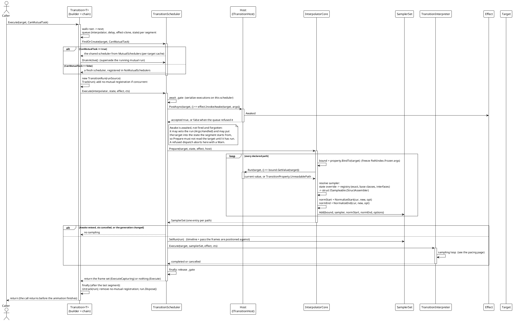
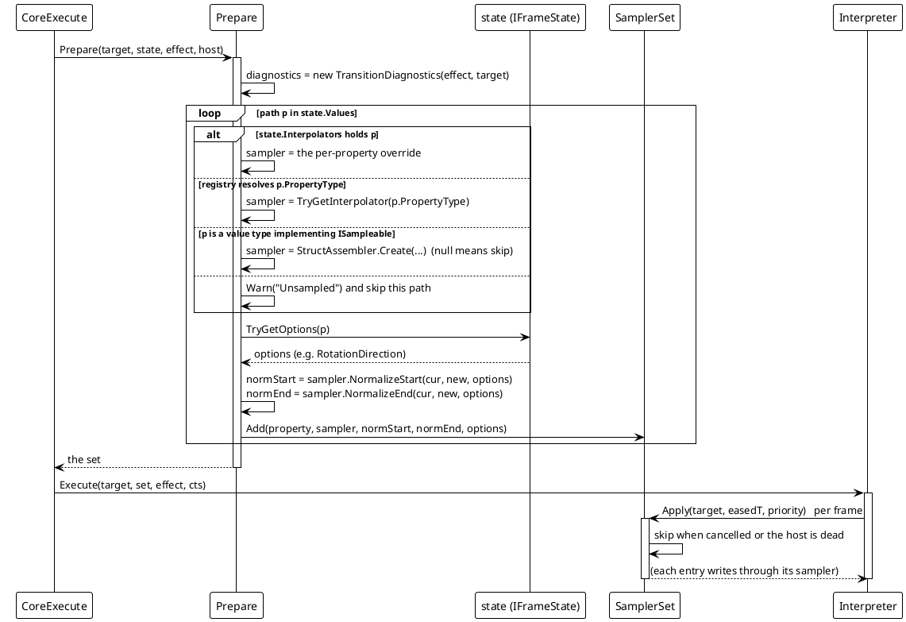
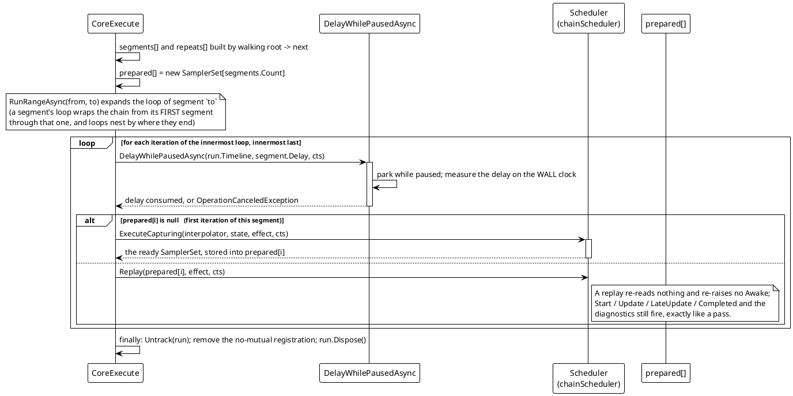

# 数据流 — 过渡动画：运行生命周期

一次 `Execute` 调用，从流式构建器到最后一帧。独特的一步是 `Prepare`：解释器从不触碰已声明状态，只碰 `Prepare` 产出的那套 `SamplerSet`，而那套集合就是本引擎里「状态快照」的含义 —— 每条已声明路径一条条目，各持有它的采样器加上两个**归一化端点值**。

## (a) 一趟、一个分段

> 来源：`Src/Core/VeloxDev.Core/TransitionSystem/Transition.cs`（`CoreExecute`、`ExecuteCoreAsync`、`RunSegmentAsync`）、`TransitionScheduler.cs`（`FindOrCreate`、`ExecuteCore`、门、代计数器、`Track`/`Untrack`）、`Interpolator.cs`（`Prepare`）、`SamplerSet.cs`。

## (b) 已准备状态是什么

`Prepare` 是唯一读目标的地方。下游一切都从产出的 `SamplerSet<TPriorityCore>` 工作，其条目恰是 `(property, sampler, normalizedStart, normalizedEnd, options)` 外加一份惰性创建的 `working` 暂存：

> 来源：`Src/Core/VeloxDev.Core/TransitionSystem/Interpolator.cs`（`Prepare<TPriorityCore>`）、`SamplerSet.cs`（`Add`、`Apply`、`CanSetValue`）、`StructAssembler.cs`。

关于这套集合、让引擎其余部分保持简单的三个事实：

- **它对整趟是固定的。** 已声明值与采样器只解析一次；一帧永不重读 state、重解析路径或重解析类型。这就是 `Repeat` 能*重放*它首次迭代准备的那套集合、且每次都得到完全相同动画的原因。
- **端点已经归一化。** `NormalizeStart` / `NormalizeEnd` 已用起点值、终点值与 options 跑过一次；帧路径只是拿一个缓动时间去求值。
- **准备不成的路径被跳过，而非致命。** `UnreadablePath`（路径不匹配此目标的运行时类型）与「解析不出采样器」都产出一条 `Warn` 与一条缺失条目 —— 集合其余部分照常动画。`StructAssembler` 返回 `null` 是同一结果。唯一*确实*致命的情形发生在更早，在 `Execute` 中同步发生：一条声明为引用类型、什么都解析不出的路径抛 `TransitionPathUnsampleableException`。

## (c) 分段串联与循环

> 来源：`Src/Core/VeloxDev.Core/TransitionSystem/Transition.cs`（`RunSegmentAsync`、`RunBodyAsync`、`RunRangeAsync`、`DelayWhilePausedAsync`）、`TransitionScheduler.cs`（`ExecuteCapturing`、`Replay`）。

分段之间的延时按**墙钟**（一个 `Stopwatch`）测量，不按源：速率为零会冻结源却不暂停它（`IsPaused` 仍为 false），而在冻结时钟上测量的延时永远减不下去。采样循环刻意相反 —— 它用时间轴，因为在那里时间轴才决定动画走了多远。
