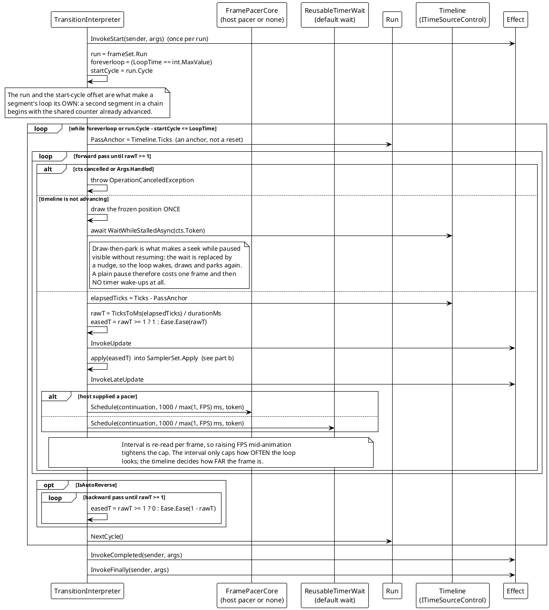
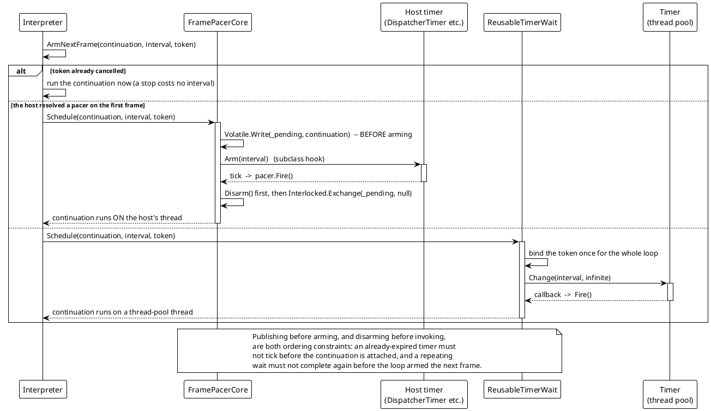
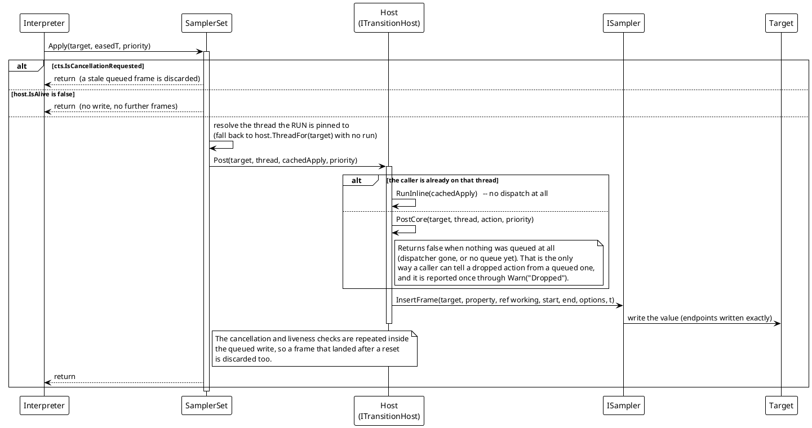

# 数据流 — 过渡动画：节拍与编组

每帧发生两件事：循环决定*何时*采样（节拍），以及每个样本的值被写到目标自己的线程上（编组）。它们是两件各有失败模式的事，因此分开绘制。

## (a) 一趟：由时间轴驱动的采样

> 来源：`Src/Core/VeloxDev.Core/TransitionSystem/TransitionInterpreter.cs`（`ExecuteSamplingLoopAsync`、`RunPassAsync`、`EmitFrame`、`ArmNextFrame`）、`FramePacerCore.cs`、`ReusableTimerWait.cs`、`TransitionRun.cs`。

承重的一行是 `Pacer.PassAnchor = Timeline.Ticks`。一趟是绝对时间轴上的一个**锚点**，绝不是重置 —— 因此多个 run 能共享一个源（各自保留自己的趟与位置），而 `Transition.Seek` 不过是写入一个不同的锚点。图里显示的两个后果：一趟恰在一个地方结束（它的远端），因为时间轴只向前走；一趟的最后一帧是**精确**端点（正向 `easedT = 1`、反向 `0`），与 `Ease(1)` 是否恰为 `1` 无关。

`FPS` 值得重申：它是*上限*，不是栅格。`ArmNextFrame` 每帧重读 `1000 / max(1, FPS)`，因此在运行中的动画上收紧上限会立即生效；醒晚了只是画出一帧走得更远的画面。

## (b) 等待：宿主节奏器，否则一个复用定时器

> 来源：`Src/Core/VeloxDev.Core/TransitionSystem/{FramePacerCore,ReusableTimerWait,TransitionInterpreter}.cs`、`Src/Adapters/*/PlatformAdapters/TransitionInterpreter.cs`。

自定义 awaiter 为何不被编组回来：`FrameWait` 实现 `INotifyCompletion` 且刻意**不**实现 `ICriticalNotifyCompletion`，于是 builder 会把调用方的 `ExecutionContext` 流下去 —— 但恢复 `SynchronizationContext` 是 `Task` 的活，所以自定义 awaiter 的续体在哪个线程上完成等待就在哪个线程上恢复。因此一个在 UI 线程上启动的循环，除非宿主提供了节奏器，会在第一帧之后漂到线程池线程上。这正是节奏接缝存在的全部理由，也是宿主必须从写路径所用的同一答案推出节奏器、否则与 `Post` 不一致的节奏器会把每一帧变成一次派发的原因。

## (c) UI 线程跳转

> 来源：`Src/Core/VeloxDev.Core/TransitionSystem/SamplerSet.cs`（`Apply`、`ApplyCore`、缓存闭包、`SetRun`）、`Src/Core/VeloxDev.Core/Threading/ThreadDispatcherBase.cs`、`Src/Adapters/*/PlatformAdapters/UIThreadInspector.cs`。

这条流里有三个避免分配的决定可见：

- **缓动时间经字段而不是闭包传递。** `Apply` 为每个目标保留一个缓存的 `Action`，并用 `Interlocked.Exchange(ref _cachedTimeBits, BitConverter.DoubleToInt64Bits(t))` 存 `t`，因此每采样编组零分配。
- **线程不逐帧重新推导。** 一趟在调度器启动它时把 `ThreadRef` 钉死一次，因为写路径跑在采样循环的线程上，而那个线程对一个「答案取决于调用方」的宿主没有答案 —— 例如从那里无法命名 Blazor 回路的 renderer。
- **检查在已排队的写入内部重复。** `ApplyCore` 重新检查 token 与存活标志，因为写入发生在消息被泵送时，而动画可能在这中间被取消；只在排队前检查会让一个已经过期的帧覆盖一次重置。
