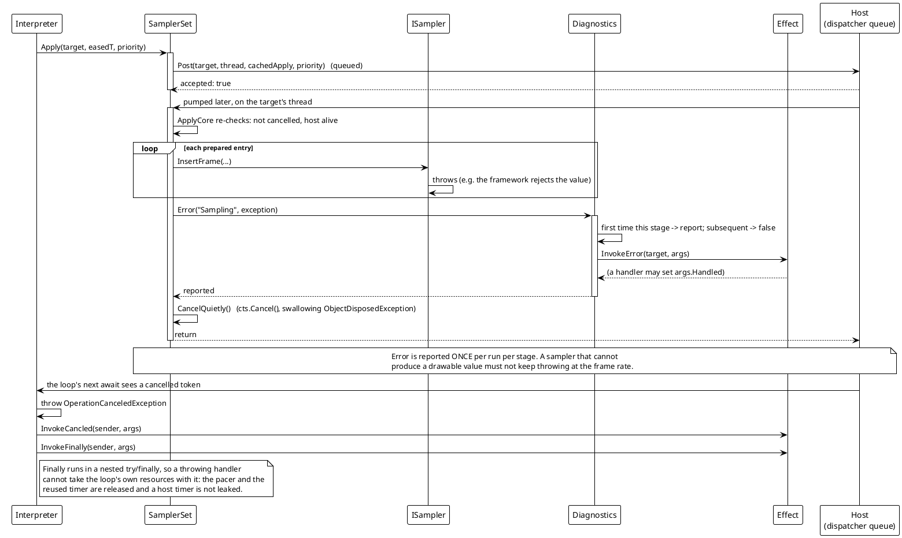
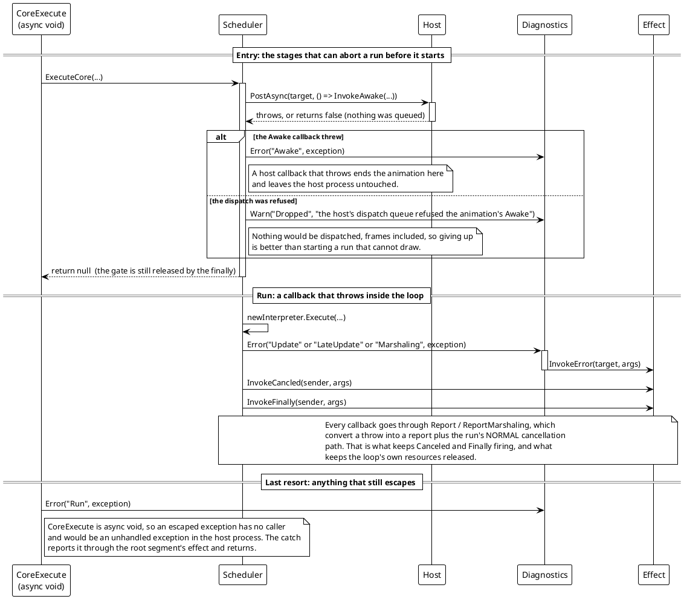

# 数据流 — 过渡动画：错误路径

引擎的失败模式是**沉默**：采样器跑在 UI 线程的 dispatcher 回调里，那里无人捕获；而 `Execute` 是 `async void`，没有调用方接得住一次抛出。设计的答案是单一内部居中者（`TransitionDiagnostics`），以及循环无条件遵守的一条规则：*异常绝不离开循环；它变成一次报告，随后该趟沿正常取消路径回卷。*

## (a) 一个抛异常的采样器，在帧中途

> 来源：`Src/Core/VeloxDev.Core/TransitionSystem/SamplerSet.cs`（`ApplyCore`、`CancelQuietly`）、`TransitionDiagnostics.cs`、`TransitionInterpreter.cs`（`ExecuteSamplingLoopAsync`、`Report`、`ReleaseLoopResources`）。

两个细节值得说清：

- **异常不外传，且 token 被*安静地*取消。** `CancelQuietly` 吞掉 `ObjectDisposedException`，因为动画或适配器可能已经释放了 token 源 —— 没有东西可取消，而那不是新的失败。
- **`Error` 每个阶段报一次。** `TransitionDiagnostics` 保留一份逐实例的 `HashSet<string> _reported`；已报过的阶段返回 `false`。这就是一个逐帧发生的情况不会产出逐帧日志的原因，也是消息点名的是*阶段*而不是帧的原因。

## (b) 一个抛异常的回调，以及入口处被中止的阶段

> 来源：`Src/Core/VeloxDev.Core/TransitionSystem/TransitionScheduler.cs`（`ExecuteCore`）、`Transition.cs`（`CoreExecute`）、`TransitionInterpreter.cs`（`Report`、`ReportMarshaling`、`ExecuteSamplingLoopAsync` 的 catch 子句）。

## (c) 运维实际看到的诊断

每次报告都携带 `TransitionEventArgs.Stage`，因此一行日志点名失败阶段而不必重跑任何东西：

| `Stage` | 以何形式抛出 | 含义 |
|---|---|---|
| `Awake` | `Error` | `Awaked` 处理器抛异常；该趟在准备前中止 |
| `Prepare` | `Error` | 归一化抛异常；该趟中止 |
| `Update` / `LateUpdate` | `Error` | effect 回调抛异常；该趟结束 |
| `Marshaling` | `Error` | 宿主的写路径抛异常（`Apply`） |
| `Sampling` | `Error` | `ISampler.InsertFrame` 抛异常；该趟被安静取消 |
| `Run` | `Error` | 有东西逃出了循环自己的 catch —— `async void` 的最后兜底 |
| `Dropped` | `Warn` | 宿主拒绝了一帧，或拒绝了一次 `Awake` 派发 |
| `Unreadable` | `Warn` | 一条已声明路径不匹配目标运行时类型；被跳过 |
| `Unsampled` | `Warn` | 一条已声明路径解析不出采样器；被跳过 |

`Warn` / `Error` 处理器像生命周期事件一样由 `WeakDelegate` 承载，在其中置 `Handled = true` 即要求终止该趟 —— 这是诊断被允许*改变*行为的唯一位置。没有处理器时报告仍会到 `Debug.WriteLine`，因此在调试器里静默降级的一次运行仍然可见。
