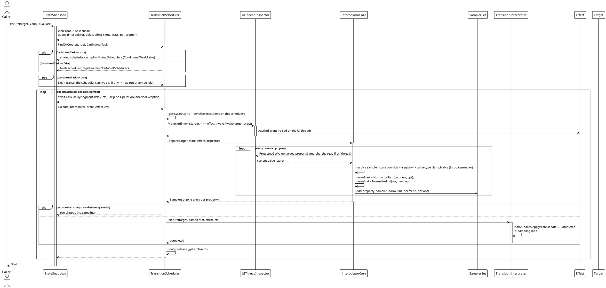
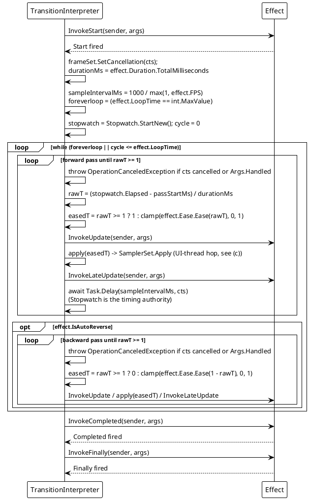
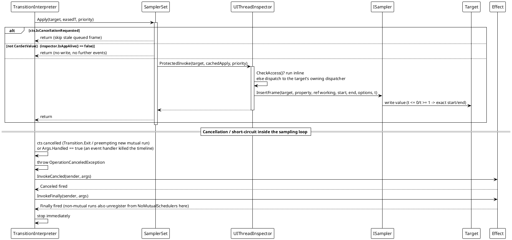
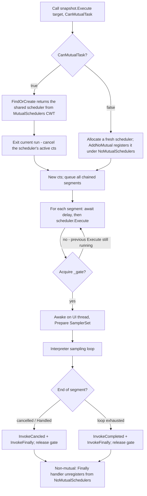

# 数据流 — 过渡动画

引擎在每个平台适配器上都通过相同的核心管道执行。一次运行在每个分段内是**两阶段**的：调度器先*准备*出一个归一化的 `SamplerSet`（读取当前值、解析采样器、固定端点），随后解释器驱动一个基于 Stopwatch 的*连续*采样循环，把每一帧写入编组到 UI 线程。本页展示运行生命周期、效果调度循环、UI 线程跳转，以及调度器的扇出/抢占规则。

## (a) 分段运行生命周期

`Execute(target)` 沿流式 `StateSnapshot` 链（`root`…`next`）行走，为每段排队 `(state, effect-clone, interpolator, delay)`，然后在每目标一个的调度器上一次播放一段。取消由一次运行共享的一个 `CancellationTokenSource` 承载，贯穿该运行的所有分段。

来源：`TransitionSystem/StateSnapshot.cs`（`CoreExecute`，分段排队与播放循环）、`TransitionScheduler.cs`（`FindOrCreate`、`Execute`、`_gate`、弱目标引用）、`Interpolator.cs`（`Prepare`，采样器解析）、`SamplerSet.cs`。

## (b) 效果调度与采样循环

每段的解释器运行一个连续循环。`Duration`/`FPS` 取自该段的 `Effect`；`FPS` 是**最大采样率上限**——让出间隔为 `1000 / FPS` ms，而 Stopwatch 是唯一计时来源（因此 `Task.Delay` 的误差永远不会让动画失真）。`LoopTime = int.MaxValue` 表示无限循环。

每程最后一次采样写入**精确端点**（正向 `easedT = 1`，反向 `easedT = 0`），而非依赖 `Ease(1)`；每个采样器把 `t <= 0`/`t >= 1` 映射为归一化后的精确起点/终点值。

## (c) UI 线程跳转、取消与应用关闭守卫

`SamplerSet.Apply` 为每个目标复用一个缓存闭包，把当前缓动时间经 `ProtectedInvoke` 交给 UI 线程。若目标分发器就是当前线程则内联执行；否则投递到目标所属分发器。`Prepare` 期间的读取同样经 `ProtectedGetValue` 编组。被取消的运行或已关闭的应用会跳过排队写入（即「过期帧守卫」），因此重置/退出的结果绝不会被覆盖。

来源：`TransitionSystem/SamplerSet.cs`（`Apply`、`SetCancellation`、`CanSetValue`、缓存 apply 闭包）、`TransitionInterpreter.cs`（`ExecuteSamplingLoopAsync`、`RunPassAsync`）、`TransitionEffect.cs`（事件触发）、`Src/Adapters/*/PlatformAdapters/UIThreadInspector.cs`（各平台编组）。

## (d) 调度器选择、抢占与扇出

一个目标**至多**持有一个共享互斥调度器（由 `SemaphoreSlim` 串行化），但可同时运行**多个**并发的非互斥调度器。同一目标上的新互斥运行会抢占（取消）当前正在执行的那个。

`Transition.Exit(target, IncludeMutual, IncludeNoMutual)` 取消目标的互斥调度器，并可选择取消每个正在运行的非互斥调度器；这些调度器随后经上面的 `Canceled`/`Finally` 路径收尾。

## 流程汇总

| 场景 | 行为 |
|---|---|
| 正常运行 | `CoreExecute` 排空每条链接的分段，然后逐段：`await delay` → 调度器 `Execute`（门控）→ UI 线程上 `Awake` → `Prepare` 为每个属性构建一个 `SamplerSet` 条目 → 解释器连续采样（`t = eased elapsed/duration`）并在 UI 线程应用每帧 → `Completed` + `Finally`。 |
| `IsAutoReverse` | 正向程后解释器运行反向程（复用同一批采样器；程末 `easedT = 0`）。 |
| `LoopTime` / `int.MaxValue` | 整个正向（+ 反向）对重复 `LoopTime + 1` 次（`cycle <= LoopTime`，自 0 起），或永远。 |
| 分段 `Await` 延迟 | 每段的前置延迟（`CoreAwait`/`CoreAwaitThen`）；取消（`OperationCanceledException`）时跳过。 |
| 同一目标的新互斥运行 | `CoreExecute` 先调用 `scheduler.Exit()`；先前调度器取消其当前 `cts`，排队帧被跳过。 |
| `TransitionEventArgs.Handled = true` | 事件处理器抛出 `OperationCanceledException` → `Canceled` + `Finally`；时间线停止。 |
| `Transition.Exit(target, …)` | 取消目标的互斥（可选非互斥）调度器；每个都经 `Finally` 注销。 |
| 后台线程启动 | `UIThreadInspector` 把读取（`ProtectedGetValue`）与帧写入（`ProtectedInvoke`）编组到目标 UI 线程；生命周期事件仍在解释器的执行线程上触发（只有 `Awake` 与帧写入总在 UI 线程）。 |
| 属性无采样器 / 路径无效 | `Prepare` 中跳过（编译 getter 的 `UnreadablePath` 哨兵，或未解析到 `ISampler`）；其余属性照常动画。 |
| 应用关闭 | `SamplerSet.CanSetValue()` 返回 false → `Apply` 跳过写入，不再触发事件。 |

> 来源：`Src/Core/VeloxDev.Core/TransitionSystem/TransitionScheduler.cs`（门控、CWT 表、弱目标）、`TransitionInterpreter.cs`（`ExecuteSamplingLoopAsync`/`RunPassAsync`）、`SamplerSet.cs`（`Apply` + 取消/应用存活守卫）、`Interpolator.cs`（`Prepare`）、`StateSnapshot.cs`（`CoreExecute`）、`TransitionEx.cs`、`Src/Adapters/*/PlatformAdapters/UIThreadInspector.cs`。

相关分析：[设计模式 — 过渡动画](../../02_设计模式分析/03_过渡动画/index.md) · [复杂度 — 过渡动画](../../04_复杂度分析/03_过渡动画/index.md)
