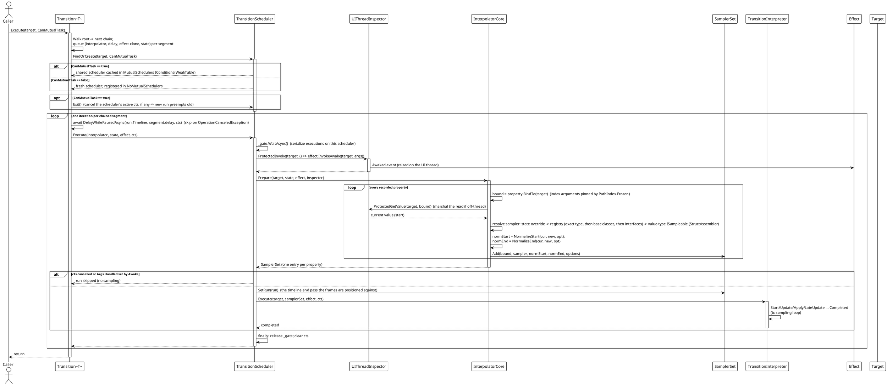
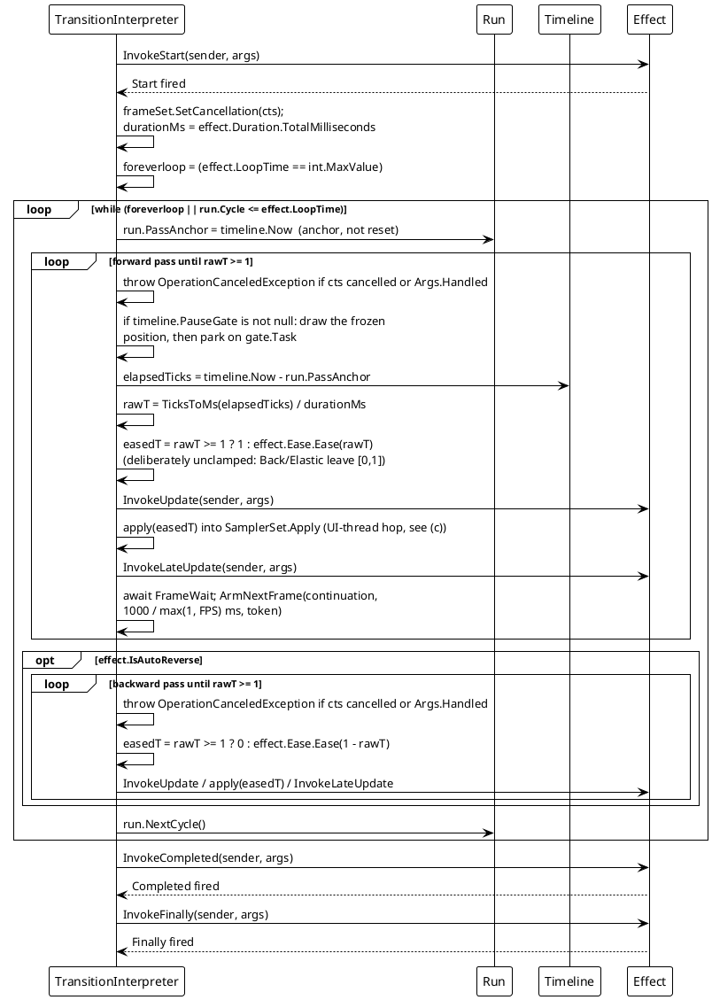
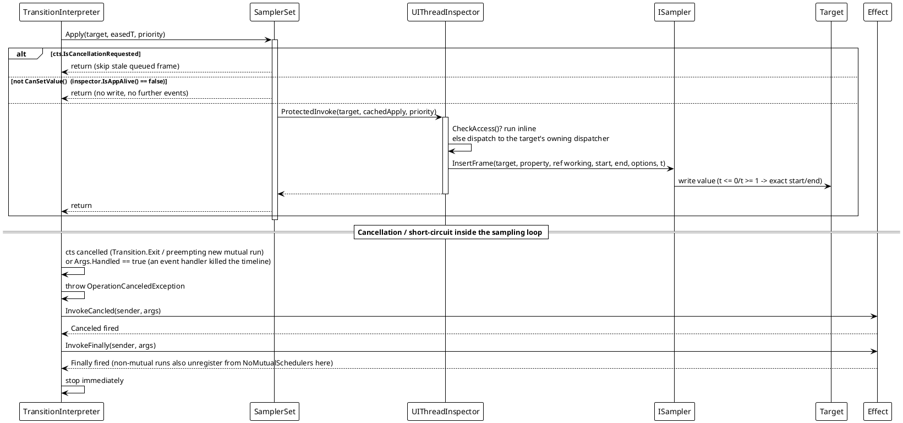
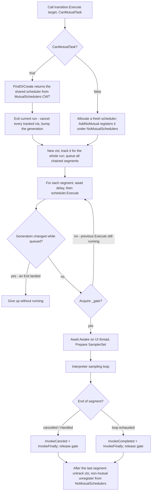

# 数据流 — 过渡动画

引擎在每个平台适配器上都通过相同的核心管道执行。一次运行在每个分段内是**两阶段**的：调度器先*准备*出一个归一化的 `SamplerSet`（读取当前值、解析采样器、固定端点），随后解释器驱动一个*连续*采样循环——它锚定在该次运行的时间轴上，并负责把每一帧写入编组到 UI 线程。本页展示运行生命周期、效果调度循环、UI 线程跳转、调度器的扇出/抢占规则，以及一条路径在被「反射得到」而非「声明得到」时是如何产生的。

## (a) 分段运行生命周期

`Execute(target)` 沿流式分段链（`root`…`next`，节点类型是适配器的 `Transition<T>`）行走，为每段排队 `(state, effect-clone, interpolator, delay)`，然后在每目标一个的调度器上一次播放一段。取消由一次运行共享的一个 `CancellationTokenSource` 承载，贯穿该运行的所有分段。

来源：`TransitionSystem/Transition.cs`（`CoreExecute`，分段排队与播放循环）、`TransitionScheduler.cs`（`FindOrCreate`、`Execute`、`_gate`、弱目标引用）、`Interpolator.cs`（`Prepare`，采样器解析）、`SamplerSet.cs`。

## (b) 效果调度与采样循环

每段的解释器运行一个连续循环。`Duration`/`FPS` 取自该段的 `Effect`；`FPS` 是**最大采样率上限**——让出间隔为 `1000 / FPS` ms，而且它只是上限：该次运行的时间轴才是唯一计时来源，晚醒只会把一帧画在更靠后的位置，而不会画错。一程是钉进这条时间轴的一个**锚点**（`run.PassAnchor`），而不是一次重置——这正是多个动画能共用一条时间轴的原因。`LoopTime = int.MaxValue` 表示无限循环。

每程最后一次采样写入**精确端点**（正向 `easedT = 1`，反向 `easedT = 0`），而非依赖 `Ease(1)`；每个采样器把 `t <= 0`/`t >= 1` 映射为归一化后的精确起点/终点值。中间帧**不**做钳制：`Back`/`Elastic` 的定义就是越出 `[0, 1]`，因此缓动值原样交给采样器，由采样器决定——数值型外推，其余钉到端点。

这里的等待不是 `Task.Delay`。`ArmNextFrame` 是解释器上的 `protected virtual` 缝：默认实现经 `ReusableTimerWait` 为整个循环复用**一个** `Timer`（取消登记整次动画只做一次，而不是每帧一次）；框架能告知下一帧何时到来的宿主——WPF、Avalonia、WinUI 的渲染节拍——则重写它。该 awaitable 实现 `INotifyCompletion` 而**刻意不**实现 `ICriticalNotifyCompletion`，编译器的 await 路径因此会捕获调用方的 `SynchronizationContext`；在 UI 线程上启动的循环于是留在 UI 线程，而不会在计时器回调所在的线程上恢复。`ReusableTimerWaitTests` 度量了这一差异。

## (c) UI 线程跳转、取消与应用关闭守卫

`SamplerSet.Apply` 为每个目标复用一个缓存闭包，把当前缓动时间经 `ProtectedInvoke` 交给 UI 线程。若目标分发器就是当前线程则内联执行；否则投递到目标所属分发器。`Prepare` 期间的读取同样经 `ProtectedGetValue` 编组。被取消的运行或已关闭的应用会跳过排队写入（即「过期帧守卫」），因此重置/退出的结果绝不会被覆盖。

来源：`TransitionSystem/SamplerSet.cs`（`Apply`、`SetCancellation`、`SetRun`、`CanSetValue`、缓存 apply 闭包）、`TransitionInterpreter.cs`（`ExecuteSamplingLoopAsync`、`RunPassAsync`、`EmitFrame`、`ArmNextFrame`）、`TransitionClock.cs`（`TransitionTimeline`、`TransitionRun`）、`ReusableTimerWait.cs`、`TransitionEffect.cs`（事件触发）、`Src/Adapters/*/PlatformAdapters/UIThreadInspector.cs`（各平台编组）。

## (d) 调度器选择、抢占与扇出

一个目标**至多**持有一个共享互斥调度器（由 `SemaphoreSlim` 串行化），但可同时运行**多个**并发的非互斥调度器。同一目标上的新互斥运行会抢占（取消）当前正在执行的那个。

`Transition.Exit(target, IncludeMutual, IncludeNoMutual)` 取消目标的互斥调度器，并可选择取消每个正在运行的非互斥调度器；这些调度器随后经上面的 `Canceled`/`Finally` 路径收尾。同一控制面上的另外三个入口——`Pause`/`Resume`、`SetRate` 与 `Seek`——走的是另一条路：它们完全不经过调度器的门控，而是作用于每个 run 所锚定的那条 `TransitionTimeline`。

## (e) 路径的两种来源：声明与反射

声明得到的路径（`.Property(x => x.Foo.Bar, value)`）只解析一次，此后作为字段随 transition 一起存在。反射驱动的入口是 `TransitionProperty.FromProperty(PropertyInfo)`：主题系统在**每一次**切换中，都要为每个已注册目标的每个主题化属性调用它——而新建的 `TransitionProperty` 会在首次使用时编译自己的 getter/setter，因此这整套东西之前是**每次切换重编一遍**。

现在 `FromProperty` 经由一个静态 `ConcurrentDictionary<PropertyInfo, TransitionProperty>` 做备忘，对同一个 `PropertyInfo` 返回**共享**实例。共享是安全的：路径不可变，`BindTo` 在没有需要冻结的索引实参时返回实例自身——而这条路径上永远如此——并且惰性编译是幂等的，并发首次使用最多只是编译两次、丢弃一份。由此产生的量化效果见[复杂度 — 过渡动画](../../04_复杂度分析/03_过渡动画/index.md)。

索引实参是这条路径故事的另一半。默认情况下，会在动画运行中变化的索引实参（捕获的局部变量，或目标自身的属性如 `SelectedIndex`）是**逐帧重新求值**的，因此路径会跟着它走；但终点值是在动画启动时读一次的，于是移动中的路径会把终点值写到一个不是它读取时所在的位置上。`PathIndex.Frozen(i)` 改为把槽位钉死。它是路径标识的一部分，所以 `Items[i]` 与 `Items[Frozen(i)]` 是两条不同的路径，而这次钉死只在 `Prepare` 里由 `TransitionProperty.BindTo` 解析一次。

## 流程汇总

| 场景 | 行为 |
|---|---|
| 正常运行 | `CoreExecute` 排空每条链接的分段，然后逐段：`await delay` → 调度器 `Execute`（门控）→ UI 线程上 `Awake` → `Prepare` 为每个属性构建一个 `SamplerSet` 条目 → 解释器连续采样（`t = eased elapsed/duration`）并在 UI 线程应用每帧 → `Completed` + `Finally`。 |
| `IsAutoReverse` | 正向程后解释器运行反向程（复用同一批采样器；程末 `easedT = 0`）。 |
| `LoopTime` / `int.MaxValue` | 只要 `run.Cycle <= effect.LoopTime` 就一直重复整个正向（+ 反向）对（`Cycle` 自 0 起，每对之后 `NextCycle`），或永远。 |
| 采样节拍 | 帧落在**何时**由时间轴决定；`1000 / max(1, FPS)` ms 只限制循环查看的频率。每次等待都经 `ArmNextFrame`——默认是每个循环复用一个 `Timer`（取消登记整次动画一次），框架重写时则是宿主的渲染节拍。 |
| `Pause` / `Resume` / `SetRate` / `Seek` | `Transition.Pause/Resume/SetRate/Seek(target, …)` 作用于该 run 的 `TransitionTimeline`，而不是调度器。暂停会冻结时钟，因此暂停时间是被扣除而非被跳过，且停下的循环完全不产生计时器唤醒；改速率会先重定基准，因此位置不会跳变；seek 替换 `run.PassAnchor`（带 `cycle` 的重载还会设置程计数器），暂停期间则只把新位置画一帧、不恢复播放。零时长的程根本不消耗时间，程计数器正是为此存在。 |
| 索引实参 | 默认逐帧重新求值，因此路径跟着它走，而终点值仍留在读取时所在的位置；`PathIndex.Frozen(i)` 把槽位钉死整次动画，并且是路径标识的一部分。 |
| 反射得到的路径 | `TransitionProperty.FromProperty` 对每个 `PropertyInfo` 返回备忘后的共享路径，主题切换因此不再为每个目标、每次切换重编 getter/setter。 |
| 分段 `Await` 延迟 | 每段的前置延迟（`CoreAwait`/`CoreAwaitThen`），由一个复用的 `ReusableTimerWait` 经 `DelayWhilePausedAsync` 等待完；取消（`OperationCanceledException`）时跳过，且暂停期间流逝的那部分不会被消耗。 |
| 同一目标的新互斥运行 | `CoreExecute` 先排空并取消上一次运行登记的全部令牌（同时递增代际号）：上一次运行在下一次检查点放弃，已排队的帧被跳过。 |
| `TransitionEventArgs.Handled = true` | 事件处理器抛出 `OperationCanceledException` → `Canceled` + `Finally`；时间线停止。 |
| `Transition.Exit(target, …)` | 取消目标的互斥（可选非互斥）调度器；每个都经 `Finally` 注销。 |
| 后台线程启动 | `UIThreadInspector` 把读取（`ProtectedGetValue`）与帧写入（`ProtectedInvoke`）编组到目标 UI 线程。循环自身的等待会捕获调用方的 `SynchronizationContext`，因此在 UI 线程启动的循环会把 `Start`/`Update`/`Completed` 回调留在该线程；只有 `Awake` 与帧写入始终被编组到目标线程。 |
| 属性无采样器 / 路径无效 | `Prepare` 中跳过（编译 getter 的 `UnreadablePath` 哨兵，或未解析到 `ISampler`）；其余属性照常动画。 |
| 应用关闭 | `SamplerSet.CanSetValue()` 返回 false → `Apply` 跳过写入，不再触发事件。 |

> 来源：`Src/Core/VeloxDev.Core/TransitionSystem/TransitionScheduler.cs`（门控、CWT 表、弱目标、代际/排空、`TransitionRun` 登记）、`TransitionInterpreter.cs`（`ExecuteSamplingLoopAsync`/`RunPassAsync`/`EmitFrame`/`ArmNextFrame`）、`TransitionClock.cs`（`TransitionTimeline.Advance`/`Wake`/`PauseGate`、`TransitionRun.PassAnchor`/`Cycle`）、`ReusableTimerWait.cs`、`SamplerSet.cs`（`Apply` + 取消/应用存活守卫、`Run`/`SetRun`）、`Interpolator.cs`（`Prepare`、`TryGetInterpolator`、`CreateScheduler`）、`TransitionProperty.cs`（`BindTo`、`FromProperty`）、`PathIndex.cs`、`Transition.cs`（`CoreExecute`、`Pause`/`Resume`/`SetRate`/`Seek`）、`Src/Core/VeloxDev.Core.Test/TransitionSystem/ReusableTimerWaitTests.cs`、`Src/Adapters/*/PlatformAdapters/UIThreadInspector.cs`。

相关分析：[设计模式 — 过渡动画](../../02_设计模式分析/03_过渡动画/index.md) · [复杂度 — 过渡动画](../../04_复杂度分析/03_过渡动画/index.md)
