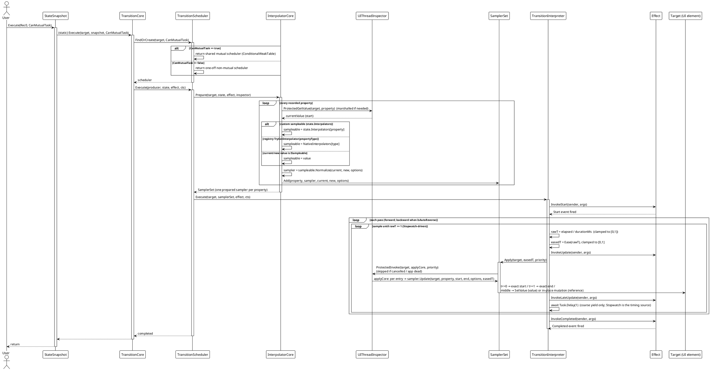
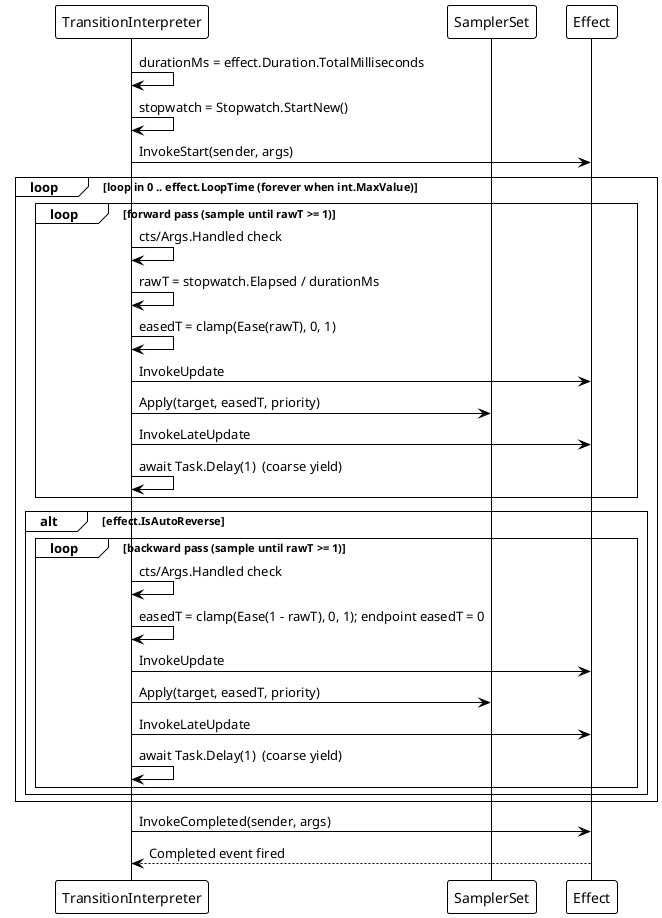
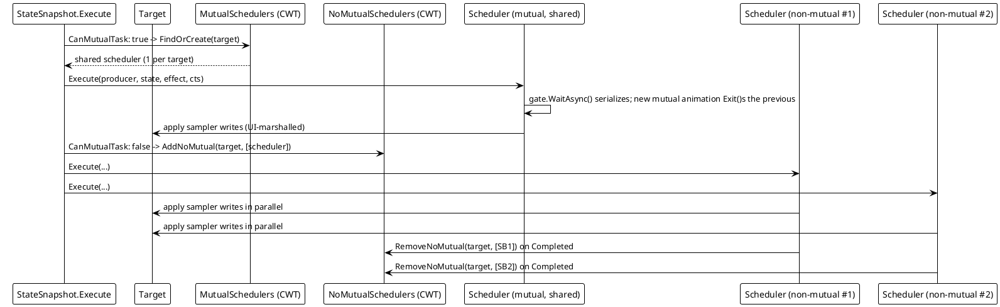

# 数据流 — 过渡动画

## (a) 正常执行流

从 `snapshot.Execute(target)` 到 Stopwatch 驱动采样循环的完整调用链。此流程在全部六个平台适配器上一致运行。

## (b) 自动往返 / 循环流

当设置了 `IsAutoReverse` 或 `LoopTime` 时，解释器会把采样程包起来。`LoopTime = int.MaxValue` 表示无限循环。

## (c) 取消 / `TransitionEventArgs.Handled = true` 短路

被取消的 `cts`（来自 `Transition.Exit` 或新的互斥动画）或处理器把 `Handled` 设为 `true` 都会抛出 `OperationCanceledException`；解释器触发 `Canceled` + `Finally` 并停止。

**应用关闭路径：** `SamplerSet.Apply` 会检查 `inspector.IsAppAlive()`（通过 `CanSetValue`）；当其为 `false`（例如 WinUI `DispatcherQueue` 入队失败）时跳过写入。`ApplyCore` 内的同一守卫会在一次采样中途停止，因此采样不再应用且不再触发更多事件。被取消的动画（`cts.IsCancellationRequested`）同样跳过已排队的写入 —— 即原 `ICancellableFrameSequence` 的过期帧守卫。

## (d) 互斥 vs 非互斥调度器扇出

一个目标**至多**持有一个共享互斥调度器（由 `SemaphoreSlim` 串行化），但可以同时持有**多个**并发的非互斥调度器。

## 流程汇总

| 场景 | 行为 |
|---|---|
| 正常执行 | `InterpolatorCore.Prepare` 为每个属性解析 `ISampleable` 并 `Normalize` 得到 `ISampler`（读取 current=start、target=end）；解释器用 Stopwatch 连续采样（`t = elapsed/duration`，缓动 + 钳制），并经 `SamplerSet.Apply` 编组到 UI 线程应用；每次采样触发 `Update`/`LateUpdate` 事件；结束时触发 `Completed` + `Finally`。 |
| `IsAutoReverse` | 正向程后，解释器运行反向程（复用同一批采样器；程末 `easedT` 强制为 0）。 |
| `LoopTime` / `int.MaxValue` | 整个正向（+ 反向）程重复 `LoopTime` 次，或永远。 |
| 同目标新的互斥动画 | 新运行前 `CoreExecute` 调用 `scheduler.Exit()`；先前调度器取消其当前 `cts`。 |
| `TransitionEventArgs.Handled = true` | 抛出 `OperationCanceledException` → `Canceled` + `Finally`；时间线停止。 |
| `Transition.Exit(target)` | 取消目标的互斥（可选非互斥）调度器。 |
| 后台线程启动 | `UIThreadInspector.ProtectedInvoke`/`ProtectedGetValue` 把读取与写入编组到 UI 线程。 |
| 属性无采样器 | `Prepare` 中跳过该属性（`UnreadablePath` 哨兵或未解析到 `ISampleable`）；其余属性照常动画。 |
| 应用关闭 | `SamplerSet.CanSetValue()` 检查 `IsAppAlive()` → 跳过写入，不再触发事件。 |

> 源码引用：`Src/Core/VeloxDev.Core/TransitionSystem/TransitionInterpreter.cs`（Stopwatch 驱动采样循环、`ExecuteSamplingLoopAsync`）、`TransitionScheduler.cs`（`FindOrCreate`、`Execute`、门控）、`Interpolator.cs`（`Prepare`、采样器解析）、`SamplerSet.cs`（`Apply`、取消/应用存活跳过）、`StateSnapshot.cs`（`CoreExecute`）、`Src/Adapters/*/PlatformAdapters/UIThreadInspector.cs`。
