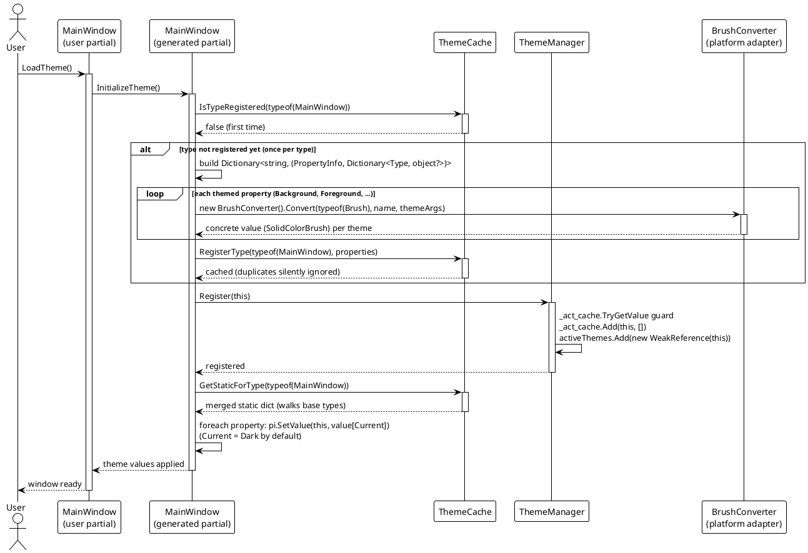
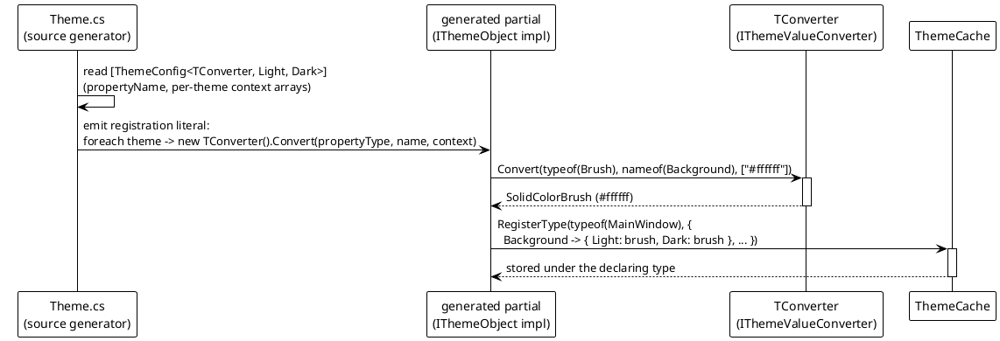

# 数据流 — 注册与转换器管线

主题感知视图（如 WPF 的 `MainWindow`）是带有 `[ThemeConfig<TConverter, TTheme...>]` 特性的 `partial class`。`VeloxDev.Generators.Theme` 生成实现 `IThemeObject` 的姊妹 partial，其 `InitializeTheme()` 完成全部注册。Demo 在 `InitializeComponent()` 之后调用一次 `InitializeTheme()`。

## 注册流程（`InitializeTheme`）

注册分散到三个存储：

- `ThemeCache`（静态，以声明类型为键）保存**每个主题的默认值**。`RegisterType` 以 `IsTypeRegistered` 守卫，因此无论多少实例调用 `InitializeTheme`，每个类型只注册一次。
- `ThemeManager._act_cache` 是仅用作**成员守卫**的 `ConditionalWeakTable<IThemeObject, ...>`（每个已注册对象映射到空字典），`activeThemes` 则按实例保存一个 `WeakReference<IThemeObject>` 用于枚举。
- **当前主题的应用**通过反射合并后的静态缓存，对每个属性调用 `pi.SetValue(this, value)`。

## 转换器管线

`ThemeCache` 从不直接看到原始特性字符串。`Theme.cs` 在生成注册字面量时，会在首次 `InitializeTheme` 中为每个主题参数数组实例化特性指定的转换器类型（`TConverter`）并调用其 `Convert`：

每个主题的值在类型首次 `InitializeTheme` 时（`IsTypeRegistered == false` 分支内）计算一次，并以每个属性一个 `Dictionary<Type, object?>` 保存。`ThemeCache.RegisterConverter`/`GetConverter` 注册表存在以支持复用，但当前生成器改为内联实例化转换器（`Activator.CreateInstance`），并不使用它 —— `Src/Generators/VeloxDev.Core.Generator/Theme.cs`，232-239 行。

元数覆盖：生成器通过 `ForAttributeWithMetadataName` 元数据名发现被装饰类，只针对泛型元数 3–7（一个转换器外加 2 到 6 个主题标记；`Theme.cs`，32-55 行）。特性家族另外还定义了七主题变体（泛型元数 8）；没有针对该元数的扫描器，但发射阶段读取被发现的类上**每一条**名称以 `ThemeConfigAttribute` 开头的特性（`Theme.cs`，90-92 行），并从泛型实参第 1 位起取出主题类型（`Theme.cs`，160-224 行），因此只要同一个类上另有「已发现元数」的特性，元数 8 的声明就会照常注册。Demo 与测试只用两主题的元数 3 形式（`ThemeConfigAttribute<BrushConverter, Light, Dark>`）。

两个 Demo 的注册方式相同 —— 一个 `[ThemeConfig]` partial 加一次 `InitializeComponent()` 之后的 `InitializeTheme()` —— 但两项全局设置的位置不同。精简 Demo 把它们放在调用旁边（`Examples/Theme/WPF Trimmed/Demo/MainWindow.xaml.cs` 的 `LoadTheme`）；规模 Demo 则没有任何窗口级设置，而是把 `SetPlatformInterpolator`、`StartModel` 与 `SetCurrent<Dark>` 放进 `App.OnStartup`，早于任何元素注册自己（`Examples/Theme/WPF/Demo/App.xaml.cs`）。规模 Demo 的方块在各自构造函数里注册（`Examples/Theme/WPF/Demo/ThemeTile.cs` 的 `ThemeTile()`），因此「构造 $N$ 个方块」本身就是「把 $N$ 个目标放进下一场切换」的全部工作。

> 源码：`Src/Generators/VeloxDev.Core.Generator/Theme.cs`（元数提供器 32-55 行；特性过滤 90-92 行；生成的 `InitializeTheme` 387-415 行）、`Src/Core/VeloxDev.Core/DynamicTheme/ThemeCache.cs`（`IsTypeRegistered` 41-47 行、`RegisterType` 54-68 行、`GetStaticForType` 98-103 行）、`Src/Core/VeloxDev.Core/DynamicTheme/ThemeManager.cs`（`Register` 74-82 行）、`Examples/Theme/WPF Trimmed/Demo/MainWindow.xaml.cs`（特性 36-37 行、`LoadTheme` 40-53 行）、`Examples/Theme/WPF/Demo/App.xaml.cs`、`Examples/Theme/WPF/Demo/ThemeTile.cs`。
