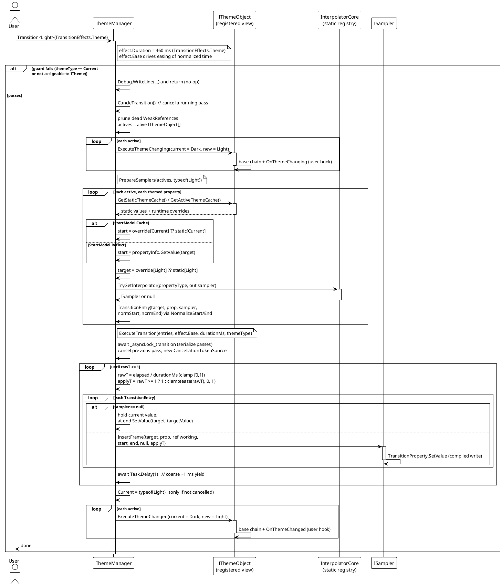
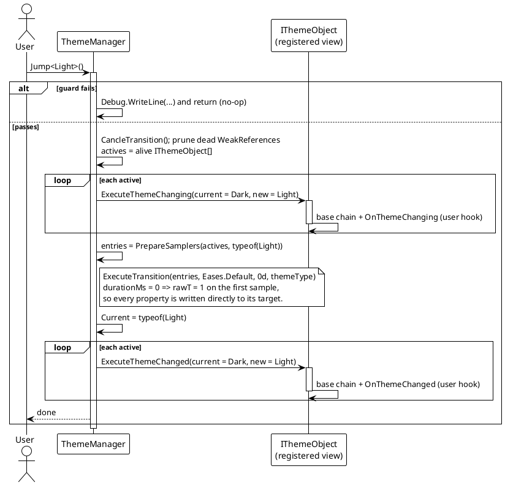

# 数据流 — 主题切换

`Transition<T>`（带动画）与 `Jump<T>`（即时）遵循同一管线：守卫目标主题、通知 `ExecuteThemeChanging`、为每个属性准备一条采样器条目、运行 `ExecuteTransition`、更新 `Current`、再通知 `ExecuteThemeChanged`。唯一的差别是动画时长 —— `Jump` 传入 `durationMs = 0`。

## 带动画切换（`Transition<T>`）

说明：

- 条目列表预先构建，每个属性一条 `TransitionEntry`：目标对象、编译后的 `TransitionProperty`、解析到的 `ISampler`（或 null）、归一化后的起始/结束值。
- 不构建帧列表 —— 采样由 Stopwatch 驱动；每次循环经 `Task.Delay(1)` 让出，当 `elapsed >= durationMs` 时结束。此循环不读取效果上的 `FPS`。
- 若已有切换正在运行又发起第二次 `Transition`/`Jump`，前者会被 `CancellationTokenSource`（`CancleTransition`）取消，只有「胜出」的那一趟会更新 `Current`。`ExecuteTransition` 先等待静态 `SemaphoreSlim`，各趟不会重叠。

## 即时切换（`Jump<T>`）

`Eases.Default` 是线性缓动（`Ease(t) => t`），但因为时长为零，首次采样即 `applyT = 1`，它永远不会被观测到。

## 守卫条件与边界路径

| 场景 | 行为 |
|---|---|
| `themeType == Current` | 守卫提前返回并输出调试信息 `[ThemeManager] Invalid theme type, jumping to current theme.`（no-op，不会重放）。 |
| `themeType` 不可赋值给 `ITheme` | 同一守卫，同样 no-op 返回。 |
| 属性类型有已注册采样器 | 端点由 `NormalizeStart`/`NormalizeEnd` 产生；中间帧由 `ISampler.InsertFrame` 写入。 |
| 属性类型没有采样器 | 简单切换：整趟持有当前值，最后一次采样写入目标值。 |
| 属性没有找到值（起始或目标） | `PrepareSamplers` 记录 `... skipping` 并从该趟跳过该属性。 |
| 已有切换运行中又发起新切换 | 前一趟被取消（`CancleTransition`）；采样由静态 `SemaphoreSlim` 串行化。 |
| 零时长效果 / `Jump` | 首次采样即 `rawT = 1` → 每个属性直接写为目标值。 |
| 已死亡的注册对象 | 在该趟开始时清理（弱引用），随后忽略。 |

> 源码：`Src/Core/VeloxDev.Core/DynamicTheme/ThemeManager.cs` —— `Transition` 83-112 行、`Jump` 118-146 行、`PrepareSamplers` 148-303 行、`ExecuteTransition` 332-400 行。
