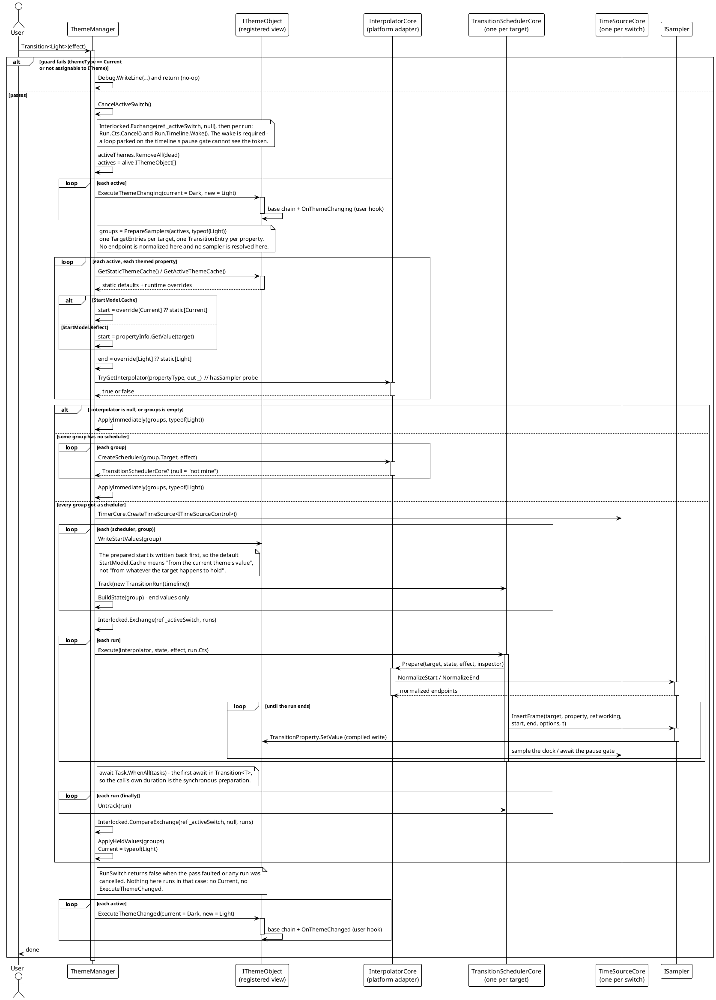
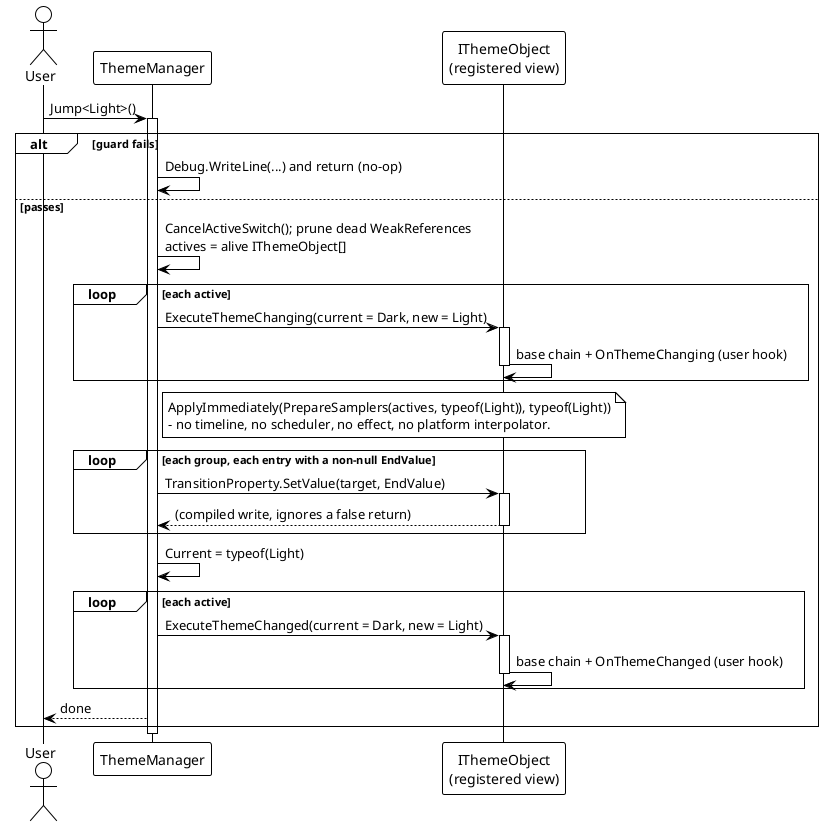

# 数据流 — 主题切换

`Transition<T>` 与 `Jump<T>` 不再共用同一条管线。带动画的切换先准备出一组按目标分组的条目，再交给每个目标一个平台 `TransitionSchedulerCore`，全部锚定在同一条 `ITimeSourceControl` 上，于是时钟、帧节拍和效果自身的标志都归过渡系统所有。即时切换完全不碰过渡系统：`Jump` 经 `ApplyImmediately` 直接写入全部终值并推进 `Current`，因此它既不依赖 `SetPlatformInterpolator`，也不受平台 `ITransitionEffect<TPriority>` 的类型约束。

两个入口共用同一段前奏 —— 守卫、取消、清理、通知 `ExecuteThemeChanging` —— 也都以通知 `ExecuteThemeChanged` 收尾，但只有真正落地的切换才走到那一步。

## 带动画切换（`Transition<T>`）

说明：

- `PrepareSamplers` 产出 `TargetEntries`（私有，每个目标一组），组内是 `TransitionEntry`（私有，每个属性一条）。条目携带 `Target`、`PropertyInfo`、编译后的 `TransitionProperty`、`StartValue`、`EndValue`、`HasSampler`。一个目标若没有任何可用属性就不建组 —— 空动画和空采样集合都没有意义。
- 只有**终值**被声明给 scheduler（`BuildState`），且仅限 `EndValue` 非 null 的条目；终值为 null 表示「这个主题不管这个属性」。起点由 `InterpolatorCore.Prepare` 重新从目标上读回，因此在 `PrepareSamplers` 里归一化端点会归一化两次。
- 整场共用一条时间轴。每个目标都锚在它上面，这正是对**任意单个**目标调用 `Transition.Pause` / `Resume` / `Seek` / `SetRate` / `Exit` 会作用于全部目标的原因，也是切换的墙钟耗时不随元素数增长的原因。帧节拍与效果的 `FPS`、`IsAutoReverse`、`LoopTime` 都归过渡系统所有（`ThemeTransitionTests.Switch_HonoursAutoReverseAndLoopTime`）。
- 平台接缝在**调度任何东西之前**解析完毕：若 `_interpolator` 为 null、若没有任何组含可动属性、或任一组的 `CreateScheduler` 返回 null，整场切换退化为 `ApplyImmediately`，而不是只动一部分。`CreateScheduler` 每个目标每场只问一次。
- `Track` 必须先于 `Execute`：scheduler 正是靠它在即将构建的采样集合里找回 run —— 也就是找回令牌。
- `RunSwitch` 是私有的 `async Task<bool>`：对被取消或被顶替的切换返回 `false`；而 `Transition` 是 `async void`，其调用方接不住异常 —— 所以围绕 scheduler 的每个 `await` 都被包住并记录日志。

## 即时切换（`Jump<T>`）

`Jump` 不做任何归一化，也不查询任何采样器：`TransitionProperty.SetValue` 把声明的值原样写入，有采样器的属性与没有采样器的属性写法完全相同。由此带来一处不对称 —— `Jump` 会先取消正在进行的带动画切换（`CancelActiveSwitch`），但正在进行的 `Jump` 无法被取消，因为它内部根本没有 await 点。

## 守卫条件与边界路径

| 场景 | 行为 |
|---|---|
| `themeType == Current` | 守卫提前返回并输出调试信息 `[ThemeManager] Invalid theme type, jumping to current theme.`（no-op，不会重放）。 |
| `themeType` 不可赋值给 `ITheme` | 同一守卫，同样 no-op 返回。 |
| 没有平台插值器（`_interpolator is null`） | `RunSwitch` 退化为 `ApplyImmediately`：一次性写入全部终值并推进 `Current` —— 不动画，但 `ExecuteThemeChanged` 仍会触发。 |
| 某个目标的 scheduler 为 null | 整场切换退化为 `ApplyImmediately`，而不是只让那一个目标瞬切。 |
| `RunSwitch` 逸出异常 | 由 `Transition` 的 catch 记录（`async void` 的调用方接不住），该场切换不推进 `Current`，也不触发 `ExecuteThemeChanged`。 |
| 已有切换运行中又发起新切换 | `CancelActiveSwitch` 取消各 run 的令牌并唤醒其时间轴；被顶替的那场返回 `false`，因此既不推进也不发通知。 |
| 属性类型有已注册采样器 | `InterpolatorCore.Prepare` 解析它并归一化端点；中间帧由 `ISampler.InsertFrame` 产生。 |
| 属性类型没有采样器 | 整趟保持准备好的起始值；`ApplyHeldValues` 在 `Task.WhenAll` 之后写入终值。 |
| 某属性的 `EndValue` 为 null | 被 `BuildState`（不采样）与 `ApplyHeldValues`（不写入）跳过 —— 该主题不管这个属性。 |
| 属性没有找到值（起始或目标） | `PrepareSamplers` 记录 `... skipping` 并从该场切换中跳过该属性。 |
| 零时长效果 / `Jump` | `Jump` 同步写入终值；零时长的 `Transition` 在下一帧跑完它那一趟。 |
| 已死亡的注册对象 | 在该场切换开始时清理（弱引用），随后忽略。 |

> 源码：`Src/Core/VeloxDev.Core/DynamicTheme/ThemeManager.cs` —— `Transition`（109-146 行）、`Transition<T>`（152-155 行）、`Jump`（161-185 行）、`Jump<T>`（190-193 行）、`RunSwitch`（199-291 行）、`WasCancelled`（297-307 行）、`CancelActiveSwitch`（312-332 行）、`WriteStartValues`（334-347 行）、`BuildState`（353-376 行）、`ApplyHeldValues`（381-399 行）、`ApplyImmediately`（404-425 行）、`PrepareSamplers`（427-577 行），以及私有嵌套类 `TargetEntries`（584-588 行）、`TransitionEntry`（590-610 行）、`SwitchTarget`（613-618 行）。行为由 `Src/Core/VeloxDev.Core.Test/DynamicTheme/ThemeTransitionTests.cs` 验证。
