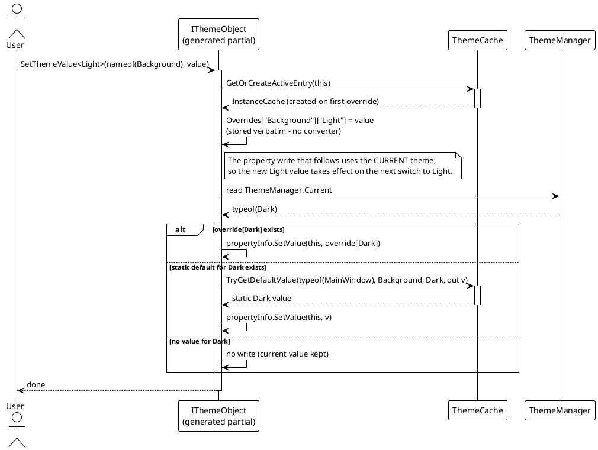
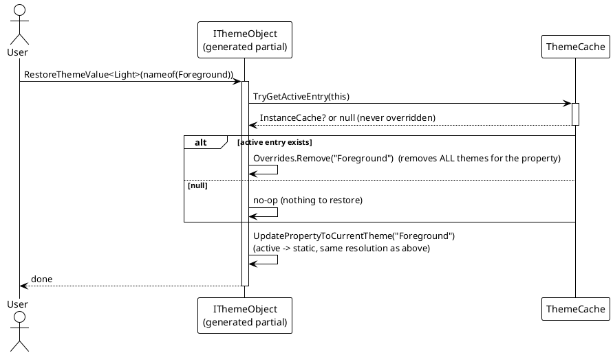

# 数据流 — 运行时覆盖

静态 `[ThemeConfig]` 值在注册时固定。要在运行时编辑某主题值，生成的 `IThemeObject` 暴露 `SetThemeValue<T>` / `RestoreThemeValue<T>`，它们写入 `ThemeCache` 中按实例的**活跃缓存**。切换时活跃值会遮蔽静态值。

## 覆盖 / 恢复流程





说明：

- 覆盖存储是 `ThemeCache` 内的 `ConditionalWeakTable<IThemeObject, InstanceCache>` —— 弱键，覆盖随实例一起回收、绝不泄漏（`Src/Core/VeloxDev.Core/DynamicTheme/ThemeCache.cs`，18、131-143 行）。
- `RestoreThemeValue<T>` 与主题无关：它把该属性（所有主题）的整条记录从 `Overrides` 中移除，然后重新应用当前主题。
- `GetStaticThemeCache()` / `GetActiveThemeCache()`（生成）分别暴露合并后的静态字典与运行时覆盖，便于检查 —— `Src/Generators/VeloxDev.Core.Generator/Theme.cs`，331-341 行。

## 切换时的解析顺序

在 `PrepareSamplers` 中，对**起始值**（当前主题）与**目标值**（目标主题）都先查活跃缓存、仅当该属性没有该主题的覆盖时才回退到静态默认值：

```csharp
// Src/Core/VeloxDev.Core/DynamicTheme/ThemeManager.cs — PrepareSamplers: the current value
// (StartModel.Cache branch, lines 497-509); the target lookup below repeats the same
// active-first order for targetThemeType (lines 529-539)
if (activeCache.TryGetValue(propEntry.Key, out var activePropCache) &&
    activePropCache.TryGetValue(propertyInfo, out var activeTypeCache) &&
    activeTypeCache.TryGetValue(Current, out currentValue))
{
    hasCurrentValue = true;
}
else if (typeValues.TryGetValue(Current, out currentValue))
{
    hasCurrentValue = true;
}
// ... the same active-first / static-second order for the target theme
```

因此只要目标主题等于 `T`，来自 `SetThemeValue<T>` 的运行时覆盖就优先于静态 `[ThemeConfig]` 值。

两个 Demo 都用按钮接线：规模 Demo 走 `OnEditThemeValue` / `OnRestoreThemeValue`（`Examples/Theme/WPF/Demo/MainWindow.xaml.cs`），精简 Demo 走 `ThemeValueEx`（`Examples/Theme/WPF Trimmed/Demo/MainWindow.xaml.cs`），后者还用 `GetStaticThemeCache()` / `GetActiveThemeCache()` 把两个缓存读回来。

> 源码：`Src/Core/VeloxDev.Core/DynamicTheme/ThemeCache.cs`（`GetOrCreateActiveEntry` 131-134 行、`TryGetActiveEntry` 139-143 行）、`Src/Core/VeloxDev.Core/DynamicTheme/ThemeManager.cs`（`PrepareSamplers` 起始/目标查找 474-549 行）、生成成员见 `Src/Generators/VeloxDev.Core.Generator/Theme.cs`（`SetThemeValue` 302-318 行、`RestoreThemeValue` 322-327 行、`UpdatePropertyToCurrentTheme` 345-373 行）。
