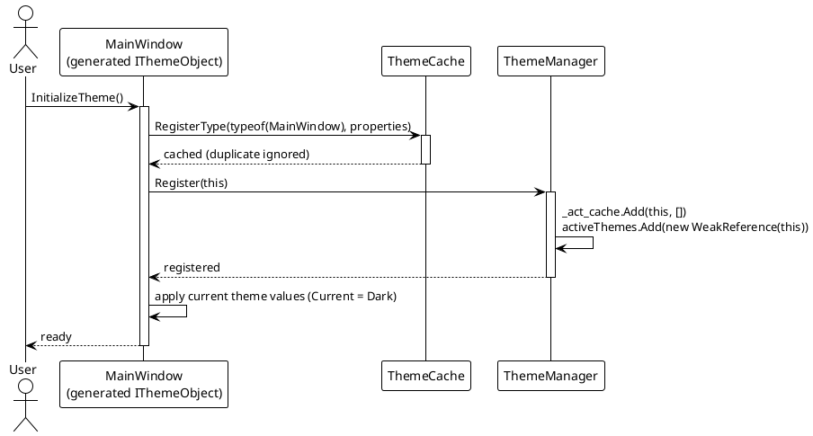
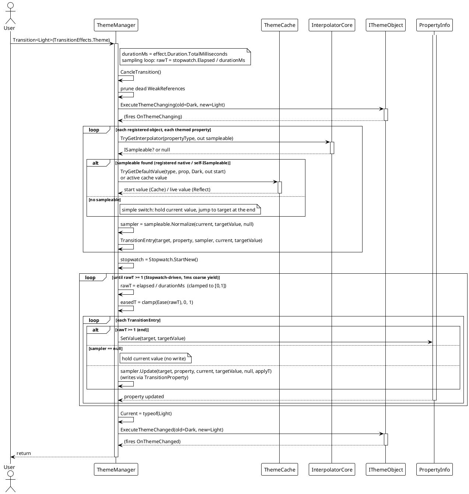
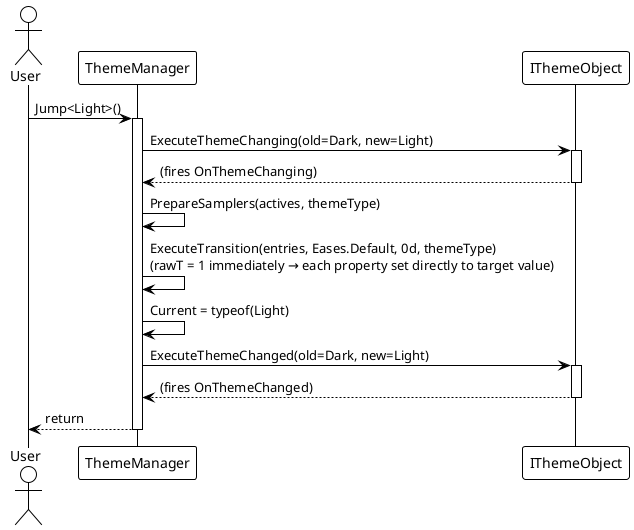
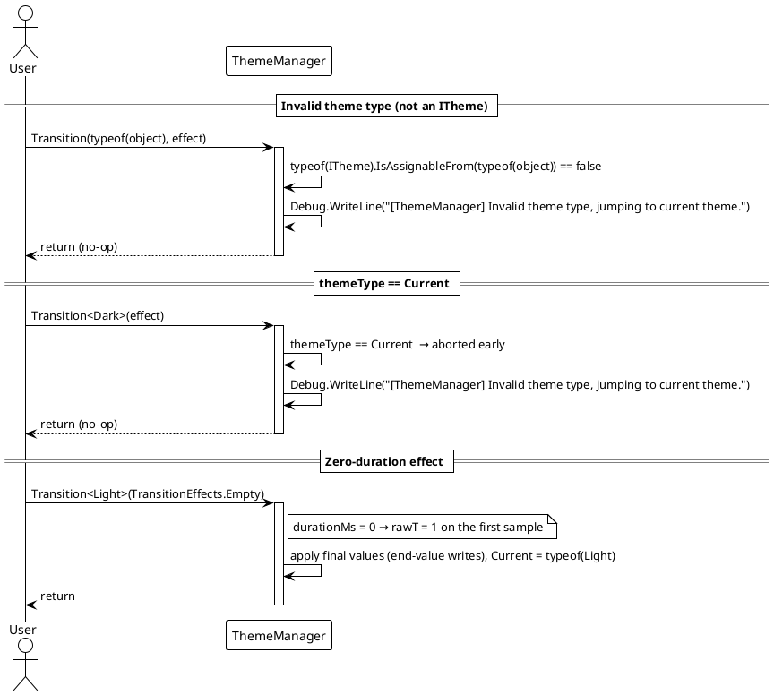

# 数据流 — 动态主题

## 注册流程（`InitializeTheme`）

源生成器生成的 `InitializeTheme()` 会在 `ThemeCache` 中注册该类型的主题属性、向 `ThemeManager` 注册实例，并应用当前主题的值。

> 源码：`VeloxDev.Generators.Theme` 生成的代码形态；注册支撑代码见 `Src/Core/VeloxDev.Core/DynamicTheme/ThemeManager.cs`（`Register`）与 `Src/Core/VeloxDev.Core/DynamicTheme/ThemeCache.cs`（`RegisterType`）。

## 带动画主题切换（`Transition<T>`）

`ThemeManager.Transition` 校验目标主题、取消正在运行的过渡、清理失效的 `WeakReference`，准备每属性采样器，然后在效果的时长内以 Stopwatch 驱动循环采样。

> 源码：`Src/Core/VeloxDev.Core/DynamicTheme/ThemeManager.cs` — `Transition`、`PrepareSamplers`、`ExecuteTransition`。采样器解析经由 `InterpolatorCore.TryGetInterpolator` 得 `ISampleable`，经 `Normalize` 得 `ISampler`；每次采样的值经 `ISampler.Update` 写入。

## 即时主题切换（`Jump<T>`）

`Jump` 复用同一采样器管线，但时长为零（`durationMs = 0`），因此首次采样即 `rawT = 1`，每个属性都直接设置为目标值。

> 源码：`Src/Core/VeloxDev.Core/DynamicTheme/ThemeManager.cs` — `Jump(Type)`。

## 异常 / 边界路径

## 正常路径与边界路径汇总

| 场景 | 行为 |
|---|---|
| 正常动画切换 | 准备每属性 `ISampleable` 并 `Normalize` 得到 `ISampler`，然后在 `Duration` 内对每个已注册对象的主题属性调用 `sampler.Update(...)`（Stopwatch 驱动、缓动 + 钳制），随后设置 `Current` 并触发 `OnThemeChanged`。 |
| `themeType == Current` | 提前终止 — 调试信息「Invalid theme type, jumping to current theme.」 |
| `themeType` 不实现 `ITheme` | 同样提前终止并输出该调试信息。 |
| 属性无采样器 | 退化为简单的切换（整趟持有 `current` 值，最后一次采样写入 `target`）；`Jump`/`SetThemeValue` 仍会设置最终值。 |
| 目标主题对该属性没有配置值 | `PrepareSamplers` 记录「No target value found」并在过渡中跳过该属性。 |
| 零时长效果（`durationMs = 0`） | 首次采样即 `rawT = 1`，每个属性直接写入目标值；主题仍会应用。 |

> 源码引用：`Src/Core/VeloxDev.Core/DynamicTheme/ThemeManager.cs`（`Transition`、`Jump`、`PrepareSamplers`、`ExecuteTransition`）、`Src/Core/VeloxDev.Core/DynamicTheme/ThemeCache.cs`。
