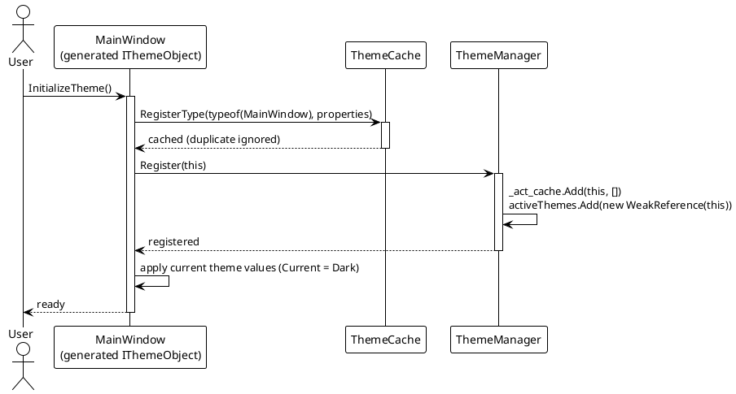
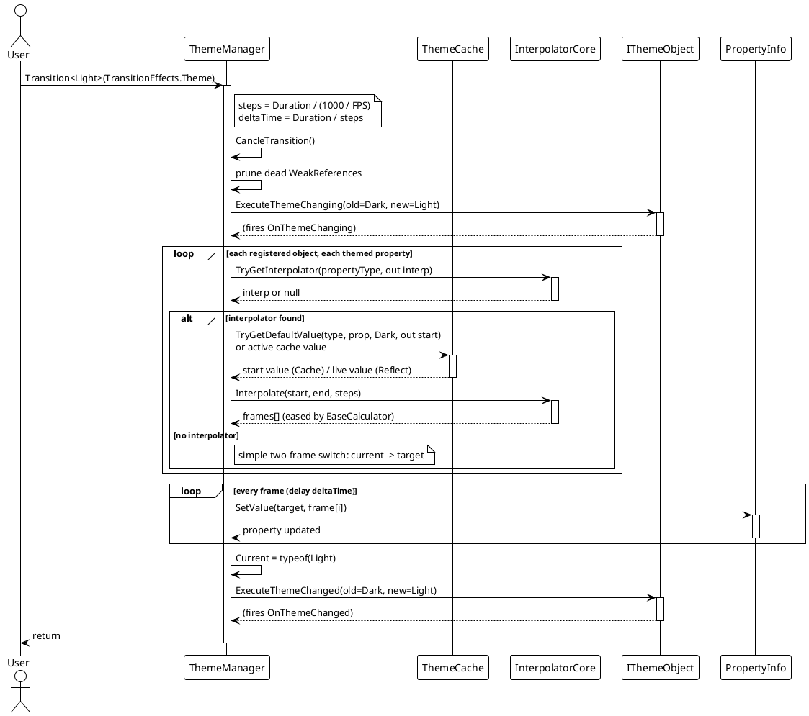
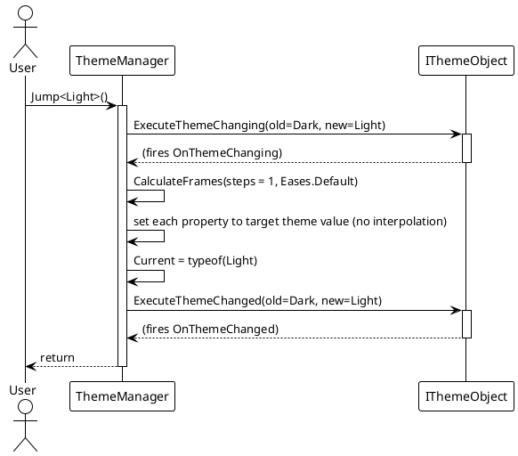
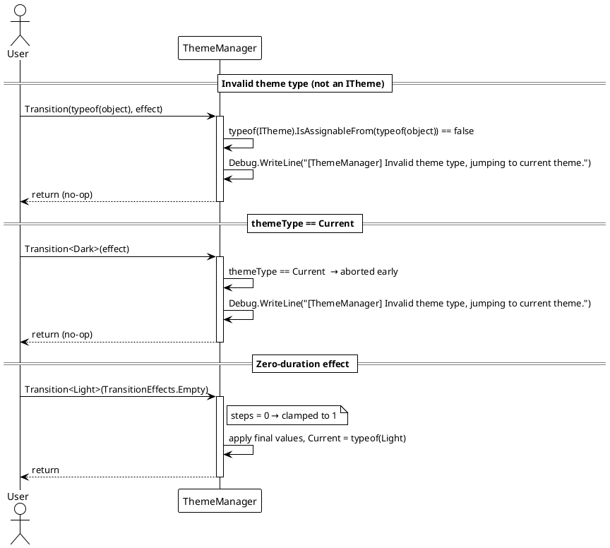

# 数据流 — 动态主题

## 注册流程（`InitializeTheme`）

源生成器生成的 `InitializeTheme()` 会在 `ThemeCache` 中注册该类型的主题属性、向 `ThemeManager` 注册实例，并应用当前主题的值。

> 源码：`VeloxDev.Generators.Theme` 生成的代码形态；注册支撑代码见 `Src/Core/VeloxDev.Core/DynamicTheme/ThemeManager.cs`（`Register`）与 `Src/Core/VeloxDev.Core/DynamicTheme/ThemeCache.cs`（`RegisterType`）。

## 带动画主题切换（`Transition<T>`）

`ThemeManager.Transition` 校验目标主题、取消正在运行的过渡、清理失效的 `WeakReference`，预先计算所有插值帧，然后按帧定时应用。

> 源码：`Src/Core/VeloxDev.Core/DynamicTheme/ThemeManager.cs` — `Transition`（第 83–106 行）、`CalculateFrames`（第 153–407 行）、`ExecuteTransition`（第 414–452 行）。插值经由 `InterpolatorCore.TryGetInterpolator` 与 `IValueInterpolator.Interpolate`。

## 即时主题切换（`Jump<T>`）

`Jump` 复用同一帧管线，但 `steps = 1`、`deltaTime = 0`，因此每个属性都直接设置为目标值。

> 源码：`Src/Core/VeloxDev.Core/DynamicTheme/ThemeManager.cs` — `Jump(Type)`（第 121–143 行）。

## 异常 / 边界路径

## 正常路径与边界路径汇总

| 场景 | 行为 |
|---|---|
| 正常动画切换 | 在 `Duration` 内对每个已注册对象的主题属性插值，然后设置 `Current` 并触发 `OnThemeChanged`。 |
| `themeType == Current` | 提前终止 — 调试信息「Invalid theme type, jumping to current theme.」 |
| `themeType` 不实现 `ITheme` | 同样提前终止并输出该调试信息。 |
| 属性无插值器 | 退化为简单的两帧切换（除最后一帧外均为 `current`，最后一帧为 `target`）；`Jump`/`SetThemeValue` 仍会设置最终值。 |
| 目标主题对该属性没有配置值 | `CalculateFrames` 记录「No target value found」并在过渡中跳过该属性。 |
| `steps <= 0`（零时长效果） | 钳制为 `steps = 1`，主题仍会应用。 |

> 源码引用：`Src/Core/VeloxDev.Core/DynamicTheme/ThemeManager.cs`（第 83–106 行 `Transition`、第 121–143 行 `Jump`、第 153–407 行 `CalculateFrames`、第 414–452 行 `ExecuteTransition`）、`Src/Core/VeloxDev.Core/DynamicTheme/ThemeCache.cs`。
