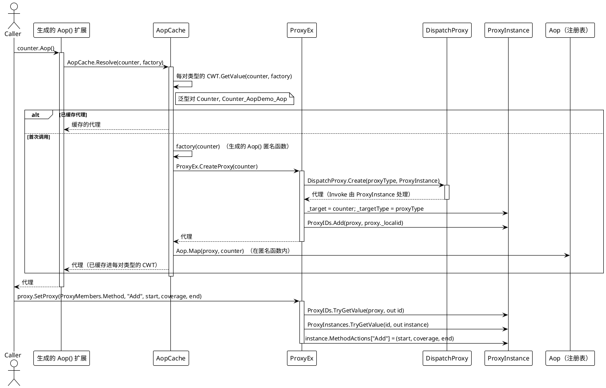
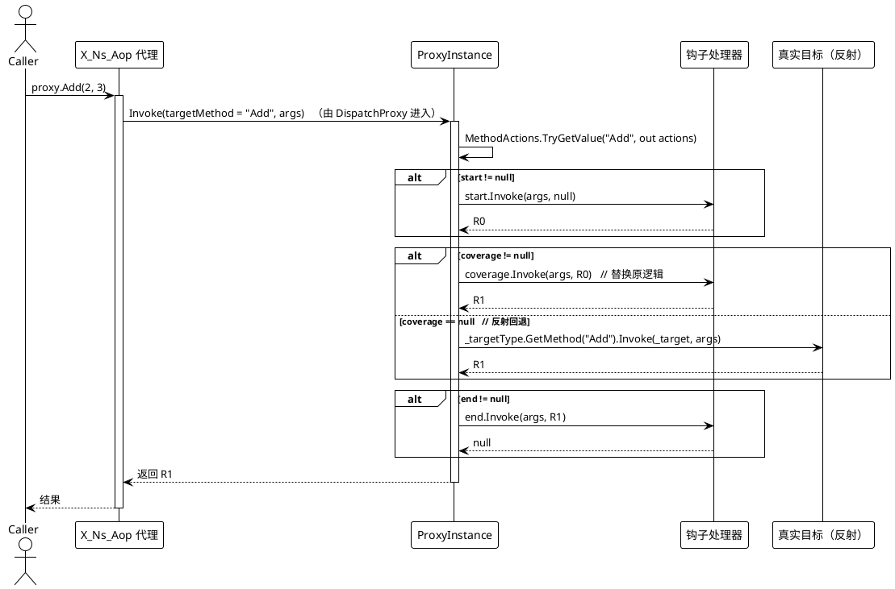
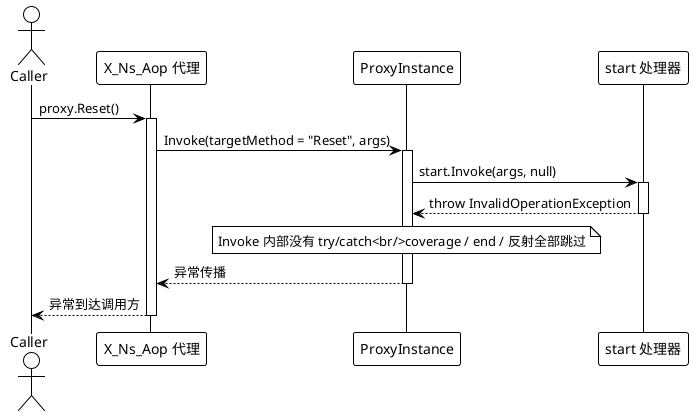
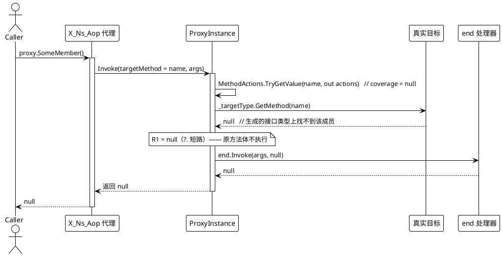

# 数据流分析 — AOP

## 1. 代理创建 + 钩子注册（`Aop()` → `SetProxy`）

说明：`Aop()` 在首次调用之后，对同一目标每次都命中缓存；`SetProxy` 通过 `ProxyIDs` → `ProxyInstances` 解析出 `ProxyInstance`，当成员键已存在时会覆盖整个 `(start, coverage, end)` 三元组（`ProxyEx.cs` 第 26-41 行，`SetMethod` 第 83-101 行）。

## 2. 被拦截的调用（`proxy.Method()`）

属性访问器形状相同：名字以 `get_` 开头的路由到 `GetterActions`，`set_*` 路由到 `SetterActions`，其余路由到 `MethodActions`（`ProxyInstance.cs` 第 23-53 行）。钩子顺序始终是 `start` →（`coverage`，或反射）→ `end`。

## 3. 错误路径

### 3a. 钩子抛出异常 → 传播

`ProxyInstance.Invoke` 内部没有 try/catch，因此任何处理器抛出的异常都会直接传播给调用方，并跳过其余阶段与任何反射调用：

### 3b. `coverage == null` 的反射回退

当 `coverage` 为 `null` 时，代理对真实目标做反射。若接口类型上解析不到该成员，`GetMethod` 返回 `null`，`?.` 短路，于是调用在不执行原方法体的情况下静默返回 `null`：

若 `GetMethod` 找到了成员但反射 `Invoke` 抛异常（例如目标抛错或实参不匹配），该异常会被 `MethodInfo.Invoke` 包装成 `TargetInvocationException` 并传播给调用方；任何 `end` 钩子都会被跳过。

## 流程汇总

| 路径 | 触发条件 | 结果 |
|---|---|---|
| 创建代理 | 首次调用 `instance.Aop()` | 创建 `DispatchProxy`，设置 `_target`/`_targetType`，登记到 `ProxyIDs`，经 `Aop.Map` 映射，缓存进每对类型的 CWT |
| 注册钩子 | `proxy.SetProxy(memberType, name, s, c, e)` | 把 `(s, c, e)` 写入 `GetterActions` / `SetterActions` / `MethodActions` |
| 正常调用 | `proxy.Member(...)` | `start` → `coverage`（或反射回退）→ `end` → 返回 `R1` |
| 钩子抛异常 | 任意非空钩子 | 异常传播给调用方；其余阶段跳过 |
| 反射回退 | `coverage == null` | `_targetType.GetMethod(Name)?.Invoke(_target, args)`；找不到则返回 `null` |
| 反射抛异常 | `coverage == null` 且找到成员 | `TargetInvocationException` 传播给调用方；`end` 跳过 |

> 出处汇总：`Src/Core/VeloxDev.Core/AspectOriented/ProxyInstance.cs`、`ProxyEx.cs`、`AopCache.cs`、`Aop.cs`、`Src/Generators/VeloxDev.Core.Generator/Writers/AopWriter.cs`。
