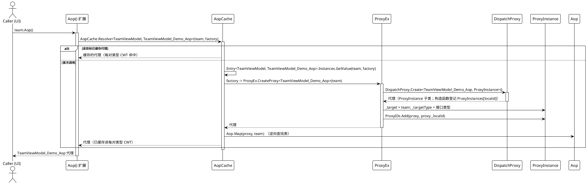
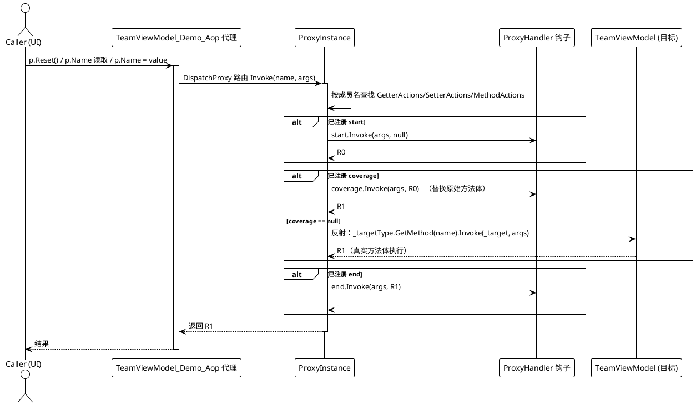

# 数据流分析 — AOP

AOP 运行期流程分三个阶段：**代理获取**、**钩子注册**、**拦截调用**。下面的示例使用 WPF 示例（`Examples/AOP/WPF/Demo`），其中 `Demo.TeamViewModel` 是目标，`TeamViewModel_Demo_Aop` 是其生成的代理接口。

## 1. 代理获取与钩子注册

生成的 `Aop()` 扩展（`AopWriter.cs`，`Src/Generators/VeloxDev.Core.Generator/Writers/AopWriter.cs`）是唯一入口。其工厂只在每个目标的首次调用时运行；后续调用命中每对类型 `ConditionalWeakTable` 的缓存：



随后 `SetProxy` 用 `ProxyMembers` 对成员分类，并通过 `ProxyIDs` → `ProxyInstances`（均为 `ProxyEx.cs` 中的静态字典）解析出存活的 `ProxyInstance`。当键已存在时，整个 `(start, coverage, end)` 三元组会被覆盖：

| 成员种类（`ProxyMembers`） | 写入的字典 | 访问器键 |
|---|---|---|
| `Getter` | `ProxyInstance.GetterActions` | `"get_" + memberName` |
| `Setter` | `ProxyInstance.SetterActions` | `"set_" + memberName` |
| `Method` | `ProxyInstance.MethodActions` | `memberName`（原样） |

例如 `p.SetProxy(ProxyMembers.Setter, nameof(TeamViewModel.Name), null, null, endHook)` 会把三元组按键 `"set_Name"` 存入 `SetterActions`（`ProxyEx.cs` 的 `SetPropertySetter`，第 63-82 行）。这些字典、`ProxyInstance` 登记与钩子都属于**同一个代理实例**，因此 `SetProxy` 必须作用于 `Aop()` 返回的对象，而非原始目标。

## 2. 拦截调用

代理上的每一次成员调用都会汇入 `ProxyInstance.Invoke`（`ProxyInstance.cs`，第 23-53 行）。成员名选择字典：`get_*` → `GetterActions`、`set_*` → `SetterActions`、其余 → `MethodActions`。钩子顺序始终是 `start` →（`coverage`，或对真实目标的反射回退）→ `end`：



对照示例中注册的钩子（`MainWindow.xaml.cs`，第 45-95 行）：

- 读取 `p.Name`：只注册了 `start` 钩子，于是读取操作记录访问，值本身来自反射回退。
- 写入 `p.Name = "..."`：只注册了 `end` 钩子；反射回退完成写入，随后 `end` 钩子观察到 `args[0]`（新值）。
- 调用 `p.Reset()`：只注册了 `coverage` 钩子，因此内置的 reset 方法体**不会执行**——钩子返回值 `R1 = null` 取代了它。

### 事件驱动扩展（集合变更 → 自我 `Aop()`）

示例还展示了经事件而非直接代理调用触发的切面行为。`TeamViewModel` 构造函数把自己的私有处理器订阅到真实的 `Members` 集合（`TeamViewModel.cs`，第 10-14 行）：

```csharp
// Examples/AOP/WPF/Demo/TeamViewModel.cs（第 35-38 行）
private void OnMemberAdded(object? sender, NotifyCollectionChangedEventArgs e)
{
    this.Aop().AOP_OnMemberAdded(sender, e);
}
```

通过代理添加成员（`p.Members.Add(...)`）会反射到目标的真实集合，其 `CollectionChanged` 触发 `OnMemberAdded`。该处理器经**同一个已缓存的代理**——`this.Aop()`——回调带 `[AspectOriented]` 的 `AOP_OnMemberAdded`，其 `end` 钩子逐个报告新增成员。被拦截的方法自身仍通过反射回退执行，于是切面叠加在原逻辑之上。

## 3. 错误与边界路径

`ProxyInstance.Invoke` 内部**没有 try/catch**——钩子各阶段均不受保护：

- `start` / `coverage` / `end` 处理器抛出的异常直接传播给调用方；其余阶段与任何反射调用都被跳过。
- 当 `coverage == null` 且反射 `MethodInfo.Invoke` 抛异常（真实方法抛错或实参不匹配）时，反射会把它包装为 `TargetInvocationException` 并传播出去；`end` 钩子被跳过。
- 当 `coverage == null` 且 `_targetType.GetMethod(name)` 返回 `null`（在代理接口上解析不到该成员）时，`?.` 短路：`Invoke` 返回 `null`，真实方法体**不执行**。
- 未注册钩子的成员没有特殊处理——`actions == null` 时仍走反射回退，因此未挂钩子的成员会透明地抵达真实目标。
- 对非已登记代理的对象调用 `SetProxy`（例如把原始目标当作 `Aop()` 结果）会静默无效：`ProxyEx.cs` 的 `ProxyIDs` 查找失败，辅助方法原样返回。

## 流程汇总

| 路径 | 触发条件 | 结果 |
|---|---|---|
| 代理获取 | 首次 `instance.Aop()` | 创建 `DispatchProxy`，设置 `_target`/`_targetType`，登记进 `ProxyIDs`，经 `Aop.Map` 映射，缓存进每对类型 CWT |
| 钩子注册 | `proxy.SetProxy(kind, name, s, c, e)` | 把 `(s, c, e)` 写入 `GetterActions`/`SetterActions`/`MethodActions`，键为 `get_*`/`set_*`/原样 |
| 正常调用 | `proxy.Member(...)` | `start` → `coverage`（或反射回退）→ `end` → 返回 `R1` |
| 钩子抛异常 | 任意非空钩子 | 异常传播给调用方；其余阶段与反射跳过 |
| 反射抛异常 | `coverage == null` 且找到成员 | `TargetInvocationException` 传播；`end` 跳过 |
| 反射未命中 | `coverage == null` 且找不到成员 | `GetMethod(...)?` 返回 `null`；调用返回 `null`，真实方法体不执行 |
| 事件扩展 | 目标集合 `CollectionChanged` | 私有处理器经已缓存代理调用 `this.Aop().AOP_OnMemberAdded(...)` |

> 出处汇总：`Src/Core/VeloxDev.Core/AspectOriented/{ProxyInstance,ProxyEx,AopCache,Aop}.cs`、`Src/Generators/VeloxDev.Core.Generator/Writers/AopWriter.cs`、`Examples/AOP/WPF/Demo/{TeamViewModel.cs,MainWindow.xaml.cs}`。
