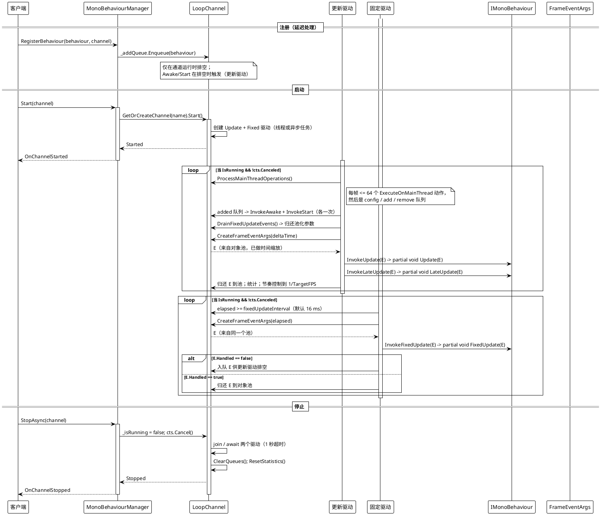
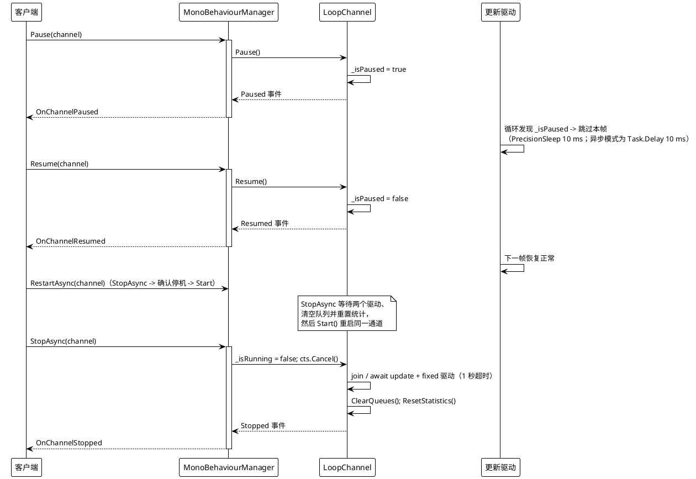
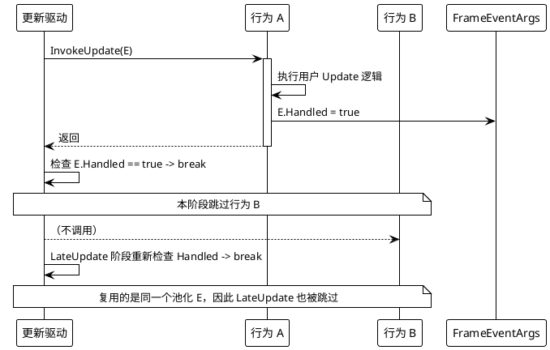
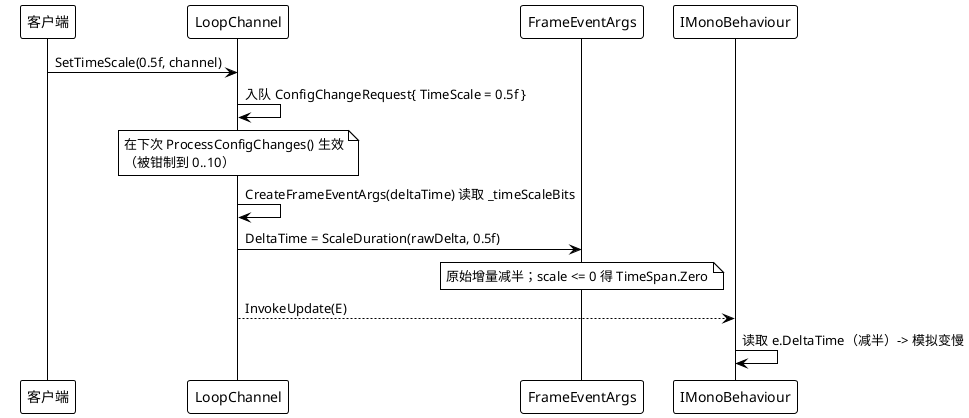
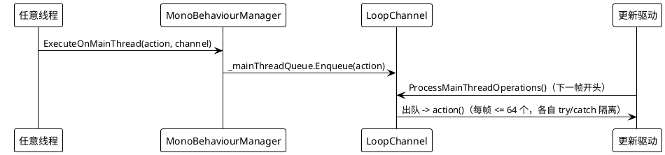
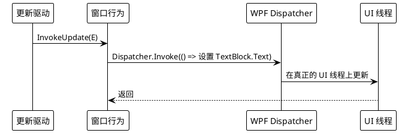

# 数据流 — MonoBehaviour

每个通道由两个并发的帧驱动驱动：**更新驱动**（注册、配置、`Update` / `LateUpdate`）与**固定驱动**（按固定间隔执行 `FixedUpdate`）。默认情况下它们是两个后台 `Thread`；启用异步循环模式时则以两个 `Task`（`UpdateLoopAsync` / `FixedUpdateLoopAsync`）运行。所有跨线程通信——注册、移除、配置变更、被转发的动作、固定事件——都经由并发队列，由更新驱动在每帧开头排空。

## 1. 注册 → 通道启动 → 每帧 tick → 停止

两个驱动既可以是 `Thread` 也可以是异步 `Task`，取决于循环模式：在使用 `VeloxDev.Core` 的 `net5.0+` 构建的桌面上，`UseAsyncLoop` 默认取 `OperatingSystem.IsBrowser() || OperatingSystem.IsIOS()`（桌面上为 false，因此使用名为 `VeloxDev.Update[name]` / `VeloxDev.FixedUpdate[name]`、`Priority = AboveNormal` 的原生线程）；在 `net5.0` 之前的各目标框架上该常量表达式为 `true`；也可用 `SetUseAsyncLoop(bool, channel)` 在 `Start` 前按通道强制指定（通道运行期间调用会抛 `InvalidOperationException`）。异步孪生版本用 `Task.Delay` 取代 `PrecisionSleep`，执行同一套骨架。只有驱动机制不同——队列交换、对象池与事件参数完全共享。

关键源码：`MonoBehaviourManager.cs` 的 `Start`（246-292）、`UpdateLoop`（444-489）、`FixedUpdateLoop`（395-442）、`UpdateLoopAsync`/`FixedUpdateLoopAsync`（492-605）、`StopAsync`（294-337）、`ProcessMainThreadOperations`（675-688）。

## 2. 暂停 / 恢复 / 重启 / 停止

`Pause` / `Resume` / `Stop` 直接翻转 volatile 状态并立即引发对应的 `LoopChannel` 事件；静态管理器把它以带通道名的事件参数转发为 `OnChannelPaused` / `OnChannelResumed` / `OnChannelStopped`。`RestartAsync`（353-377 行）即 `StopAsync` + 停机确认等待，驱动未及时停止时以 `ForceCleanup()` 兜底，随后等待队列清空再重新 `Start()`。

## 3. `Handled = true` 短路

`ExecuteBehaviorsUpdateSync` / `ExecuteBehaviorsLateUpdateSync` / `ExecuteBehaviorsFixedUpdateSync` 都会在 `frameArgs.Handled` 被置位后立即 break（`MonoBehaviourManager.cs` 第 611-657 行）。由于同一帧里 `Update` 与 `LateUpdate` 两个阶段复用同一个 `FrameEventArgs` 实例，`Update` 期间把 `Handled` 置 `true` 也会在该帧抑制 `LateUpdate`。把 `Handled` 置 `true` 的 `FixedUpdate` 会立即归还其（池化的）参数，而不入队等待排空。

## 4. 时间缩放

`SetTimeScale` 入队一个池化的 `ConfigChangeRequest`；更新驱动应用它（`ProcessConfigChanges`，第 690-709 行）并钳制到 `0..10`。由于 `CreateFrameEventArgs`（745-755 行）被两个驱动共享，时间缩放同样作用于 `Update`、`LateUpdate` **以及** `FixedUpdate` 的增量时间；`ScaleDuration`（862-868 行）对 `scale <= 0` 返回 `TimeSpan.Zero`。

## 5. 转发到更新驱动 — `ExecuteOnMainThread` 与 UI 跳转

`ExecuteOnMainThread` 把委托从任意线程（某次 `FixedUpdate`、外部事件处理器、worker 回调）转发到通道的**更新驱动**——即时间线的“主”线程——从而与 `Update`/`LateUpdate` 串行化，可安全触碰这些钩子共享的状态。它**不会**投递到 OS/UI 线程：更新驱动是后台循环。在 WPF 示例中，行为在 UI 线程之外运行，把结果推到窗口是用钩子内部的 `Dispatcher.Invoke` 完成的（`Examples/MonoBehaviour/WPF/Demo/MainWindow.xaml.cs` 的 `UpdatePerformanceDisplay`/`UpdateComponentStatistics`，第 143-190 行）。

关键源码：`ExecuteOnMainThread` 入队（第 212 行，静态包装 1049-1050 行），排空在 `ProcessMainThreadOperations`（675-688 行）内，WPF 跳转见 `MainWindow.xaml.cs`。
