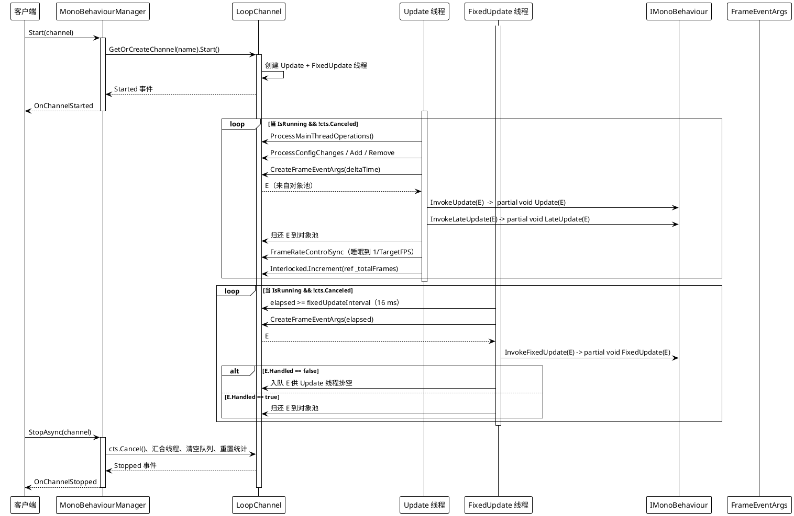
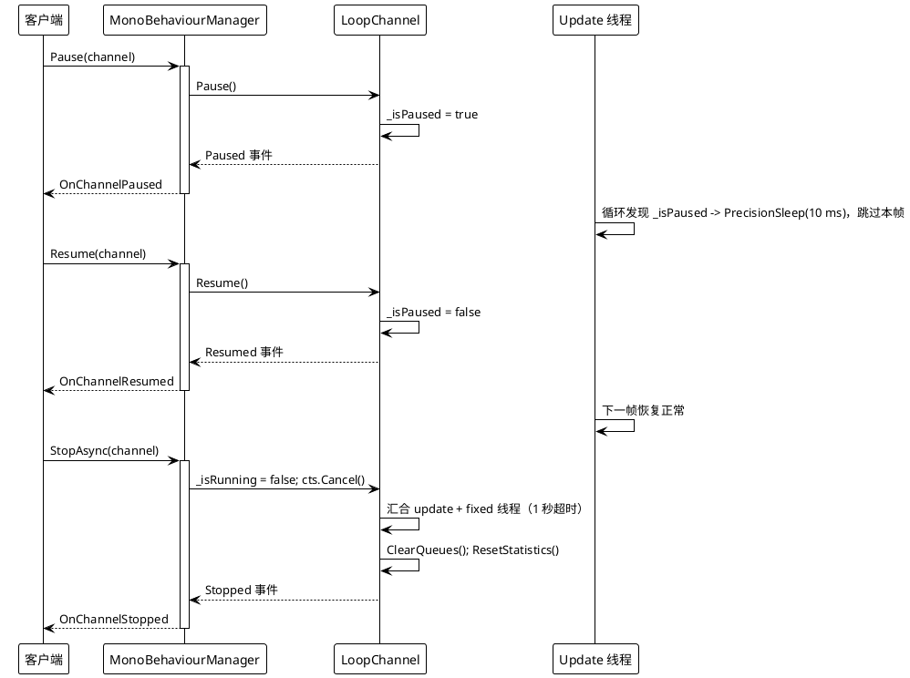
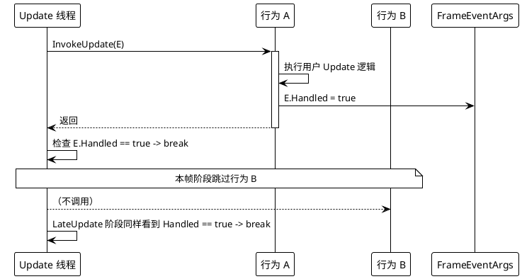
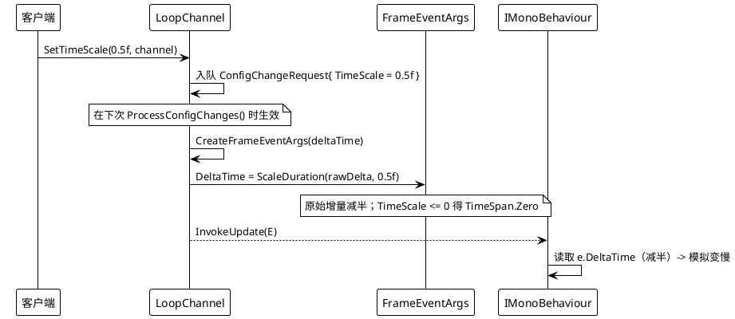

# 数据流 — MonoBehaviour

每个通道由一个 Update 线程与一个 FixedUpdate 线程驱动（`UseAsyncLoop` 为 `true` 时改为两个异步任务）。配置、注册与主线程动作通过并发队列交换，并在每帧开始时排空。

## 1. 通道启动与每帧分发

关键源码：`MonoBehaviourManager.cs` 第 394-441 行（`FixedUpdateLoop`）、443-488 行（`UpdateLoop`）、610-656 行（`ExecuteBehaviorsUpdateSync` / `LateUpdate` / `FixedUpdate`）、245-291 行（`Start`）、293-336 行（`StopAsync`）。

## 2. 暂停 / 恢复 / 停止

## 3. `Handled = true` 短路

出处：`MonoBehaviourManager.cs` 第 611-624 行（`ExecuteBehaviorsUpdateSync` 检查 `if (frameArgs.Handled || token.IsCancellationRequested) break;`）。运行时探针，2026-08-17：当一个 `HaltBehavior` 先把 `Handled` 置 `true`，其后的 `BehaviorB.UpdateCount` 保持为 `0`。

## 4. 时间缩放

出处：`MonoBehaviourManager.cs` 第 202-210 行（`SetTimeScale`）、744-754 行（`CreateFrameEventArgs`）、861-867 行（`ScaleDuration`）。运行时探针，2026-08-17：`SetTimeScale(0.5f)` 产生的增量时间比值约为 `0.49`（相对未缩放基准）。
