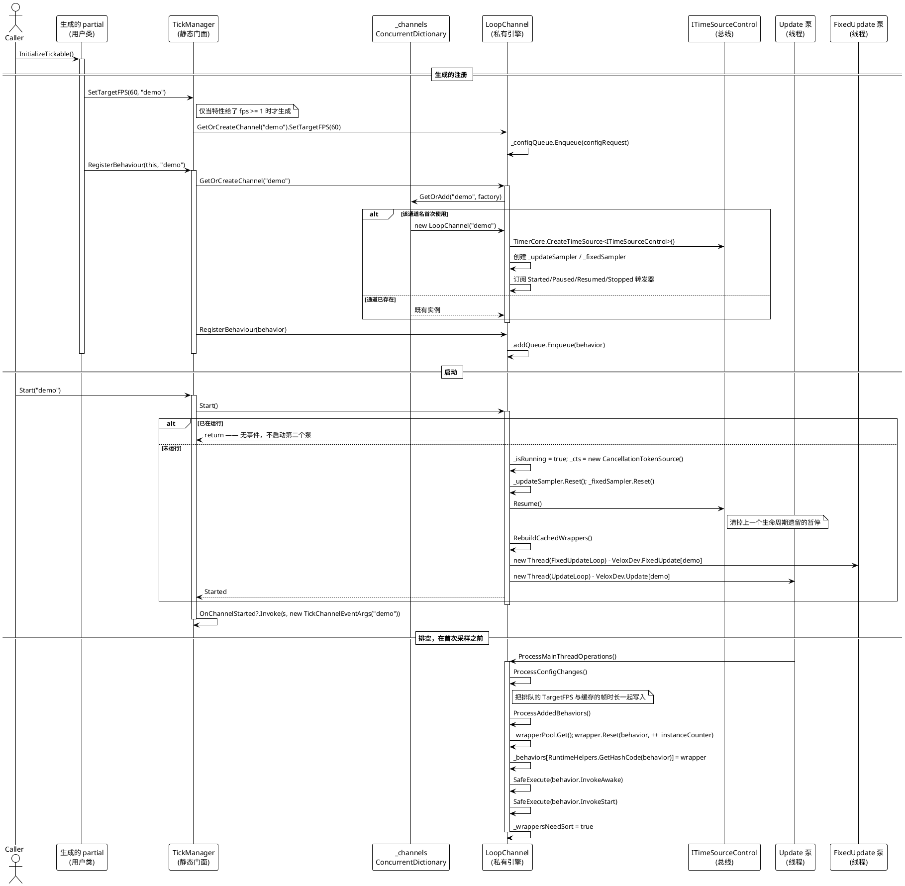

# 启动与注册

把「类上的 `[Tickable]`」变成「这个对象的 `Awake` 在第一帧之前运行」的那条流程。有两点使它不那么显然：注册是**入队**而不是当场生效的，而排空发生在帧被采样**之前**。



> 源码：`Src/Core/VeloxDev.Core/TimeLine/TickManager.cs` 274-327（Start）、430-438（RegisterBehaviour）、753-801（排空）、1017-1030（GetOrCreateChannel）、1066-1067（静态转发）行；`Src/Generators/VeloxDev.Core.Generator/Writers/TickWriter.cs` 76-90 行。

## 顺序主张，精确表述

不变量是：**`Awake` 与 `Start` 在该通道的第一帧之前运行。**

机制不是「先注册后启动」，而是 `ProcessMainThreadOperations` —— 其中包含 `ProcessAddedBehaviors` —— 在 update 循环体的开头被调用，**早于** `_updateSampler.Sample()`：

```csharp
// Src/Core/VeloxDev.Core/TimeLine/TickManager.cs（526-537 行）
var frameStartTime = GetTimestamp();
ProcessMainThreadOperations();

// 无偿采样：总线没前进就没有帧可推。
var sample = _updateSampler.Sample();
if (sample.Delta == TimeSpan.Zero)
{
    Sleep(TimeSpan.FromMilliseconds(MIN_SLEEP_MS), token);
    continue;
}

var frameArgs = CreateFrameEventArgs(sample.Delta, sample.Total);
```

因此两种顺序都成立：

| 调用方顺序 | 发生什么 |
|---|---|
| 先 `InitializeTickable()` 再 `Start(name)` | 队列在第一次迭代被排空，早于首次采样。`Awake` → `Start` → 第一次 `Update` |
| 先 `Start(name)` 再 `InitializeTickable()` | 队列在下一次迭代被排空，早于那一帧的采样。仍是 `Awake` → `Start` → `Update` |

WPF 演示依赖并测量了这一点：`MainWindow.xaml.cs` 先注册、再设帧率、最后启动（57-61 行），而 `SimState.AwakeAtUpdateCount` 记录 `Awake` 运行那一刻的 `Update` 计数 —— 它是零，这是证据而不是主张。

## `Awake` / `Start` 与「停止再启动」

下面这张表最容易让人踩坑，每一行都附上背后的机制：

| 操作 | 生命周期会重跑吗？ | 为什么 |
|---|---|---|
| `StopAsync` + `Start` | 不会 | `StopAsync` 清空队列（`ClearQueues`，第 954 行），`Start` 只重启泵。注册没了，但没有任何东西重新入队 |
| `RestartAsync` | 不会 | 同上 —— 它就是 `StopAsync` + 等待 + `Start` |
| `CloseTickable()` + `InitializeTickable()` | **会** | 从 `_wrapperPool` 取出新包装器，并在其上运行 `InvokeAwake` / `InvokeStart` |

注意这处不对称：停止通道会*丢掉*注册却不告知行为（`ITickable` 上没有「关闭」钩子），而重新注册一个仍在注册中的实例会替换包装器并重跑两个钩子。`MainWindow.xaml.cs` 111-135 行把两个按钮都放了出来，让这一对可见而不是靠断言。

## 失败与边界路径

- **`null` 行为。** `RegisterBehaviour` 会滤掉它（`if (behavior != null)`，第 432 行），队列永远见不到。万一有 `null` 到达，排空过程会再跳过一次（`if (behavior == null) continue;`，第 790 行）。
- **重复注册。** `_behaviors` 以 `RuntimeHelpers.GetHashCode(behavior)` 为键，所以第二次注册会覆盖第一个包装器。`Awake` 与 `Start` 仍会重跑 —— 在新包装器上。
- **对运行中的通道调用 `Start`。** 在第 276 行返回：不新建线程，不第二次触发 `OnChannelStarted`。
- **在从未启动的通道上注册。** 条目留在 `_addQueue` 里直到有人调用 `Start`。它不会丢，也不会启动。
- **`Awake` / `Start` 抛异常。** `SafeExecute` 捕获并写 `Debug.WriteLine`；`InvokeStart` 仍会运行，排空过程仍会置 `_wrappersNeedSort`。
- **在 `StopAsync` 期间注册。** 队列在 `finally` 块里被清空，所以停到一半到达的注册会被丢弃。请在停止完成后重新注册。
