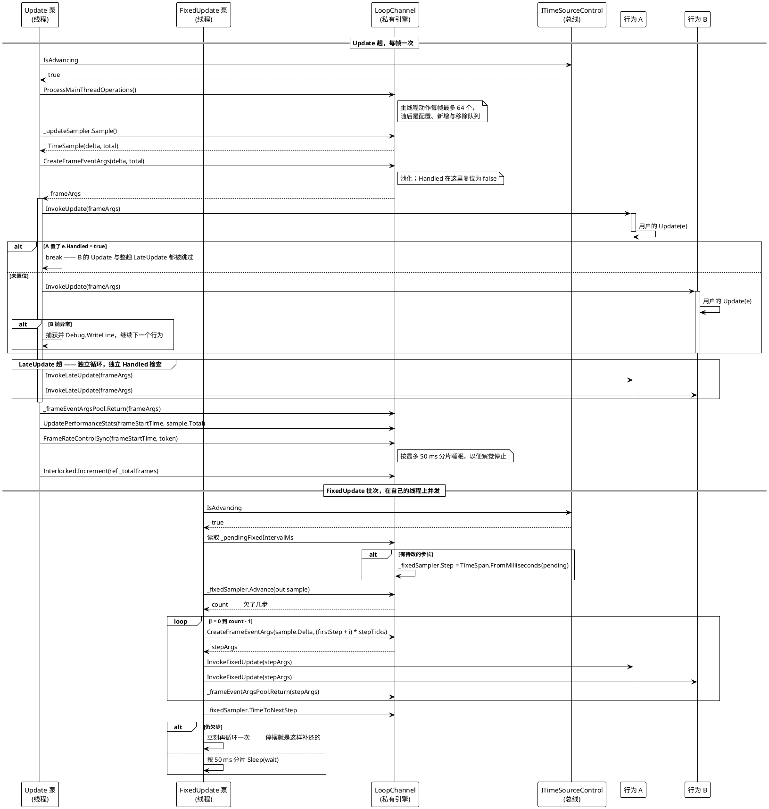

# 帧派发

稳态。update 线程上一趟 `Update` 紧接一趟 `LateUpdate`；fixed-update 线程上一批独立的定步长推送。两者并发，异常路径按行为隔离。



> 源码：`Src/Core/VeloxDev.Core/TimeLine/TickManager.cs` 509-554（UpdateLoop）、446-507（FixedUpdateLoop）、689-734（三个派发循环）、824-833（CreateFrameEventArgs）、836-870（限速与 Sleep）、914-926（统计）行。

## 三个派发循环

三者形状相同：读缓存数组，按下标遍历，在每个行为之前检查 `Handled` 与令牌，异常按行为隔离。

```csharp
// Src/Core/VeloxDev.Core/TimeLine/TickManager.cs（704-718 行）
private void ExecuteBehaviorsLateUpdateSync(FrameEventArgs frameArgs, CancellationToken token)
{
    var wrappers = GetCachedWrappers();
    for (int i = 0; i < wrappers.Length; i++)
    {
        if (frameArgs.Handled || token.IsCancellationRequested) break;
        var w = wrappers[i];
        if (w is { IsActive: true, Behavior: not null })
        {
            try { w.Behavior.InvokeLateUpdate(frameArgs); }
            catch (Exception ex) { Debug.WriteLine($"[{Name}] LateUpdate error: {ex.Message}"); }
        }
    }
}
```

| 循环 | 顺序 | 与谁共享 `frameArgs` | 中止条件 |
|---|---|---|---|
| `ExecuteBehaviorsUpdateSync` | 注册顺序 | `LateUpdate` | `Handled` \|\| 已取消 |
| `ExecuteBehaviorsLateUpdateSync` | 注册顺序 | `Update`（同一对象） | `Handled` \|\| 已取消 |
| `ExecuteBehaviorsFixedUpdateSync` | 注册顺序 | 无 —— 每步一个对象 | `Handled` \|\| 已取消 |

值得直说的一条推论：**`Handled` 在 `Update` 与 `LateUpdate` 之间是共享的，与 `FixedUpdate` 之间不共享。** `Update` 与 `LateUpdate` 收到的是同一个池化 `FrameEventArgs` 对象，所以 `Update` 里立起的标志在几微秒后的 `LateUpdate` 循环里可见。而 `FixedUpdate` 的每一步在 fixed 循环内部自建参数，永远看不到那个标志。WPF 演示一次把两半都演示出来：每一步固定推送下两只球继续走，而由 `LateUpdate` 定位的跟随环冻住（`MainWindow.xaml.cs` 230-245 行）。

## 两个泵上的停摆路径

每个循环在做事之前都先看总线：

```csharp
// Src/Core/VeloxDev.Core/TimeLine/TickManager.cs（468-472 行为 fixed 泵；520-524 行形状相同）
if (!_bus.IsAdvancing)
{
    _bus.WaitWhileStalledAsync(token).GetAwaiter().GetResult();
    continue;
}
```

基于线程的泵不能 `await`，所以它们同步阻塞在那个 awaitable 上。代价是每通道每泵阻塞一条线程；收益是停摆期间零唤醒 —— 而旧实现每 10 ms 醒来重读一次标志。异步泵（`UpdateLoopAsync` / `FixedUpdateLoopAsync`，622-682 / 557-620 行）用 `await` 做同一件事，park 期间完全不占线程 —— 这正是那条路径存在的全部理由。

`Thread.Sleep` 从不睡满一整个间隔。`Sleep` 把等待按 `MAX_SLEEP_CHUNK_MS`（50）分片，并在片间重查令牌（862-870 行），所以即使目标帧率是 2 fps、帧预算有半秒长，停止也能在 50 ms 内被察觉。

## 补偿上的差别

这是演示存在要展示的那部分。

| 泵 | 采样器 | 契约 |
|---|---|---|
| Update | `IUncompensatedTimeSampler` | 报告流逝了多少，不欠账。钩子里睡 300 ms 不会被补还 —— 采样早已完成，所以这段睡眠会在**下一帧**变成一个巨大的 `DeltaTime` |
| FixedUpdate | `ICompensatingTimeSampler` | `Advance` 返回欠了多少整步（含停摆期间漏掉的），而只要有欠账 `TimeToNextStep` 就是零 —— 所以循环会立刻再跑一次并成批交付 |

演示为每个泵各配一个卡顿按钮、各配一个观察对象。`MainWindow.xaml.cs` 97-101 行与 `MainWindow.Hooks.cs` 76-90、144-160 行是它们的实现；读数用 `HookNote.Slept`（本次调用睡了）与 `HookNote.AfterSleep`（本次调用承载后果）区分两种情形。

## 一次 `FixedUpdate` 唤醒究竟交付什么

`FixedUpdateLoop` 的一次迭代可以交付多步，而每一步拿到的是它自己步序号对应的时间，而不是把最后一次读数重复：

```csharp
// Src/Core/VeloxDev.Core/TimeLine/TickManager.cs（476-494 行）
var count = _fixedSampler.Advance(out var sample);
if (count > 0)
{
    // 每一步的 Total 是自己的步序号乘步长，而不是把最后一次的读数重复 N 遍。
    var stepTicks = _fixedSampler.Step.Ticks;
    var firstStep = sample.Step - count + 1;

    for (var i = 0; i < count; i++)
    {
        var fixedFrameArgs = CreateFrameEventArgs(
            sample.Delta,
            TimeSpan.FromTicks((firstStep + i) * stepTicks));
        ExecuteBehaviorsFixedUpdateSync(fixedFrameArgs, token);

        _frameEventArgsPool.Return(fixedFrameArgs);
    }
}
```

`TickableBusTests.FixedUpdatePushesTrackTheVirtualClockNotTheWakeCadence` 就是这条性质的可执行表述：4 倍速下推送数必须跟随虚拟时钟（`rate * 真实时间 / 步长`），而不是唤醒节奏。旧实现每次唤醒最多推一步，因此任何速率都无法让它快于「每真实 16 ms 一步」。
