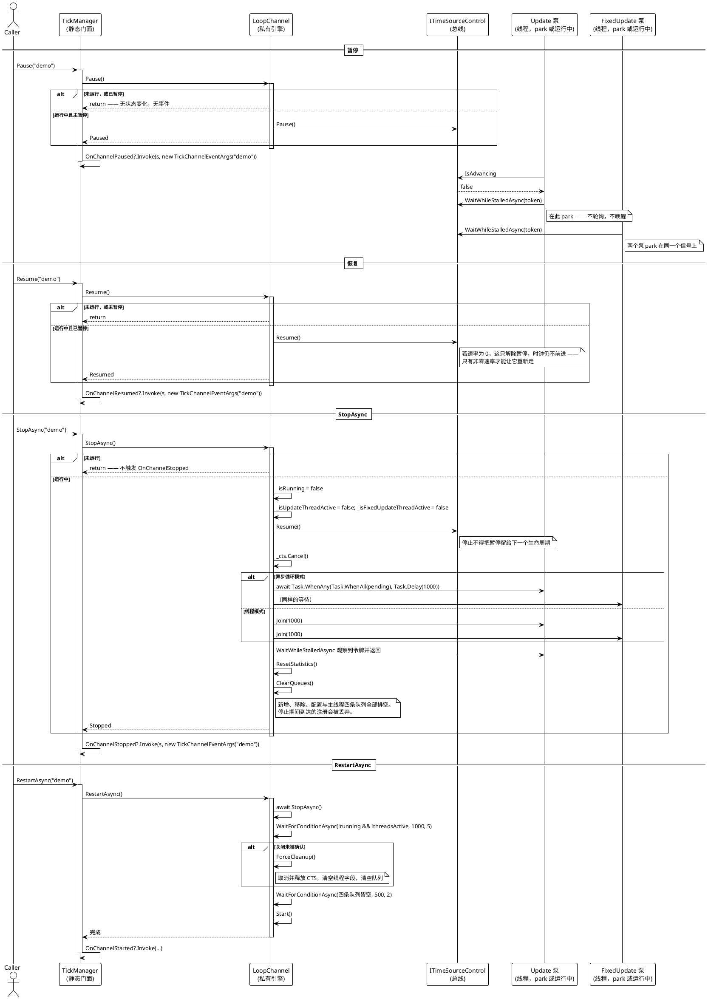

# 暂停、恢复与停止

这些是在不拆掉通道的前提下停住与重启交付的迁移。流程很短，但里面状态很多：暂停住在共享时钟上，停止必须触及一个已经 park 住的泵，而重启必须重新锚定时钟。

> 源码：`Src/Core/VeloxDev.Core/TimeLine/TickManager.cs` 329-374（StopAsync）、384-402（Pause/Resume）、404-428（RestartAsync）、440（TogglePause）、954-993（ClearQueues、ForceCleanup、WaitForConditionAsync）、1051-1064（静态转发）行。

## 为什么 park 住的泵仍能被停止

这是设计必须解决的失败模式，钉住它的测试是 `TickableBusTests.StoppingWhilePausedEndsTheChannel`：

> 停摆中的循环 park 在一个对令牌一无所知的等待上。不在这个等待里观察令牌的话，`StopAsync` 会一直等下去，然后 `ForceCleanup` 释放掉那个令牌源，异常从线程体里逃出去。

也就是说：park 住的循环在等某个东西。如果那个等待不观察取消令牌，`StopAsync` 就会等满超时、退回 `ForceCleanup`、在一个仍持有它的线程脚下释放令牌源，并让异常从线程体里逃出去。阻止这一切的契约在 `WaitWhileStalledAsync` 上 —— 它接收令牌，因此取消能传播*进* park 里面。测试断言该任务能跑赢 5 秒超时。

## 每个迁移重置了什么，没重置什么

| | `Pause` | `Resume` | `StopAsync` | `RestartAsync` |
|---|---|---|---|---|
| `_isRunning` | 不变 | 不变 | `false` | 先 `false` 后 `true` |
| 总线暂停标志 | `true` | `false` | `false`（被清除） | 清除后保持 |
| 总线速率 | 不变 | 不变 | **不**清除 | **不**清除 |
| `TotalFrames` / `TotalTime` / `CurrentFPS` | 不变 | 不变 | 归零 | 归零后重新累计 |
| 行为注册 | 不变 | 不变 | **丢失**（队列被清空） | **丢失** |
| `Awake` / `Start` 重跑 | 否 | 否 | 否 | **否** |
| 采样器 | 不变 | 不变 | 不变 | **重新锚定** |
| 触发的事件 | `OnChannelPaused` | `OnChannelResumed` | `OnChannelStopped` | `OnChannelStopped` + `OnChannelStarted` |

表里有三项是一旦漏掉就会出事：

- **速率为 `0` 不是总线的暂停标志，`Resume` 与 `StopAsync` 都不清除它。** `SetTimeScale(0)` 冻结时钟；`StopAsync` 的 `_bus.Resume()` 只解除*暂停*。以速率 0 被停掉的通道重启后会立刻再次 park。演示把 `IsAdvancing` 与 `SystemStatus` 并排打印，正是为了让两种状态在屏幕上可区分（`MainWindow.xaml.cs` 307-324 行）。
- **`StopAsync` 会丢掉注册**却不通知行为 —— 停止路径不会在 `ITickable` 上调用 `CloseTickable` 钩子。（`CloseTickable()` 成员确实存在，它正是*执行*注销的那个方法，但 `StopAsync` 从不调用它。）指望「停掉通道、下次 `Start` 时行为自动回来」的宿主会发现它们没了。
- **`RestartAsync` 同样不重跑 `Awake` / `Start`。** 唯一会重跑的路径是 `CloseTickable()` + `InitializeTickable()`。

## 触发点位置让事件变得诚实

每个触发点都写在保护*之后*，绝不写在之前。于是一个事件意味着「状态确实变了」，而保护定义了哪些迁移是静默的：

| 调用 | 何时被抑制 | 触发 |
|---|---|---|
| `Pause` | 未运行，或已暂停 | `OnChannelPaused` |
| `Resume` | 未运行，或未暂停 | `OnChannelResumed` |
| `TogglePause` | 未运行 | 上面两者之一，恰好一个 |
| `StopAsync` | 未运行 | `OnChannelStopped` |
| `Start` | 已在运行 | `OnChannelStarted` |

`TogglePause` 不可能两者都触发，因为它字面上就是 `if (_bus.IsPaused) Resume(); else Pause();`（第 440 行），而这两个方法是仅有的触发点。

## 失败与边界路径

- **暂停中停止。** 上文已述，并由测试覆盖；它会正常完成。
- **fixed 泵正处在批次中途时停止。** 令牌在派发循环的每个行为开头被检查（中止条件里的 `token.IsCancellationRequested`），所以长批次会在一个行为之内中止。
- **队列非空时停止。** `ClearQueues` 在 `finally` 块里排空四条队列，所以从未生效的注册被丢弃，而不是泄漏到下一个生命周期。
- **关闭未被确认后的重启。** 回退手段是 `ForceCleanup`：取消并释放令牌源、清空线程与任务字段、清空队列。这是唯一可能在下一个 `Start` 创建新泵时旧泵仍在运行的路径，所以它向 `Debug.WriteLine` 写一条警告。
- **`RestartAsync` 的排空等待是尽力而为。** 它的 `WaitForConditionAsync` 结果被忽略；若 500 ms 后队列仍非空，`Start` 照样进行（`TickManager.cs` 420-425 行）。
- **`StopAsync` 永不 fault。** 泵的 join 包在 `try { … } catch (Exception) { }` 里、清理放在 `finally`，所以即使某个泵行为异常，返回的 task 也正常完成。
