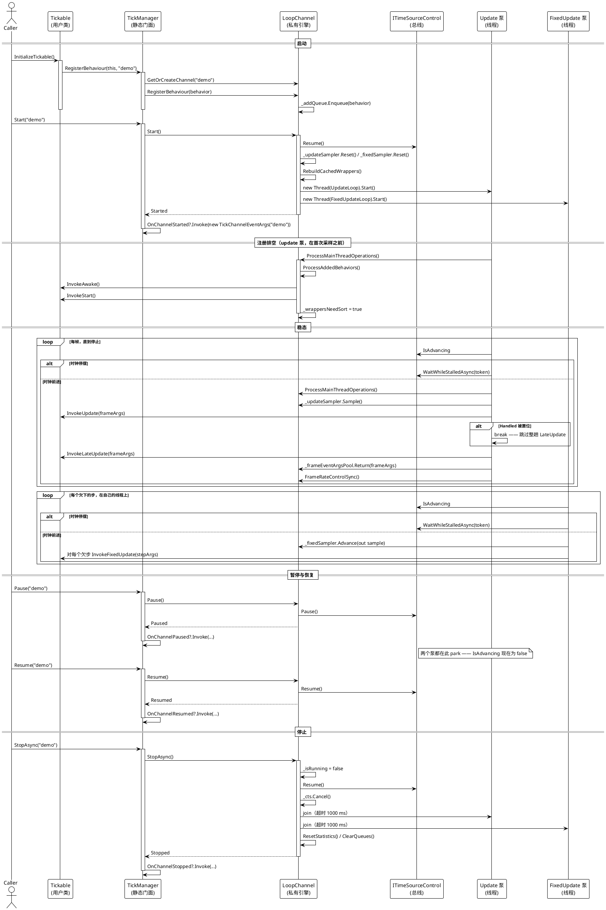

# 数据流 — Tickable

tickable 特性只有一条调用链，分三个阶段；值得按顺序读，因为每一阶段都会改变下一阶段所依赖的状态：

1. **启动与注册** —— 调用方启动通道并入队一个行为；update 泵在采样之前排空队列，因此 `Awake` 与 `Start` 落在第一次 `Update` 之前。
2. **帧派发** —— 稳态：一趟 `Update`、一趟 `LateUpdate`，以及另一条线程上一批独立的 `FixedUpdate`。
3. **暂停、恢复与停止** —— 在不拆掉通道的前提下停住与重启交付的那些迁移。

## 完整生命周期一图

> 源码：`Src/Core/VeloxDev.Core/TimeLine/TickManager.cs` 274-327（Start）、329-374（StopAsync）、384-402（Pause/Resume）、430-438（注册）、509-554（UpdateLoop）、446-507（FixedUpdateLoop）、753-801（排空）、1017-1030（GetOrCreateChannel）、1048-1064（静态转发）行。

## 按阶段的流程

| 子页 | 流程 | 图 |
|---|---|---|
| [启动与注册](00_启动与注册/index.md) | `InitializeTickable()` → `RegisterBehaviour` → `GetOrCreateChannel` → `Start` → 排空 → `InvokeAwake`/`InvokeStart` | PlantUML |
| [帧派发](01_帧派发/index.md) | 每帧 `InvokeUpdate` → `InvokeLateUpdate`、`Handled` 短路、并发的 `InvokeFixedUpdate` 批次与异常路径 | PlantUML |
| [暂停恢复与停止](02_暂停恢复与停止/index.md) | `Pause` / `Resume` / `TogglePause` / `StopAsync` / `RestartAsync`，含 park 状态与「暂停中停止」路径 | PlantUML |

## 什么跨过了哪条边界

上面那张图只有在把线程边界写清楚之后才有意义。图中每一支箭头都跨过了四条边界之一：

| 从 → 到 | 机制 | 后果 |
|---|---|---|
| 调用方 → `LoopChannel` | `ConcurrentQueue<T>`（新增、移除、配置）或 `volatile` 字段 | 无锁；在稍后生效，而不是调用时 |
| Update 泵 → 行为 | 直接方法调用 | 同步；慢钩子会拖慢本帧 |
| FixedUpdate 泵 → 行为 | 直接方法调用，在自己的线程上 | 与 Update 并发；共享状态需自行加锁 |
| 泵 → 总线 | `ITimeSourceControl` | 暂停与速率被两个泵以及同一时钟上的动画共同观察 |

这条链里唯一**不**存在的东西是向 UI 线程的封送。`ExecuteOnMainThread` 的目标是 update 泵；在钩子里阻塞等待 `Dispatcher.Invoke` 会被逐钩子的异常保护捕获。
