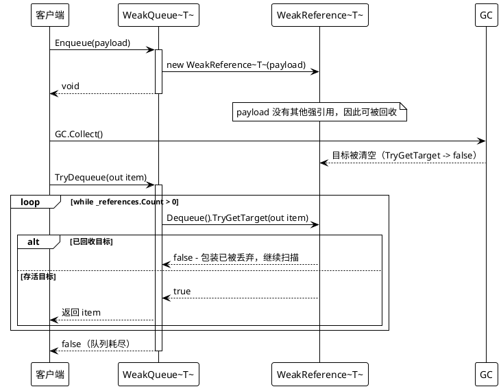
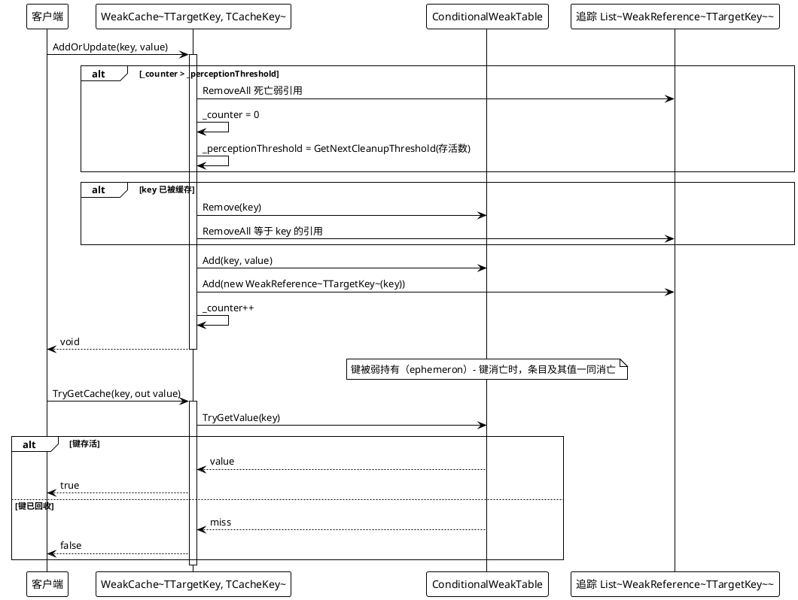
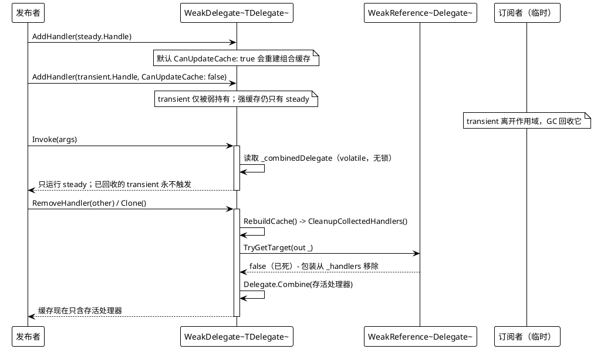

# 数据流 — 弱引用类型

四个类型都由每实例 `lock` 保护，死亡引用在访问时被跳过或剪除。下面的三张时序图追踪三种代表性流程：弱队列、ephemeron 缓存清扫、弱多播。泛型约束使载荷为引用类型：`WeakQueue<T>` / `WeakStack<T>` 要求 `where T : class`，因此 `TryDequeue` / `TryPop` / `TryPeek` 暴露 `T?`，其 null / `false` 也意味着「没有存活条目」。

## 1. WeakQueue — 入队、回收、出队跳过死亡引用

`Enqueue` 只包裹条目（`WeakQueue.cs`，第 34-42 行）。`TryDequeue` 弹出队头并调用 `TryGetTarget`；载荷已被回收意味着包装已丢弃，循环继续（第 63-78 行）。`TryPeek` 行为相同，但保留存活的队头、只丢弃死亡条目（第 80-96 行）。`Count` 与 `GetEnumerator` 会先对整个底层队列运行 `Prune()`（第 10-21、107-120、124-135 行），因此报告的数量与产出的条目总是存活；死亡载荷永远不会被返回。

## 2. WeakCache — AddOrUpdate、周期清扫、ephemeron 淘汰

表（`_caches`）是查找的真源。`AddOrUpdate` 先检查清扫计数；由于 `ConditionalWeakTable.Add` 在键已存在时会抛出，它会在新增前显式 `Remove` 旧条目，并刷新追踪列表，使 `_targets` 对每个存活键只保留一个弱引用（第 44-63 行）。`TryGetCache` 是一次纯表读取（第 31-43 行）：当键已被回收时 ephemeron 条目已消失，值——仅在键存活期间经由表被引用——也随之消失，无需手动淘汰。`ForeachCache`（第 14-30 行）先剪除死亡追踪引用，再经由表遍历存活键。注意清扫阈值按存活数几何增长（`GetNextCleanupThreshold`，第 75-79 行），使周期清理摊还到每次插入为 O(1)。

## 3. WeakDelegate — 弱多播与重建时的剪除

`AddHandler` 追加 `WeakReference<Delegate>`，当 `CanUpdateCache` 为 true 时立即重建组合委托（第 10-18 行）；`RemoveHandler` 从尾端扫描并移除匹配条目（第 20-33 行）。调用从不遍历弱列表的热路径：`GetInvocationList` 通过无锁 `volatile` 读返回缓存的 `_combinedDelegate`，仅在缓存为 null 时才加锁并重建（第 40-51 行）。`Invoke(object?[] objects)` 对该缓存委托做 DynamicInvoke（第 58-61 行）——知道签名的调用方改为类型化调用，这正是 `TransitionEffectCore` 每帧所做的（`TransitionEffect.cs`，第 87-90 行）。缓存委托是强引用，因此剪除只移除已回收处理器的包装条目：`RebuildCache` 调用 `CleanupCollectedHandlers`（第 63-77、79-88 行），`Clone` 只把存活处理器复制进新实例（第 90-105 行）。因此唯一类泄漏的角落是：以默认缓存更新添加、却从不退订的处理器——它会被强缓存扎根，直到之后某次增删/克隆重建将其排除。

出处：`Src/Core/VeloxDev.Core/WeakTypes/{WeakQueue,WeakStack,WeakDelegate,WeakCache}.cs`；用法见 `Src/Core/VeloxDev.Core/TransitionSystem/TransitionEffect.cs`；行为由 `Src/Core/VeloxDev.Core.Test/WeakTypes/*.cs` 覆盖（FIFO/LIFO 顺序、peek、范围操作、缓存覆盖/移除/清理）。
