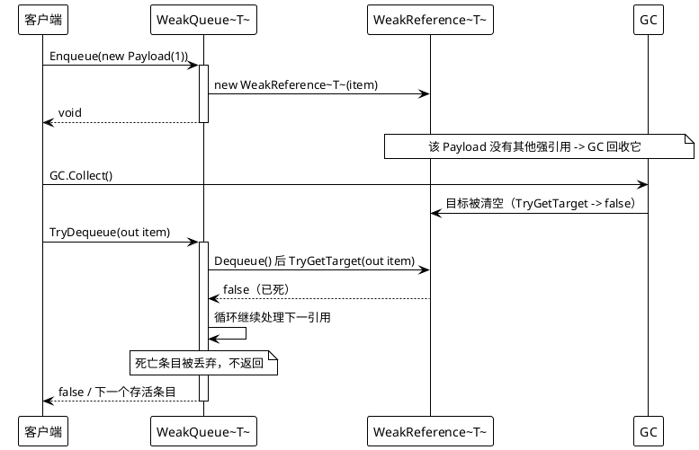
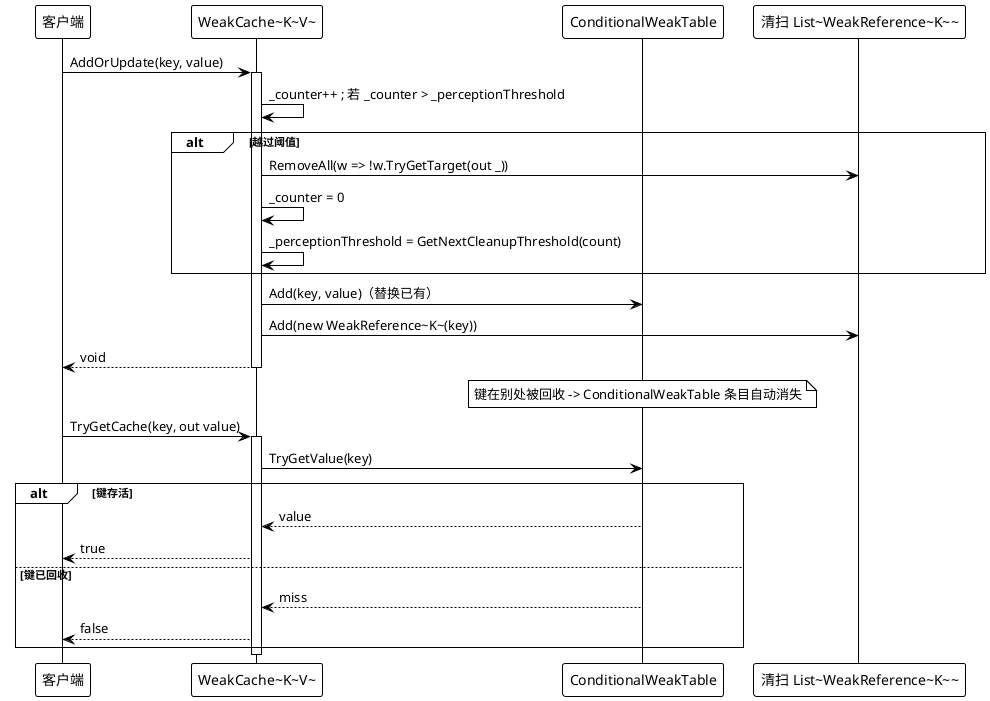
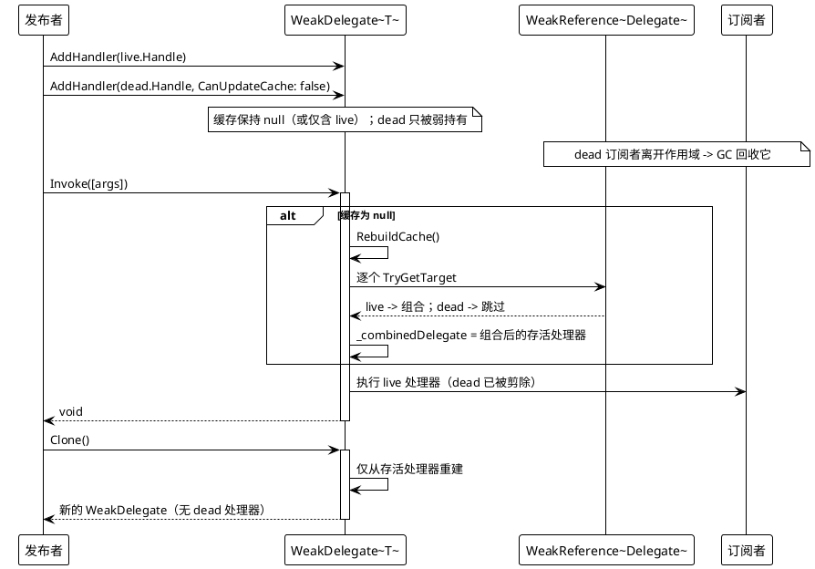

# 数据流 — 弱引用类型

四个类型都以锁保护；死亡引用在访问时被跳过或剪除。下面的时序图追踪三种代表性流程。

## 1. WeakQueue — 入队、回收、出队跳过死亡引用

运行时探针，2026-08-17：`GC.Collect()` 之后队列报告 `Count: 1`，`TryDequeue` 只返回仍存活的那个条目。

## 2. WeakCache — AddOrUpdate 与周期清扫

出处：`WeakCache.cs` 第 44-63 行（`AddOrUpdate`）、31-43 行（`TryGetCache`）、75-79 行（`GetNextCleanupThreshold`）。

## 3. WeakDelegate — 调用 / 克隆时剪除已回收处理器

出处：`WeakDelegate.cs` 第 10-19 行（`AddHandler`）、40-51 行（`GetInvocationList`）、62-76 行（`RebuildCache`）、78-87 行（`CleanupCollectedHandlers`）、89-104 行（`Clone`）。运行时探针，2026-08-17：GC 之后调用原实例只运行存活处理器（计数器 `1`），调用 `Clone` 也只运行存活处理器（计数器 `2`）。
